#  ezIDA

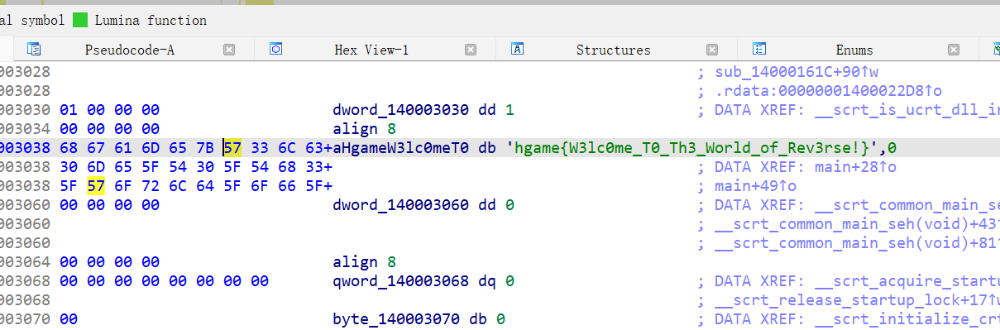

IDA打开得到flag

> hgame{W3lc0me_T0_Th3_World_of_Rev3rse!}

# ezASM

题目是一段汇编代码

```apl
section .data
    c db 74, 69, 67, 79, 71, 89, 99, 113, 111, 125, 107, 81, 125, 107, 79, 82, 18, 80, 86, 22, 76, 86, 125, 22, 125, 112, 71, 84, 17, 80, 81, 17, 95, 34
    flag db 33 dup(0)
    format db "plz input your flag: ", 0
    success db "Congratulations!", 0
    failure db "Sry, plz try again", 0

section .text
    global _start

_start:
    ; Print prompt
    mov eax, 4
    mov ebx, 1
    mov ecx, format
    mov edx, 20
    int 0x80

    ; Read user input
    mov eax, 3
    mov ebx, 0
    mov ecx, flag
    mov edx, 33
    int 0x80

    ; Check flag
    xor esi, esi
check_flag:
    mov al, byte [flag + esi]
    xor al, 0x22
    cmp al, byte [c + esi]
    jne failure_check

    inc esi
    cmp esi, 33
    jne check_flag

    ; Print success message
    mov eax, 4
    mov ebx, 1
    mov ecx, success
    mov edx, 14
    int 0x80

    ; Exit
    mov eax, 1
    xor ebx, ebx
    int 0x80

failure_check:
    ; Print failure message
    mov eax, 4
    mov ebx, 1
    mov ecx, failure
    mov edx, 18
    int 0x80

    ; Exit
    mov eax, 1
    xor ebx, ebx
    int 0x80

```

输入的flag每个字节异或‘0x22’后与c数组比较

得到脚本：

```c
#include <stdio.h>

int main()
{
    unsigned char c[] = {
        74, 69, 67, 79, 71, 89, 99, 113, 111, 125, 107, 81, 125, 107, 79, 82,
        18, 80, 86, 22, 76, 86, 125, 22, 125, 112, 71, 84, 17, 80, 81, 17, 95, 34};
    int length = sizeof(c) / sizeof(c[0]);

    printf("Flag: ");
    for (int i = 0; i < length; i++)
    {
        printf("%c", c[i] ^ 0x22);
    }
    printf("\n");

    return 0;
}

```

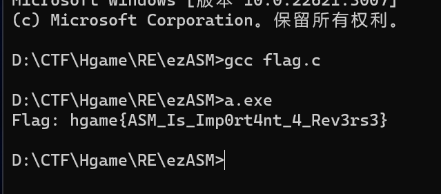

> hgame{ASM_Is_Imp0rt4nt_4_Rev3rs3}


# ezUPX

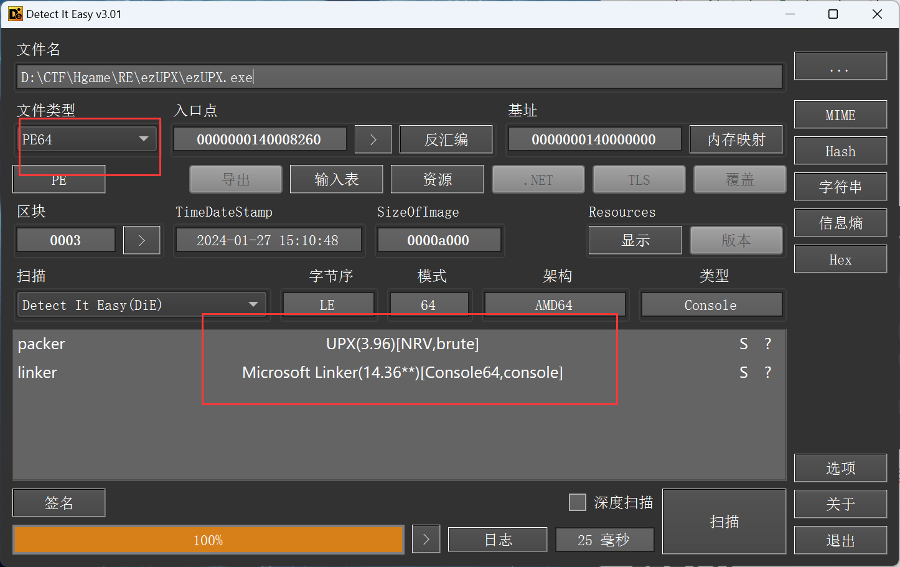

64位PE文件，有壳

脱壳后得到

```apl
int __cdecl main(int argc, const char **argv, const char **envp)
{
  int v3; // edx
  __int64 i; // rax
  __int128 v6[2]; // [rsp+20h] [rbp-38h] BYREF
  int v7; // [rsp+40h] [rbp-18h]

  memset(v6, 0, sizeof(v6));
  v7 = 0;
  sub_140001020("plz input your flag:\n");
  sub_140001080("%36s");
  v3 = 0;
  for ( i = 0i64; (*((_BYTE *)v6 + i) ^ 0x32) == byte_1400022A0[i]; ++i )
  {
    if ( (unsigned int)++v3 >= 0x25 )
    {
      sub_140001020("Cooool!You really know a little of UPX!");
      return 0;
    }
  }
  sub_140001020("Sry,try again plz...");
  return 0;
}
```

unsigned char byte_1400022A0[36] = {
    0x64, 0x7B, 0x76, 0x73, 0x60, 0x49, 0x65, 0x5D, 0x45, 0x13, 0x6B, 0x02, 0x47, 0x6D, 0x59, 0x5C, 
    0x02, 0x45, 0x6D, 0x06, 0x6D, 0x5E, 0x03, 0x46, 0x46, 0x5E, 0x01, 0x6D, 0x02, 0x54, 0x6D, 0x67, 
    0x62, 0x6A, 0x13, 0x4F
};

把数据提取出来，每个异或‘0x32’即可

得到脚本

```c
# include<stdio.h>

int main()
{
    unsigned char c[] = {
    0x64, 0x7B, 0x76, 0x73, 0x60, 0x49, 0x65, 0x5D, 0x45, 0x13, 0x6B, 0x02, 0x47, 0x6D, 0x59, 0x5C, 
    0x02, 0x45, 0x6D, 0x06, 0x6D, 0x5E, 0x03, 0x46, 0x46, 0x5E, 0x01, 0x6D, 0x02, 0x54, 0x6D, 0x67, 
    0x62, 0x6A, 0x13, 0x4F, 0x32};

    printf("Flag: ");
    for (int i = 0; i < sizeof(c); i++)
    {
        printf("%c", c[i] ^ 0x32);
    }
    printf("\n");

    return 0;
}
```

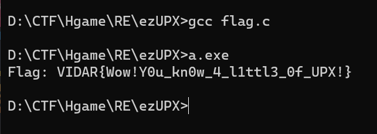

> VIDAR{Wow!Y0u_kn0w_4_l1ttl3_0f_UPX!}  


# ezPYC

PYC解包得到
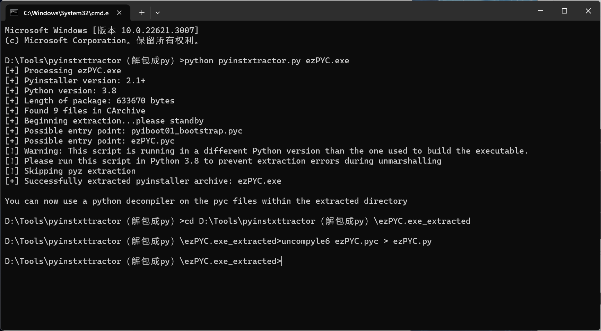

```python
# uncompyle6 version 3.9.0
# Python bytecode version base 3.8.0 (3413)
# Decompiled from: Python 3.9.0 (tags/v3.9.0:9cf6752, Oct  5 2020, 15:23:07) [MSC v.1927 32 bit (Intel)]
# Embedded file name: ezPYC.py
flag = [
 87, 75, 71, 69, 83, 121, 83, 125, 117, 106, 108, 106, 94, 80, 48, 
 114, 100, 112, 112, 55, 94, 51, 112, 91, 48, 108, 119, 97, 115, 
 49, 112, 112, 48, 108, 100, 37, 124, 2]
c = [1, 2, 3, 4]
input = input('plz input flag:')
for i in range(0, 36, 1):
    if ord(input[i]) ^ c[i % 4] != flag[i]:
        print('Sry, try again...')
        exit()
else:
    print('Wow!You know a little of python reverse')
# okay decompiling ezPYC.pyc

```

密钥为1，2，3，4的异或

得到脚本

```python
flag = [
 87, 75, 71, 69, 83, 121, 83, 125, 117, 106, 108, 106, 94, 80, 48,
 114, 100, 112, 112, 55, 94, 51, 112, 91, 48, 108, 119, 97, 115,
 49, 112, 112, 48, 108, 100, 37, 124, 2]
c = [1, 2, 3, 4]
result = ''
for i in range(len(flag)):
    result += chr(flag[i] ^ c[i % len(c)])

print(f"Flag: {result}")
```

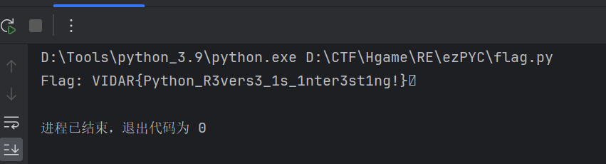

> VIDAR{Python_R3vers3_1s_1nter3st1ng!}


# babyre

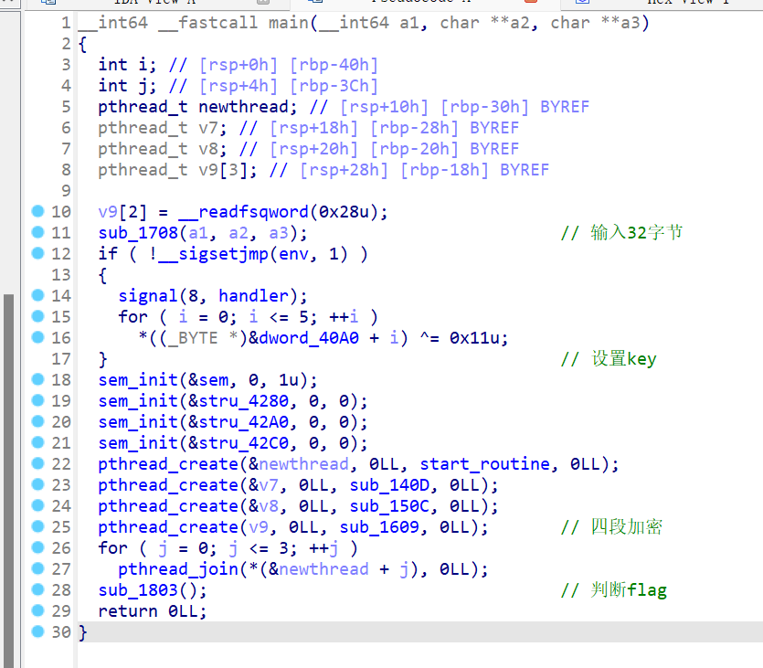

IDA打开，通过判断可以得到以上

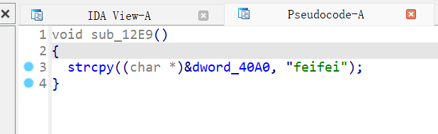

找到key，结合设置那里，每位异或17

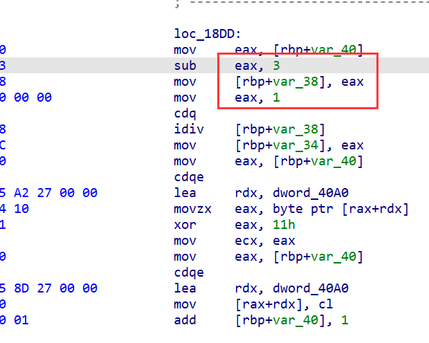

这里eax寄存器减了3，key其实只有前三位异或17

在最后判断flag的函数里可以提取到密文

```apl
unsigned int cipher[32] = { 0x00002F14, 0x0000004E, 0x00004FF3, 0x0000006D, 0x000032D8, 0x0000006D, 0x00006B4B, 0xFFFFFF92, 0x0000264F, 0x0000005B, 0x000052FB, 0xFFFFFF9C, 0x00002B71, 0x00000014, 0x00002A6F, 0xFFFFFF95, 0x000028FA, 0x0000001D, 0x00002989, 0xFFFFFF9B, 0x000028B4, 0x0000004E, 0x00004506, 0xFFFFFFDA, 0x0000177B, 0xFFFFFFFC, 0x000040CE, 0x0000007D, 0x000029E3, 0x0000000F, 0x00001F11, 0x000000FF };
```

结合四个加密函数，大概就是创建四个线程，每个线程里存有各自的函数的地址，然后按顺序依次调用，调用了一个线程后该线程对应的信号量减一，下一个线程的信号量加一，这时就调用下一个线程的函数，依次循环，直到全局变量 i 为 31 停止，最后退出线程，四个线程总共循环 8 次

```c
#include <stdio.h>
#include <string.h>
__int32 enc[33] = {12052, 78, 20467, 109, 13016, 109, 27467, -110,
                   9807, 91, 21243, -100, 11121, 20, 10863, -107, 10490, 29, 10633, -101,
                   10420, 78, 17670, -38, 6011, -4, 16590, 125, 10723,
                   15, 7953, 255, 250};
__int32 key[6] = {0x77, 0x74, 0x78, 0x66, 0x65, 0x69};
int main()
{
    int i = 31;
    while (i >= 0)
    {
        enc[i] ^= (enc[i + 1] - key[(i + 1) % 6]);
        i--;
        enc[i] /= (enc[i + 1] + key[(i + 1) % 6]);
        i--;
        enc[i] += (key[(i + 1) % 6] ^ enc[i + 1]);
        i--;
        enc[i] -= (key[(i + 1) % 6] * enc[i + 1]);
        i--;
    }
    for (int j = 0; j < 32; j++)
    {
        printf("%c", enc[j]);
    }
    return 0;
}
```

> hgame{you_are_3o_c1ever2_3Olve!}


# ezcpp

丢进IDA打开
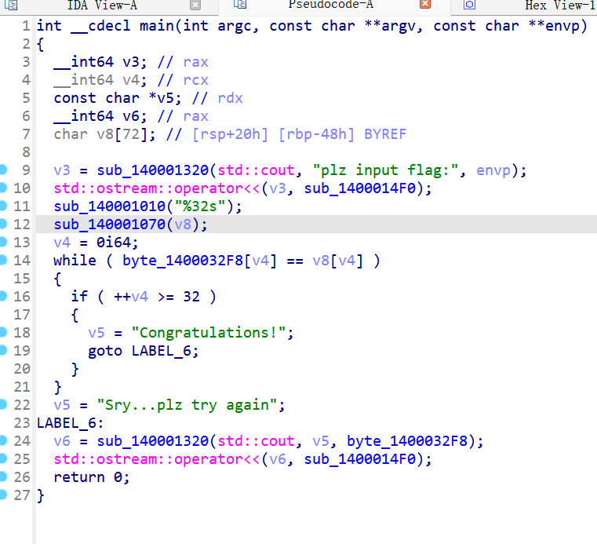

关键在于`sub_140001070`函数上，打开能发现是个tea加密函数
找到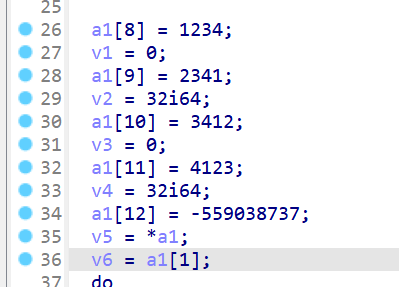

```apl
key1 = 2341, key2 = 1234, key3 = 4123, key4 = 3412, delta = -559038737
```

提取cipher时发现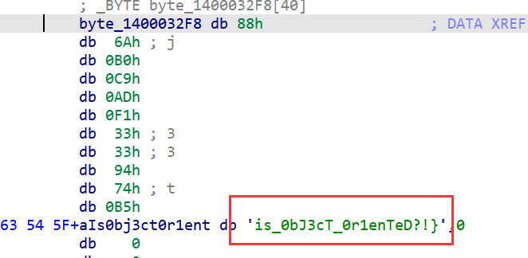

其实flag后半段是完整的，那猜测tea加密只加密了前11位

```apl
unsigned char byte_1400032F8[32] = {
    0x88, 0x6A, 0xB0, 0xC9, 0xAD, 0xF1, 0x33, 0x33, 0x94, 0x74, 0xB5, 0x69, 0x73, 0x5F, 0x30, 0x62, 
    0x4A, 0x33, 0x63, 0x54, 0x5F, 0x30, 0x72, 0x31, 0x65, 0x6E, 0x54, 0x65, 0x44, 0x3F, 0x21, 0x7D
};
```

根据加密函数可得(脚本来自[hgame_wp | 北海の小站 (beihaihaihai.top)](https://www.beihaihaihai.top/2024/02/14/hagme-week2/index.html))

```c++
#include<iostream>
#include<string.h>
//密文flag
int flag[32] = {0x88, 0x6A, 0xB0, 0xC9, 0xAD, 0xF1, 0x33, 0x33, 0x94, 0x74, 
                0xB5, 0x69, 0x73, 0x5F, 0x30, 0x62, 0x4A, 0x33, 0x63, 0x54, 
                0x5F, 0x30, 0x72, 0x31, 0x65, 0x6E, 0x54, 0x65, 0x44, 0x3F, 
                0x21, 0x7D};
int v20,v21,v18,v19,v10,v9,v5,v6,sum,delta;
//四个密钥
int key1 = 2341, key2 = 1234, key3 = 4123, key4 = 3412;
//将int类型拆分成字符的函数
void trans(int v,int i){
    flag[i] = v & 0xff;
    flag[i+1] = (v>>8) & 0xff;
    flag[i+2] = (v>>16) & 0xff;
    flag[i+3] = (v>>24) & 0xff;
}
int main(){
    //按照原加密的顺序逆过来
    delta = -559038737;
    //first
    sum = delta * 32;
    //将字符拼合成int的整数
    v20 = flag[3]|(flag[4]<<8)|(flag[5]<<16)|(flag[6]<<24);
    v21 = flag[7]|(flag[8]<<8)|(flag[9]<<16)|(flag[10]<<24);
    //TEA加密的部分
    for(int i = 0;i < 32;i++){
        v21 -= (sum + v20) ^ (key3 + 32 * v20) ^ (key4 + 16 * v20);
        v20 -= (sum + v21) ^ (key1 + 32 * v21) ^ (key2 + 16 * v21);
        sum -= delta;
    }
    //调用函数将int拆分成原来的字符
    trans(v20,3);
    trans(v21,7);
    //second
    sum = delta * 32;
    v18 = flag[2]|(flag[3]<<8)|(flag[4]<<16)|(flag[5]<<24);
    v19 = flag[6]|(flag[7]<<8)|(flag[8]<<16)|(flag[9]<<24);
    for(int i = 0;i < 32;i++){
        v19 -= (sum + v18) ^ (key3 + 32 * v18) ^ (key4 + 16 * v18);
        v18 -= (sum + v19) ^ (key1 + 32 * v19) ^ (key2 + 16 * v19);  
        sum -= delta;
    }
    trans(v18,2);
    trans(v19,6);
    //third
    sum = delta * 32;
    v9 = flag[1]|(flag[2]<<8)|(flag[3]<<16)|(flag[4]<<24);
    v10 = flag[5]|(flag[6]<<8)|(flag[7]<<16)|(flag[8]<<24);
    for(int i = 0;i < 32;i++){
        v10 -= (sum + v9) ^ (key3 + 32 * v9) ^ (key4 + 16 * v9);
        v9 -= (sum + v10) ^ (key1 + 32 * v10) ^ (key2 + 16 * v10);
        sum -= delta;
    }
    trans(v9,1);
    trans(v10,5);
    //forth
    sum = delta * 32;
    v5 = flag[0]|(flag[1]<<8)|(flag[2]<<16)|(flag[3]<<24);
    v6 = flag[4]|(flag[5]<<8)|(flag[6]<<16)|(flag[7]<<24);
    for(int i = 0;i < 32;i++){
        v6 -= (sum + v5) ^ (16 * v5 + key4) ^ (32 * v5 + key3);
        v5 -= (sum + v6) ^ (16 * v6 + key2) ^ (32 * v6 + key1);
        sum -= delta;
    }
    trans(v5,0);
    trans(v6,4);
    //print
    for(int i = 0;i < 32;i++){
        printf("%c",flag[i]);
    }
    return 0;
}
```

> hgame{#Cpp_is_0bJ3cT_0r1enTeD?!}


# babyAndroid

丢进JADX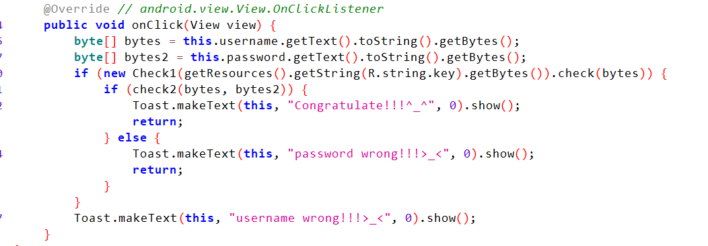

check1在java层，如下：

```java
package com.feifei.babyandroid;

import java.util.Arrays;

/* loaded from: classes.dex */
public class Check1 {
    private byte[] S = new byte[256];
    private int i;
    private int j;

    public Check1(byte[] bArr) {
        for (int i = 0; i < 256; i++) {
            this.S[i] = (byte) i;
        }
        int i2 = 0;
        for (int i3 = 0; i3 < 256; i3++) {
            byte[] bArr2 = this.S;
            i2 = (i2 + bArr2[i3] + bArr[i3 % bArr.length]) & 255;
            swap(bArr2, i3, i2);
        }
        this.i = 0;
        this.j = 0;
    }

    private void swap(byte[] bArr, int i, int i2) {
        byte b = bArr[i];
        bArr[i] = bArr[i2];
        bArr[i2] = b;
    }

    public byte[] encrypt(byte[] bArr) {
        byte[] bArr2 = new byte[bArr.length];
        for (int i = 0; i < bArr.length; i++) {
            int i2 = (this.i + 1) & 255;
            this.i = i2;
            int i3 = this.j;
            byte[] bArr3 = this.S;
            int i4 = (i3 + bArr3[i2]) & 255;
            this.j = i4;
            swap(bArr3, i2, i4);
            byte[] bArr4 = this.S;
            bArr2[i] = (byte) (bArr4[(bArr4[this.i] + bArr4[this.j]) & 255] ^ bArr[i]);
        }
        return bArr2;
    }

    public boolean check(byte[] bArr) {
        return Arrays.equals(new byte[]{-75, 80, 80, 48, -88, 75, 103, 45, -91, 89, -60, 91, -54, 5, 6, -72}, encrypt(bArr));
    }
}
```

看着应该是rc4加密，找到密钥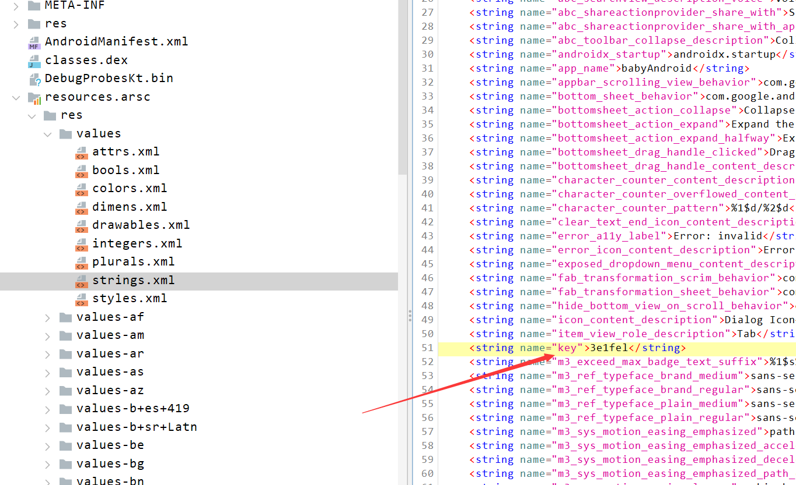

网上找RC4在线解密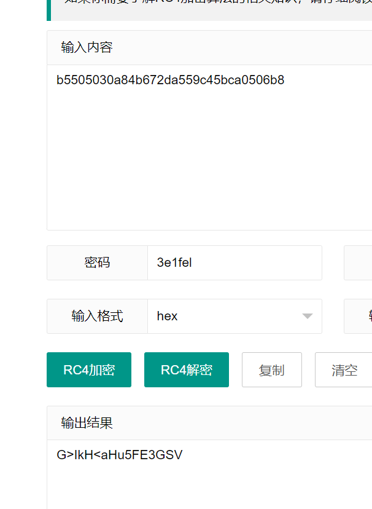

再来是check2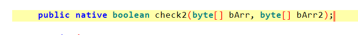在native层，借助IDA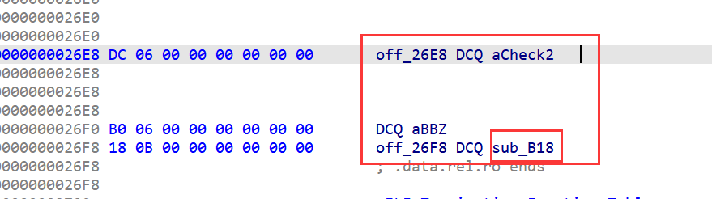

找到关键函数sub_B18，应该是AES加密，找到密文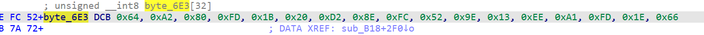

```c
unsigned char byte_6E3[32] = {
    0x64, 0xA2, 0x80, 0xFD, 0x1B, 0x20, 0xD2, 0x8E, 0xFC, 0x52, 0x9E, 0x13, 0xEE, 0xA1, 0xFD, 0x1E, 
    0x66, 0x0B, 0x7A, 0x72, 0xA3, 0x1B, 0xD8, 0x36, 0x6F, 0xDC, 0x3D, 0xEE, 0x3C, 0x01, 0x57, 0x63
};
```

网上找AES在线解码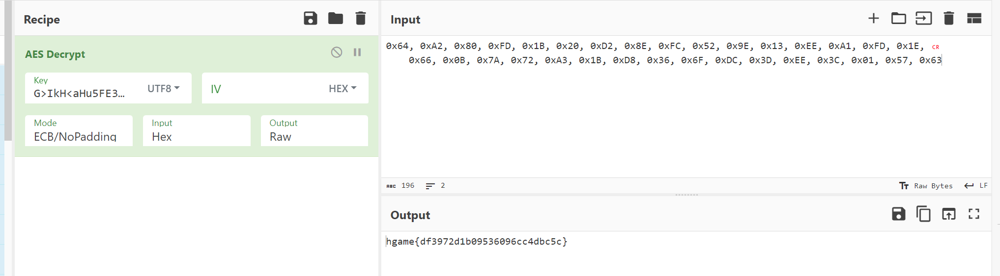

> hgame{df3972d1b09536096cc4dbc5c}


# Arithmetic


PE64位有壳程序，用UPX -d脱壳失败，应该是非标准型

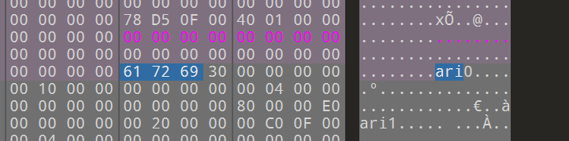

010editor打开发现特征码被改过，改回55 50 58（UPX）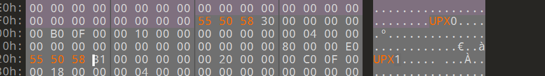

脱壳后丢进IDA，程序从out中读取了数据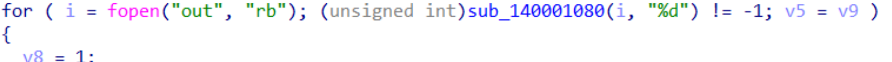

010editor打开out文件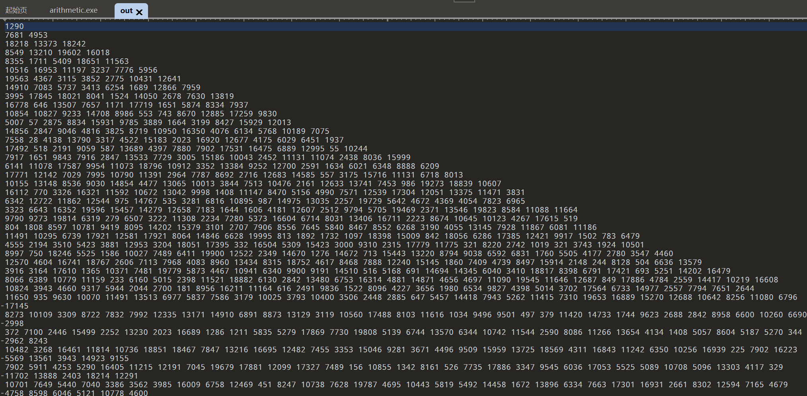

之后便是求解数塔问题了，根据提示是求最大路径和，左 1 右 2，找到最大值

```c++
#define _CRT_SECURE_NO_WARNINGS
#include <bits/stdc++.h>
#include <time.h>
#define MAX 6752833

using namespace std;

long a[500][500], f[510][510], last[510][510], lis[510];
int path[510];

int main() {
    srand(time(NULL));
    int x = 1, y = 1;
    FILE *fp = fopen("out", "rb");
    while (fscanf(fp, "%d", &a[x][y]) != EOF) {
        if (x == y) {
            y = 1;
            x++;
            continue;
        }
        y++;
    }
    x--;

    f[1][1] = a[1][1];
    for (int i = 2; i <= x; i++) {
        for (int j = 1; j <= i; j++) {
            f[i][j] = f[i - 1][j] + a[i][j];
            last[i][j] = j;
            if (f[i - 1][j - 1] + a[i][j] >= f[i][j]) {
                f[i][j] = f[i - 1][j - 1] + a[i][j];
                last[i][j] = j - 1;
            }
        }
    }

    for (int i = 1; i <= x; i++) {
        if (f[x][i] == MAX) {
            x = 500, y = i;
            while (x > 1) {
                lis[x] = a[x][y];
                if (last[x][y] == y - 1) {
                    path[x] = 2;
                    y = y - 1;
                } else {
                    path[x] = 1;
                }
                x--;
            }
        }
    }

    for (int i = 2; i <= 500; i++) {
        printf("%d", path[i]);
    }

    return 0;
}

```

> hgame{934f7f68145038b3b81482b3d9f3a355}


# mystery

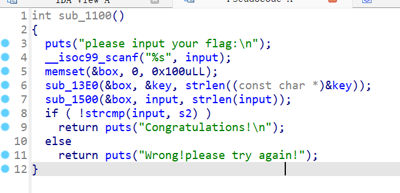

打开能发现`sub_13E0`和`sub_1500`是RC4加密（后者魔改）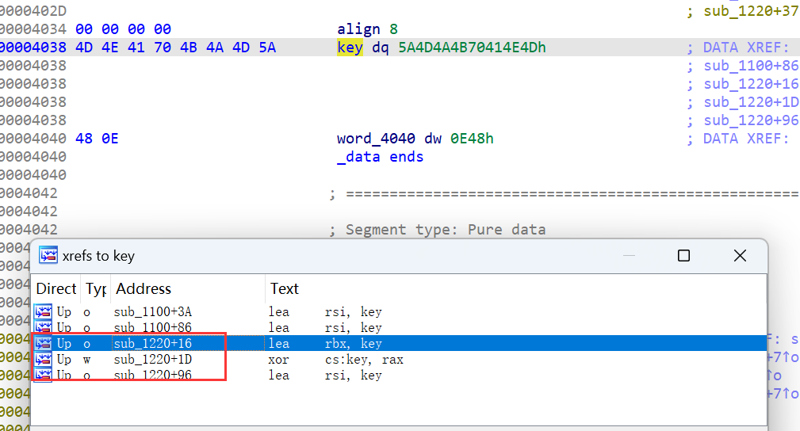

key找到能发现是改过的，交叉应用可以找到（后面没用上）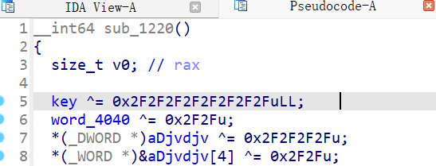

s2提取密文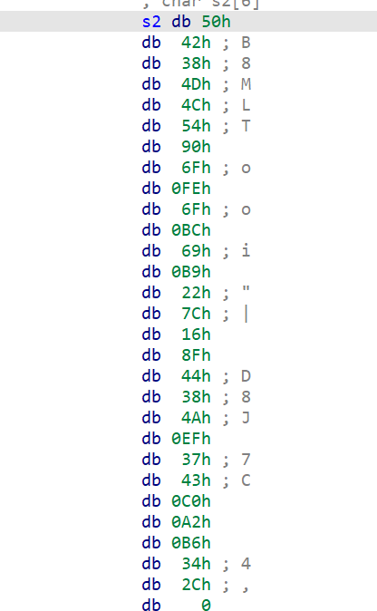

```c
unsigned char cipher[29] = {
    0x50, 0x42, 0x38, 0x4D, 0x4C, 0x54, 0x90, 0x6F, 0xFE, 0x6F, 0xBC, 0x69, 0xB9, 0x22, 0x7C, 0x16, 
    0x8F, 0x44, 0x38, 0x4A, 0xEF, 0x37, 0x43, 0xC0, 0xA2, 0xB6, 0x34, 0x2C, 0x00
};
```

在`sub_1500`函数里下断点，动调找到result（解密的key）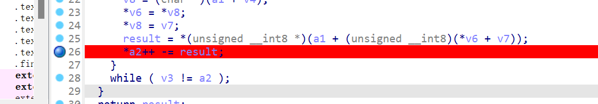

```c
unsigned char key[] = {0x18, 0x25, 0x29, 0x20, 0x19, 0x27, 0xb9, 0xc9, 0x34, 0xc7, 0x71, 0xc9, 0xac, 0x17, 0xb4, 0x1e, 0xe5, 0xe9, 0xfc,
                           0x2a, 0x4a, 0x01, 0xea, 0x79, 0xc7, 0x82, 0xfe, 0x51, 0xe7, 0xb1, 0xae, 0x28, 0x15};
```

准备就绪，脚本：

```c
#include <stdio.h>

int main()
{
    unsigned char cipher[] = {0x50, 0x42, 0x38, 0x4D, 0x4C, 0x54, 0x90, 0x6F, 0xFE, 0x6F, 0xBC, 0x69, 0xB9, 0x22, 0x7C, 0x16, 0x8F, 0x44,
                              0x38, 0x4A, 0xEF, 0x37, 0x43, 0xC0, 0xA2, 0xB6, 0x34, 0x2C, 0x00};

    unsigned char key[] = {0x18, 0x25, 0x29, 0x20, 0x19, 0x27, 0xb9, 0xc9, 0x34, 0xc7, 0x71, 0xc9, 0xac, 0x17, 0xb4, 0x1e, 0xe5, 0xe9, 0xfc,
                           0x2a, 0x4a, 0x01, 0xea, 0x79, 0xc7, 0x82, 0xfe, 0x51, 0xe7, 0xb1, 0xae, 0x28, 0x15};

    for (int i = 0; i < sizeof(cipher); i++)
    {
        cipher[i] += key[i];
        printf("%c", cipher[i]);
    }

    return 0;
}
# hgame{I826-2e904t-4t98-9i82}
```


# encrypt

IDA打开找到`main`函数，发现全是回调函数

```c
int __cdecl main(int argc, const char **argv, const char **envp)
{
  void *v3; // rdi
  void *v4; // r14
  UCHAR *v5; // r15
  UCHAR *v6; // rsi
  unsigned int v7; // ebx
  HANDLE ProcessHeap; // rax
  unsigned int v9; // ebx
  HANDLE v10; // rax
  UCHAR *v11; // rax
  __int64 v12; // rax
  ULONG v13; // ebx
  HANDLE v14; // rax
  UCHAR *v15; // r9
  HANDLE v16; // rax
  _OWORD *v17; // rax
  ULONG v18; // ebx
  HANDLE v19; // rax
  HANDLE v20; // rax
  HANDLE v21; // rax
  HANDLE v22; // rax
  HANDLE v23; // rax
  HANDLE v24; // rax
  UCHAR v26[4]; // [rsp+58h] [rbp-19h] BYREF
  ULONG cbOutput; // [rsp+5Ch] [rbp-15h] BYREF
  ULONG v28; // [rsp+60h] [rbp-11h] BYREF
  BCRYPT_KEY_HANDLE phKey; // [rsp+68h] [rbp-9h] BYREF
  UCHAR pbOutput[4]; // [rsp+70h] [rbp-1h] BYREF
  BCRYPT_ALG_HANDLE phAlgorithm; // [rsp+78h] [rbp+7h] BYREF
  ULONG pcbResult; // [rsp+80h] [rbp+Fh] BYREF
  WCHAR pszAlgId[2]; // [rsp+88h] [rbp+17h] BYREF
  int v34; // [rsp+8Ch] [rbp+1Bh]
  UCHAR pbInput[16]; // [rsp+90h] [rbp+1Fh] BYREF
  __m128i si128; // [rsp+A0h] [rbp+2Fh]

  v3 = 0i64;
  v4 = 0i64;
  phAlgorithm = 0i64;
  v5 = 0i64;
  phKey = 0i64;
  v6 = 0i64;
  v28 = 0;
  pcbResult = 0;
  *(_DWORD *)pbOutput = 0;
  *(_DWORD *)v26 = 0;
  cbOutput = 0;
  sub_140001770(std::cin, argv, envp);
  v34 = 83;
  *(_DWORD *)pszAlgId = 4522049;
  *(__m128i *)pbInput = _mm_load_si128((const __m128i *)&xmmword_1400034F0);
  si128 = _mm_load_si128((const __m128i *)&xmmword_1400034E0);
  if ( BCryptOpenAlgorithmProvider(&phAlgorithm, pszAlgId, 0i64, 0) >= 0
    && BCryptGetProperty(phAlgorithm, L"ObjectLength", pbOutput, 4u, &pcbResult, 0) >= 0 )
  {
    v7 = *(_DWORD *)pbOutput;
    ProcessHeap = GetProcessHeap();
    v5 = (UCHAR *)HeapAlloc(ProcessHeap, 0, v7);
    if ( v5 )
    {
      if ( BCryptGetProperty(phAlgorithm, L"BlockLength", v26, 4u, &pcbResult, 0) >= 0 )
      {
        v9 = *(_DWORD *)v26;
        v10 = GetProcessHeap();
        v11 = (UCHAR *)HeapAlloc(v10, 0, v9);
        v6 = v11;
        if ( v11 )
        {
          memcpy(v11, &unk_1400034A0, *(unsigned int *)v26);
          v12 = 8i64;
          *(__m128i *)pbInput = _mm_xor_si128(
                                  _mm_load_si128((const __m128i *)&xmmword_140003500),
                                  _mm_loadu_si128((const __m128i *)pbInput));
          do
            *(_WORD *)&pbInput[2 * v12++] ^= 0x55u;
          while ( v12 < 15 );
          if ( BCryptSetProperty(phAlgorithm, L"ChainingMode", pbInput, 0x20u, 0) >= 0
            && BCryptGenerateSymmetricKey(phAlgorithm, &phKey, v5, *(ULONG *)pbOutput, (PUCHAR)&pbSecret, 0x10u, 0) >= 0
            && BCryptExportKey(phKey, 0i64, L"OpaqueKeyBlob", 0i64, 0, &cbOutput, 0) >= 0 )
          {
            v13 = cbOutput;
            v14 = GetProcessHeap();
            v15 = (UCHAR *)HeapAlloc(v14, 0, v13);
            if ( v15 )
            {
              if ( BCryptExportKey(phKey, 0i64, L"OpaqueKeyBlob", v15, cbOutput, &cbOutput, 0) >= 0 )
              {
                v16 = GetProcessHeap();
                v17 = HeapAlloc(v16, 0, 0x32ui64);
                v3 = v17;
                if ( v17 )
                {
                  *v17 = xmmword_140005750;
                  v17[1] = xmmword_140005760;
                  v17[2] = xmmword_140005770;
                  *((_WORD *)v17 + 24) = word_140005780;
                  if ( BCryptEncrypt(phKey, (PUCHAR)v17, 0x32u, 0i64, v6, *(ULONG *)v26, 0i64, 0, &v28, 1u) >= 0 )
                  {
                    v18 = v28;
                    v19 = GetProcessHeap();
                    v4 = HeapAlloc(v19, 0, v18);
                    if ( v4 )
                    {
                      if ( BCryptEncrypt(
                             phKey,
                             (PUCHAR)v3,
                             0x32u,
                             0i64,
                             v6,
                             *(ULONG *)v26,
                             (PUCHAR)v4,
                             v28,
                             &pcbResult,
                             1u) >= 0
                        && BCryptDestroyKey(phKey) >= 0 )
                      {
                        phKey = 0i64;
                        v20 = GetProcessHeap();
                        HeapFree(v20, 0, v3);
                        v3 = 0i64;
                        if ( !memcmp(v4, &unk_140005050, v28) )
                          puts("right flag!");
                      }
                    }
                  }
                }
              }
            }
          }
        }
      }
    }
  }
  if ( phAlgorithm )
    BCryptCloseAlgorithmProvider(phAlgorithm, 0);
  if ( phKey )
    BCryptDestroyKey(phKey);
  if ( v4 )
  {
    v21 = GetProcessHeap();
    HeapFree(v21, 0, v4);
  }
  if ( v3 )
  {
    v22 = GetProcessHeap();
    HeapFree(v22, 0, v3);
  }
  if ( v5 )
  {
    v23 = GetProcessHeap();
    HeapFree(v23, 0, v5);
  }
  if ( v6 )
  {
    v24 = GetProcessHeap();
    HeapFree(v24, 0, v6);
  }
  return 0;
}
```

毫无头绪，有许多函数，挨个搜一下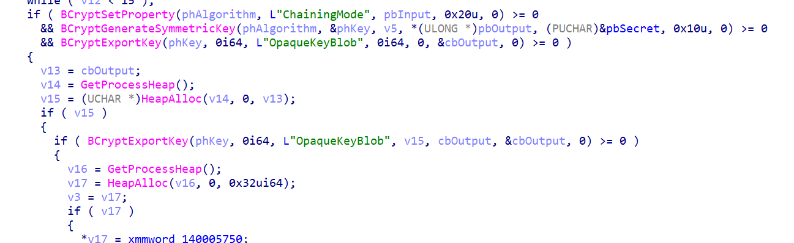

- 根据这几个函数找到加密，`win下的CNG加密`[使用 CNG 加密数据 - Win32 apps | Microsoft Learn](https://learn.microsoft.com/zh-cn/windows/win32/seccng/encrypting-data-with-cng)

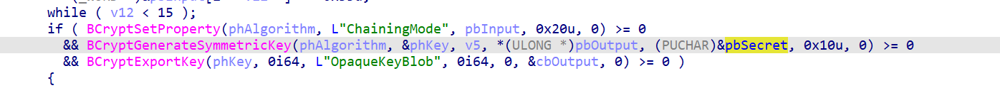

提取pbSecret(key)：

```c
key = 4C9D7B3EECD0661FA034DC863F5F1FE2
```

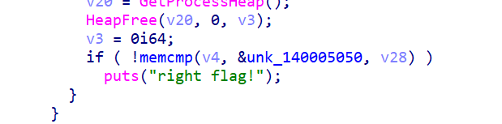

提取unk_140005050(cipher):

```c
cipher = A4E10F1C53BC42CD8E7154B7F175E35097207197A83B7761406968C1B47B88549F19034470782425F0A96535913A049C4E66BED28B8B2073CEA0CBE939BD6D83
```

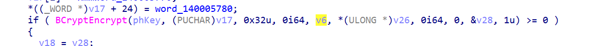

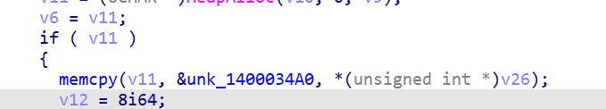

根据以上，可知iv(v6)的值在unk_1400034A0中，提取：

```c
iv = 936AF225FA6810B8D07C3E5E9EE8EE0D
```

然后厨子梭了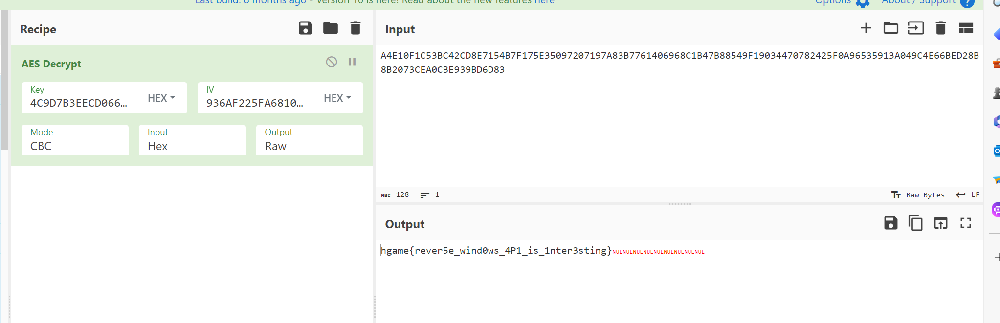

```python
# hgame{rever5e_wind0ws_4P1_is_1nter3sting}
```


# findme

```c
int __cdecl main(int argc, const char **argv, const char **envp)
{
  sub_140001010("hgame{It_is_a_fake_flag!HaHaHa}\n");
  sub_140001010("you should try to decrypt it:\n");
  sub_140001010("aGdhbWV7SXRfaXNfYWxzb19hX2Zha2VfZmxhZyFIYUhhSGFIYX0=");
  puts(Buffer);
  return 0;
}
```

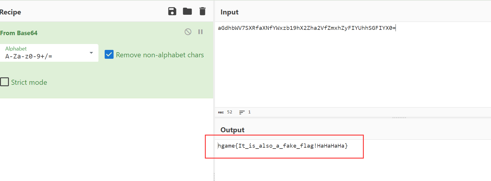

main函数给了两个假flag，点进buffer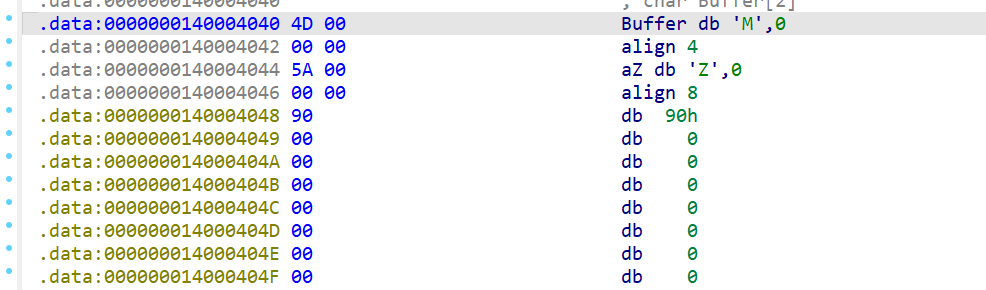

MZ90，exe文件头，但是中间有大量0混淆数据

```python
with open("findme.exe", "rb") as fp:
    with open("real.exe", "wb") as v5:
        n = 0
        while True:
            byte = fp.read(1)
            if not byte:
                break
            n += 1
            if n > 0x2440 and n % 4 == 1:
                v5.write(byte)

```

脚本去掉后，得到real.exe，丢进IDA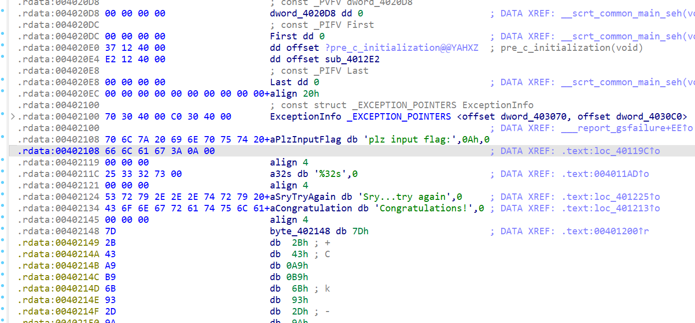

找到内容，但是反编译不了，有很多jz花指令，打idapython去花

```python
import idautils
import idc
import ida_bytes

# 查找.text段
code_start = 0
code_end = 0

for seg_ea in idautils.Segments():
    if idc.get_segm_name(seg_ea) == ".text":
        code_start = idc.get_segm_start(seg_ea)
        code_end = idc.get_segm_end(seg_ea)
        break

print(hex(code_start), hex(code_end))

# 在.text段中查找并替换指令
for ea in range(code_start, code_end):
    # 查找指令序列 0x74 0x03
    if ida_bytes.get_byte(ea) == 0x74 and ida_bytes.get_byte(ea + 1) == 0x03:
        # 将指令替换为5个nop（0x90）
        ida_bytes.patch_bytes(ea, b"\x90"*5)

```

去花指令后，分析后可以知道是魔改的RC4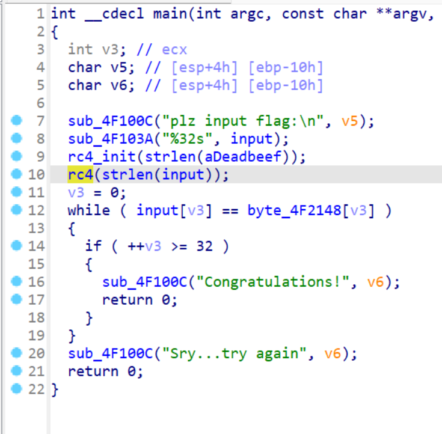

动调找到key和cipher

```python
cipher = [0x7D, 0x2B, 0x43, 0xA9, 0xB9, 0x6B, 0x93, 0x2D, 0x9A, 0xD0,
        0x48, 0xC8, 0xEB, 0x51, 0x59, 0xE9, 0x74, 0x68, 0x8A, 0x45,
        0x6B, 0xBA, 0xA7, 0x16, 0xF1, 0x10, 0x74, 0xD5, 0x41, 0x3C,
        0x67, 0x7D]
```

```python
key = [0x15, 0xc4, 0xe2, 0x3c, 0x54, 0xf0, 0x4d, 0xc1, 0x4b, 0x59,       0x15, 0x56, 0x78, 0xf2, 0x18, 0x77, 0x41, 0x9, 0x34, 0xe0,       0xf9, 0x41, 0x48, 0xb0, 0x7f, 0xdc, 0xd, 0x63, 0xe0, 0xce,       0xf3, 0x0]
```

因为python搓脚本的时候，因为对 `cipher[i]` 的减法操作导致了结果超出了 Unicode 范围
所以将超出范围的hex(key[i])数据改为对应补码，脚本：

```python
cipher= [0x7D, 0x2B, 0x43, 0xA9, 0xB9, 0x6B, 0x93, 0x2D, 0x9A, 0xD0,
        0x48, 0xC8, 0xEB, 0x51, 0x59, 0xE9, 0x74, 0x68, 0x8A, 0x45,
        0x6B, 0xBA, 0xA7, 0x16, 0xF1, 0x10, 0x74, 0xD5, 0x41, 0x3C,
        0x67, 0x7D]
key = [0x15, -0x3c, -0x1e, 0x3c, 0x54, -0x10, 0x4d, -0x3f, 0x4b, 0x59, 0x15, 0x56, 0x78, -0xe, 0x18, 0x77, 0x41, 0x9, 0x34, -0x20, -0x7, 0x41, 0x48, -0x50, 0x7f, -0x24, 0xd, 0x63, -0x20, -0x32, -0xd, 0x0]

flag = ''
for i in range(len(cipher)):
    cipher[i] -= key[i]
    flag += chr(cipher[i])
    print(chr(cipher[i]), end='')


# hgame{FlOw3rs_Ar3_Very_fr4grant} 
```


# crackme

```c++
int __cdecl main(int argc, const char **argv, const char **envp)
{
  __int64 v3; // rax
  __int64 v4; // rax
  __int64 v5; // rax
  __int64 v6; // rax
  int i; // [rsp+20h] [rbp-128h]
  char v9; // [rsp+34h] [rbp-114h] BYREF
  char v10[3]; // [rsp+35h] [rbp-113h] BYREF
  int v11; // [rsp+38h] [rbp-110h]
  int v12; // [rsp+3Ch] [rbp-10Ch]
  int v13; // [rsp+40h] [rbp-108h]
  int v14; // [rsp+44h] [rbp-104h]
  int v15; // [rsp+48h] [rbp-100h]
  int v16; // [rsp+4Ch] [rbp-FCh]
  int v17[8]; // [rsp+50h] [rbp-F8h] BYREF
  char v18[8]; // [rsp+70h] [rbp-D8h] BYREF
  __int64 v19; // [rsp+78h] [rbp-D0h]
  _DWORD *v20; // [rsp+80h] [rbp-C8h]
  __int64 v21; // [rsp+88h] [rbp-C0h]
  _DWORD *v22; // [rsp+90h] [rbp-B8h]
  const char *pExceptionObject; // [rsp+98h] [rbp-B0h] BYREF
  char v24[16]; // [rsp+B0h] [rbp-98h] BYREF
  char v25[16]; // [rsp+C0h] [rbp-88h] BYREF
  char v26[24]; // [rsp+D0h] [rbp-78h] BYREF
  char v27[32]; // [rsp+E8h] [rbp-60h] BYREF
  char v28[24]; // [rsp+108h] [rbp-40h] BYREF

  sub_140001C80(v27, argv, envp);
  sub_140002490(std::cin, v27);
  v12 = 857870677;
  v13 = 1234;
  v14 = 2345;
  v15 = 3456;
  v16 = 4567;
  sub_140001C20(v27, 0i64);
  sub_140001C20(v27, 1i64);
  sub_140001A80(v26, 24i64);
  v3 = unknown_libname_17(&v9);
  sub_140001BA0(v26, 8i64, v3);
  for ( i = 0; i < 8; i += 2 )
  {
    v20 = (_DWORD *)sub_140001AD0(v26, i);
    v19 = 4 * i;
    v4 = sub_140001C00(v27);
    *v20 = *(_DWORD *)(v4 + v19);
    v22 = (_DWORD *)sub_140001AD0(v26, i + 1);
    v21 = 4 * i;
    v5 = sub_140001C00(v27);
    *v22 = *(_DWORD *)(v5 + v21 + 4);
  }
  sub_140001A80(v28, 24i64);
  v17[0] = 855388650;
  v17[1] = -262770878;
  v17[2] = -117067598;
  v17[3] = 1598378430;
  v17[4] = -79758149;
  v17[5] = 1802165040;
  v17[6] = 75733113;
  v17[7] = 792951007;
  qmemcpy(
    v24,
    (const void *)std::u16string_view::basic_string_view<char16_t,std::char_traits<char16_t>>(v25, v17, v18),
    sizeof(v24));
  v6 = unknown_libname_17(v10);
  sub_140001B20(v28, v24, v6);
  sub_140001AD0(v26, 0i64);
  sub_140001AD0(v26, 1i64);
  v11 = 0;
  pExceptionObject = "exception";
  CxxThrowException(&pExceptionObject, (_ThrowInfo *)&_TI2PEAD);
}
```

`main`·函数到这里就戛然而止了，但是
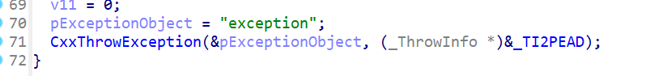

有一个 CxxThrowException(&pExceptionObject, (*ThrowInfo \*)&*TI2PEAD);的异常抛出函数

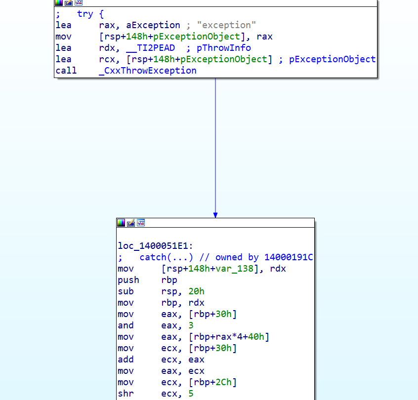

try后面跟着三个catch，地址连续，但是IDA并没有识别
把他们dump下来，再用IDA打开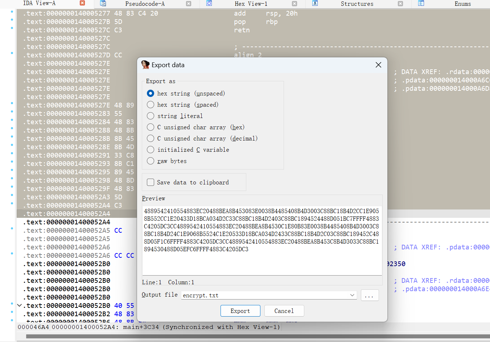

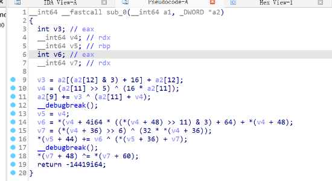

是魔改的XTEA加密，不是sum + delta而是sum ^ delta
然后再从main函数里提取

```c
unsigned int key[4]={1234,2345,3456,4567}
unsigned int delta=857870677
unsigned int data[]={855388650,4032196418,4177899698,1598378430,4215209147,1802165040,75733113,792951007}
```

得到脚本：

```c
#include <stdio.h>
#include <stdint.h>

void decrypt(unsigned int *data, unsigned int *key) {
    unsigned int v0 = data[0], v1 = data[1];
    unsigned int delta = 857870677;
    unsigned int sum = 0, i;

    for (i = 0; i < 32; i++) {
        sum ^= delta;
    }

    for (i = 0; i < 32; i++) {
        sum ^= delta;
        v1 -= (((v0 >> 6) ^ (v0 << 5)) + v0) ^ (key[(sum >> 11) & 3] + sum);
        v0 -= (((v1 >> 5) ^ (16 * v1)) + v1) ^ (key[sum & 3] + sum);
    }

    data[0] = v0;
    data[1] = v1;
}

int main() {
    unsigned int data[8] = {
        0x32FC31EA, 0xF0566F42, 0xF905B0B2, 0x5F4551BE,
        0xFB3EFCBB, 0x6B6ADB30, 0x4839879, 0x2F4378DF
    };
    unsigned int key[4] = {1234, 2345, 3456, 4567};

    for (int i = 0; i < 8; i += 2) {
        decrypt(data + i, key);
    }

    unsigned char a;

    for (int i = 0; i < 8; i++) {
        for (int k = 0; k < 4; k++) {
            a = *((unsigned char *)(&data[i]) + k);
            printf("%c", a);
        }
    }

    return 0;
}

# hgame{C_p1us_plus_exc3pti0n!!!!}
```


# change

```c
int __cdecl main(int argc, const char **argv, const char **envp)
{
  int i; // [rsp+20h] [rbp-B8h]
  int v5; // [rsp+24h] [rbp-B4h]
  __int64 v6; // [rsp+38h] [rbp-A0h]
  char v7[32]; // [rsp+40h] [rbp-98h] BYREF
  char enc[32]; // [rsp+60h] [rbp-78h] BYREF
  char key[32]; // [rsp+80h] [rbp-58h] BYREF
  char v10[32]; // [rsp+A0h] [rbp-38h] BYREF

  sub_7FF7401D21E0((__int64)v10, (__int64)"am2qasl");
  v6 = std::shared_ptr<__ExceptionPtr>::operator=(v7, v10);
  sub_7FF7401D2280(key, v6);
  printf(std::cout, "plz input your flag:");
  sub_7FF7401D10F0(std::cin, &plaintext);
  encode((__int64)key, (__int64)enc, (__int64)&plaintext);
  for ( i = 0; i < 24; ++i )
  {
    v5 = cipher[i];
    if ( v5 != *(char *)sub_7FF7401D2960((__int64)enc, i) )
    {
      printf(std::cout, "sry,try again...");
      sub_7FF7401D2710((__int64)enc);
      sub_7FF7401D2780(key);
      sub_7FF7401D2710((__int64)v10);
      return 0;
    }
  }
  printf(std::cout, "Congratulations!");
  sub_7FF7401D2710((__int64)enc);
  sub_7FF7401D2780(key);
  sub_7FF7401D2710((__int64)v10);
  return 0;
}
```

经过静态分析和动调，可以知道输入经历`encode`函数之后，与cipher比较，点进encode

```c
_QWORD *__fastcall encode(_QWORD *key, _QWORD *enc, __int64 len_key)
{
  char *v3; // rax
  char v4; // al
  char *v5; // rax
  int i; // [rsp+20h] [rbp-58h]
  unsigned int Duration; // [rsp+28h] [rbp-50h]
  unsigned int v9; // [rsp+30h] [rbp-48h]
  unsigned __int64 v10; // [rsp+48h] [rbp-30h]
  unsigned __int64 v11; // [rsp+58h] [rbp-20h]

  std::shared_ptr<__ExceptionPtr>::operator=(enc, len_key);
  for ( i = 0; i < (unsigned __int64)unknown_libname_19(enc); ++i )
  {
    if ( i % 2 )
    {
      sub_7FF7401D2D20((__int64 (__fastcall *)(_QWORD, _QWORD))sub_7FF7401D3670);
      v11 = unknown_libname_19(key);
      v9 = *(char *)sub_7FF7401D2960(key, i % v11);
      v5 = (char *)sub_7FF7401D2960(enc, i);
      beep(*v5, v9);
    }
    else
    {
      sub_7FF7401D2D20((__int64 (__fastcall *)(_QWORD, _QWORD))sub_7FF7401D3650);
      v10 = unknown_libname_19(key);
      Duration = *(char *)sub_7FF7401D2960(key, i % v10);
      v3 = (char *)sub_7FF7401D2960(enc, i);
      beep(*v3, Duration);
    }
    *(_BYTE *)sub_7FF7401D2960(enc, i) = v4;
  }
  return enc;
}
```

关键在于两个`beep`函数，动调可以发现前一个beep会调用

```c
__int64 __fastcall sub_7FF7401D3650(unsigned int a1, int a2)
{
  return (a2 ^ a1) + 10;
}
```

第二个beep会调用

```c
__int64 __fastcall sub_7FF7401D3670(unsigned int a1, int a2)
{
  return a2 ^ a1;
}
```

分析可以知道，偶数位调用`sub_7FF7401D3650`函数，奇数位调用`sub_7FF7401D3670`函数
提取cipher

```c
unsigned char cipher[24] = {
    0x13, 0x0A, 0x5D, 0x1C, 0x0E, 0x08, 0x23, 0x06, 0x0B, 0x4B, 0x38, 0x22, 0x0D, 0x1C, 0x48, 0x0C, 
    0x66, 0x15, 0x48, 0x1B, 0x0D, 0x0E, 0x10, 0x4F
};
```

可得脚本：

```python
enc = [0x13, 0x0A, 0x5D, 0x1C, 0x0E, 0x08, 0x23, 0x06, 0x0B, 0x4B,
       0x38, 0x22, 0x0D, 0x1C, 0x48, 0x0C, 0x66, 0x15, 0x48, 0x1B,
       0x0D, 0x0E, 0x10, 0x4F]
key = "am2qasl"
flag = ""
for i in range(24):
       if i % 2 == 0:
              flag += chr((enc[i]-10) ^ ord(key[i%7]));
       else:
              flag += chr(enc[i] ^ ord(key[i%7]));

print(flag)

# hgame{ugly_Cpp_and_hook}
```


# crackme2

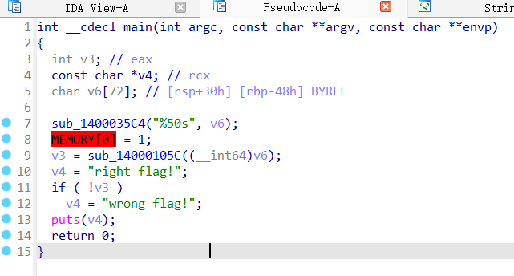

IDA打开后，有一串红色的指令
sub_14000105C函数点进去发现是变表的base64加密，尝试解了一下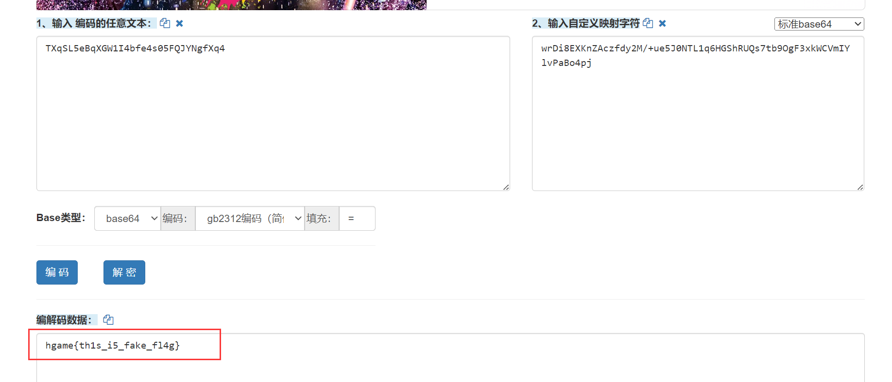

发现是假的flag
那么只有从红色代码入手了
发现SEH触发异常，隐藏了真正的代码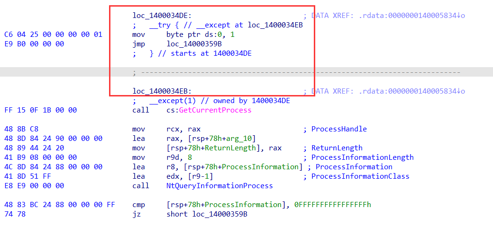

将其nop掉就可以得到了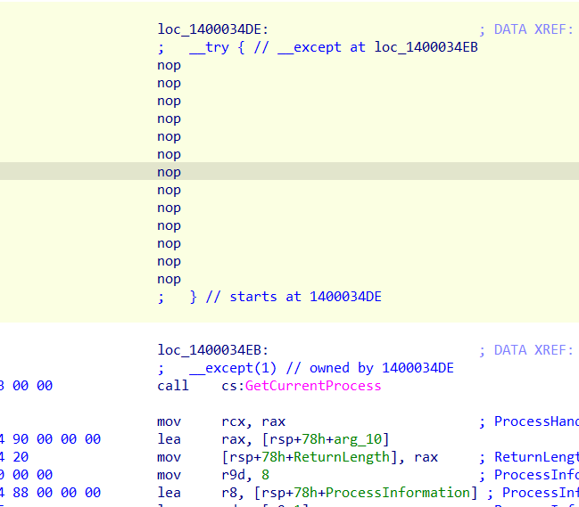

F5反编译得到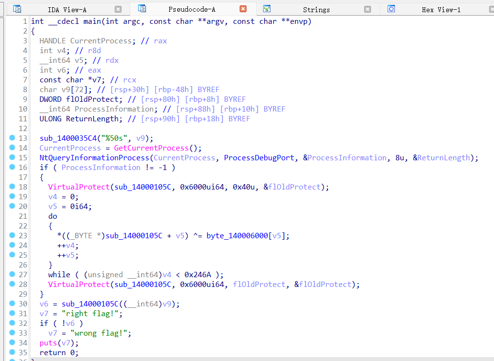发现程序在运⾏时对sub_14000105C进⾏了异或解密(SMC)，打个idapython给它patch掉

```python
def smc(addr,length,addr2):
    for i in range(length):
        bt=get_wide_byte(addr+i)
        bt2=get_wide_byte(addr2+i)
        bt^=bt2 
        patch_byte(addr+i,bt)
        print('done')

smc(0x14000105C,0x246A,0x140006000)
```

重新构建函数后得到

```c
_BOOL8 __fastcall sub_14000105C(unsigned __int8 *a1)
{
    int v1; // r11d 
    int v2; // ebx 
    int v3; // r15d 
    int v4; // r9d 
    int v5; // edi 
    int v6; // r10d
    int v7; // ebp 
    int v8; // esi 
    int v9; // r14d 
    int v10; // r12d 
    int v11; // r13d 
    int v12; // ecx 
    int v13; // r8d 
    int v15; // [rsp+0h] [rbp-118h] 
    int v16; // [rsp+4h] [rbp-114h] 
    int v17; // [rsp+8h] [rbp-110h] 
    int v18; // [rsp+Ch] [rbp-10Ch] 
    int v19; // [rsp+10h] [rbp-108h] 
    int v20; // [rsp+14h] [rbp-104h] 
    int v21; // [rsp+18h] [rbp-100h] 
    int v22; // [rsp+1Ch] [rbp-FCh] 
    int v23; // [rsp+20h] [rbp-F8h] 
    int v24; // [rsp+24h] [rbp-F4h] 
    int v25; // [rsp+28h] [rbp-F0h] 
    int v26; // [rsp+2Ch] [rbp-ECh] 
    int v27; // [rsp+30h] [rbp-E8h] 
    int v28; // [rsp+34h] [rbp-E4h] 
    int v29; // [rsp+38h] [rbp-E0h] 
    int v30; // [rsp+3Ch] [rbp-DCh] 
    int v31; // [rsp+40h] [rbp-D8h] 
    int v32; // [rsp+48h] [rbp-D0h] 
    int v33; // [rsp+4Ch] [rbp-CCh] 
    int v34; // [rsp+50h] [rbp-C8h] 
    int v35; // [rsp+54h] [rbp-C4h]
    int v36; // [rsp+78h] [rbp-A0h]  
    int v37; // [rsp+90h] [rbp-88h] 
    int v38; // [rsp+9Ch] [rbp-7Ch] 
    int v39; // [rsp+120h] [rbp+8h] 
    int v40; // [rsp+128h] [rbp+10h] 
    int v41; // [rsp+130h] [rbp+18h] 
    int v42; // [rsp+138h] [rbp+20h] 
    v1 = a1[25]; 
    v2 = a1[21]; 
    v3 = a1[31]; 
    v4 = a1[29]; 
    v5 = *a1; 
    v6 = a1[23]; 
    v7 = a1[8]; 
    v8 = a1[28]; 
    v9 = a1[12]; 
    v10 = a1[3]; 
    v11 = a1[2];
    v19 = a1[30];
    v15 = a1[18];
    v16 = a1[24];
    v27 = a1[11];
    v17 = a1[26];
    v30 = a1[14];
    v40 = a1[7];
    v26 = a1[20];
    v37 = 2 * v26;
    v42 = a1[22];
    v28 = a1[1];
    v25 = a1[27];
    v21 = a1[19];
    v23 = a1[16];
    v31 = a1[13];
    v29 = a1[10];
    v41 = a1[5];
    v24 = a1[4];
    v20 = a1[15];
    v39 = a1[17];
    v22 = a1[6];
    v18 = a1[9];
    if (v18 + 201 * v24 + 194 * v10 + 142 * v20 + 114 * v39 + 103 * v11 + 52 * (v17 + v31) + ((v9 + v23) << 6) + 14 * (v21 + 4 * v25 + v25) + 9 * (v40 + 23 * v27 + v2 + 3 * v1 + 4 * v2 + 4 * v6) + 5 * (v16 + 23 * v30 + 2 * (v3 + 2 * v19) + 5 * v5 + 39 * v15 + 51 * v4) + 24 * (v8 + 10 * v28 + 4 * (v42 + v7 + 2 * v26)) + 62 * v22 + 211 * v41 + 212 * v29 != 296473)
        return 0i64;
    v38 = 2 * v16;
    if (207 * v41 + 195 * v22 + 151 * v40 + 57 * v5 + 118 * v6 + 222 * v42 + 103 * v7 + 181 * v8 + 229 * v9 + 142 * v31 + 51 * v29 + 122 * (v26 + v20) + 91 * (v2 + 2 * v16) + 107 * (v27 + v25) + 81 * (v17 + 2 * v18 + v18) + 45 * (v19 + 2 * (v11 + v24) + v11 + v24) + 4 * (3 * (v23 + a1[19] + 2 * v23 + 5 * v4) + v39 + 29 * (v10 + v1) + 25 * v15) + 26 * v28 + 101 * v30 + 154 * v3 != 354358)
        return 0i64;
    if (177 * v40 + 129 * v26 + 117 * v42 + 143 * v28 + 65 * v8 + 137 * v25 + 215 * v21 + 93 * v31 + 235 * v39 + 203 * v11 + 15 * (v7 + 17 * v30) + 2 * (v24 + 91 * v9 + 95 * v29 + 51 * v41 + 81 * v20 + 92 * v18 + 112 * (v10 + v6) + 32 * (v22 + 2 * (v1 + v23)) + 6 * (v2 + 14 * v16 + 19 * v15) + 83 * v5 + 53 * v4 + 123 * v19) + v17 + 175 * v27 + 183 * v3 == 448573 && 113 * v19 + 74 * v3 + 238 * v6 + 140 * v2 + 214 * v26 + 242 * v8 + 160 * v21 + 136 * v23 + 209 * v9 + 220 * v31 + 50 * v24 + 125 * v10 + 175 * v20 + 23 * v39 + 137 * v22 + 149 * v18 + 83 * (v4 + 2 * v30) + 21 * (9 * v29 + v16) + 59 * (4 * v27 + v17) + 41 * (v1 + v41) + 13 * (v7 + 11 * (v40 + v15) + 6 * v42 + 4 * (v28 + 2 * v11) + v28 + 2 * v11 + 17 * v5) + 36 * v25 == 384306 && 229 * v21 + 78 * v1 + v2 + v9 + 133 * v27 + 74 * v6 + 69 * v26 + 243 * v7 + 98 * v28 + 253 * v8 + 142 * v25 + 175 * v31 + 105 * v41 + 221 * v10 + 121 * v39 + 218 * (v19 + v29) + 199 * (v24 + v30) + 33 * (v40 + 7 * v17) + 4 * (27 * v20 + 50 * v11 + 45 * v18 + 19 * (v3 + v42) + v16 + 16 * v23 + 52 * v4) + 195 * v22 + 211 * v5 + 153 * v15 == 424240 && 181 * v25 + 61 * v2 + 65 * v21 + 58 * v31 + 170 * v29 + 143 * v24 + 185 * v10 + 86 * v11 + 97 * v22 + 235 * (v23 + v27) + 3 * (53 * v41 + 74 * (v8 + v3) + 13 * (v42 + 6 * v9) + 11 * (v39 + 7 * v20) + 15 * (v18 + 4 * v17) + v7 + 35 * v1 + 29 * v15) + 4 * (57 * v6 + 18 * (v5 + v37) + v28 + 17 * v16 + 55 * v30) + 151 * v40 + 230 * v4 + 197 * v19 == 421974 && (v33 = 2 * v41, 209 * v21 + 249 * v30 + 195 * v2 + 219 * v25 + 201 * v39 + 85 * v18 + 213 * (v17 + v31) + 119 * (v11 + 2 * v41) + 29 * (8 * v24 + v40 + 4 * v27 + v27) + 2 * (v8 + 55 * (2 * v29 + v19) + 3 * (v10 + 39 * v9 + 2 * (v6 + 20 * v20) + 35 * v7) + 4 * (v5 + 31 * v42 + 28 * v3) + 26 * v28 + 46 * (v37 + v16) + 98 * v1) + 53 * v23 + 171 * v15 + 123 * v4 == 442074) && (v32 = 2 * v18, 162 * v19 + 74 * v5 + 28 * v27 + 243 * v42 + 123 * v28 + 73 * v8 + 166 * v23 + 94 * v24 + 113 * v11 + 193 * v22 + 122 * (v6 + 2 * v7) + 211 * (v10 + v25) + 21 * (v17 + 7 * v41) + 11 * (v4 + 23 * (v16 + v39) + 2 * (v40 + 5 * v30 + 2 * (2 * v18 + v29) + 2 * v18 + v29)) + 5 * (46 * v9 + 26 * v20 + 4 * (v31 + 2 * v21) + v15 + 27 * v2 + 10 * v1) + 36 * (v3 + 5 * v26) == 376007) && (v35 = v25 + v30, 63 * v19 + 143 * v5 + 250 * v6 + 136 * v2 + 214 * v40 + 62 * v26 + 221 * v42 + 226 * v7 + 171 * v28 + 178 * v8 + 244 * v23 + (v9 << 7) + 150 * v31 + 109 * v29 + 70 * v41 + 127 * v20 + 204 * v39 + 121 * v22 + 173 * v18 + 69 * (v25 + v30 + v27) + 74 * (v16 + 2 * v15 + v15) + 22 * (7 * v24 + v17 + 10 * v11) + 40 * (v1 + 4 * v21 + v21) + 81 * v10 + 94 * v4 + 84 * v3 == 411252) && 229 * v15 + 121 * v4 + 28 * v30 + 206 * v16 + 145 * v27 + 41 * v1 + 247 * v6 + 118 * v26 + 241 * v28 + 79 * v8 + 102 * v25 + 124 * v23 + 65 * v9 + 68 * v31 + 239 * v17 + 148 * v24 + 245 * v39 + 115 * v11 + 163 * v22 + 137 * v18 + 53 * (v5 + 2 * v29) + 126 * (v40 + 2 * v10) + 38 * (v7 + v21 + 4 * v7 + 6 * v41) + 12 * (v2 + 16 * v42) + 109 * v20 + 232 * v3 + 47 * v19 == 435012 && 209 * v21 + 233 * v40 + 93 * v1 + 241 * v2 + 137 * v8 + 249 * v17 + 188 * v29 + 86 * v24 + 246 * v10 + 149 * v20 + 99 * v11 + 37 * v22 + 219 * v18 + 17 * (v6 + 10 * v25) + 49 * (v5 + 3 * v3 + 4 * v28 + v28) + 5 * (16 * v39 + 11 * (v41 + 2 * v27 + v27) + 12 * v7 + v31 + 30 * v16 + 27 * v19) + 18 * (v23 + 2 * (v4 + v26 + 2 * v4) + v4 + v26 + 2 * v4) + 24 * v9 + 109 * v42 + 183 * v30 + 154 * v15 == 392484 && (v34 = 2 * v31, 155 * v15 + 247 * v40 + 157 * v28 + 119 * v23 + 161 * v17 + 133 * v20 + 85 * v22 + 229 * (v7 + v24) + 123 * (2 * v31 + v42) + 21 * (v41 + 12 * v30) + 55 * (v9 + v5 + v18 + 2 * v5) + 15 * (v3 + 16 * v10 + 9 * v21) + 2 * (v2 + 115 * v29 + 111 * v16 + 26 * v6 + 88 * v8 + 73 * v39 + 71 * v11 + 28 * (v26 + 2 * (v25 + 2 * v1)) + 51 * v27 + 99 * v4 + 125 * v19) == 437910) && 220 * v3 + 200 * v4 + 139 * v15 + 33 * v5 + 212 * v30 + 191 * v16 + 30 * v27 + 233 * v1 + 246 * v6 + 89 * v2 + 252 * v40 + 223 * v42 + 19 * v25 + 141 * v21 + 163 * v9 + 185 * v17 + 136 * v31 + 46 * v24 + 109 * v10 + 217 * v39 + 75 * v22 + 157 * v18 + 125 * (v11 + v19) + 104 * (v33 + v20) + 43 * (v28 + 2 * v29 + v29) + 32 * (v8 + v7 + 2 * v8 + 2 * (v23 + v26)) == 421905 && 211 * v24 + 63 * v15 + 176 * v5 + 169 * v16 + 129 * v27 + 146 * v40 + 111 * v26 + 68 * v42 + 39 * v25 + 188 * v23 + 130 * v9 + (v31 << 6) + 91 * v41 + 208 * v20 + 145 * v39 + 247 * v18 + 93 * (v22 + v17) + 71 * (v6 + 2 * v11) + 103 * (v8 + 2 * v30) + 6 * (v21 + 10 * v28 + 28 * v7 + 9 * v29 + 19 * v2 + 24 * v1 + 22 * v3) + 81 * v10 + 70 * v4 + 23 * v19 == 356282 && (v12 = v10 + 2 * (v31 + 4 * (v29 + v17)) + v31 + 4 * (v29 + v17), 94 * v42 + 101 * v2 + 152 * v40 + 200 * v7 + 226 * v8 + 211 * v23 + 121 * v24 + 74 * v11 + 166 * v18 + ((v6 + 3 * v28) << 6) + 41 * (4 * v9 + v21) + 23 * (v39 + 11 * v41) + 7 * (v20 + 10 * v25 + 2 * v12 + v12) + 3 * (78 * v30 + 81 * v16 + 55 * v27 + 73 * v1 + 4 * v26 + v15 + 85 * v3 + 65 * v19) + 62 * v22 + 88 * v5 + 110 * v4 == 423091) && 133 * v22 + 175 * v15 + 181 * v30 + 199 * v16 + 123 * v27 + 242 * v1 + 75 * v6 + 69 * v2 + 153 * v40 + 33 * v26 + 100 * v42 + 229 * v7 + 177 * v8 + 134 * v31 + 179 * v29 + 129 * v41 + 14 * v10 + 247 * v24 + 228 * v20 + 92 * v11 + 86 * (v9 + v32) + 94 * (v23 + v21) + 37 * (v17 + 4 * v3) + 79 * (v25 + 2 * v28) + 72 * v5 + 93 * v39 + 152 * v4 + 214 * v19 == 391869 && 211 * v24 + 213 * v18 + 197 * v40 + 159 * v25 + 117 * v21 + 119 * v9 + 98 * v17 + 218 * v41 + 106 * v39 + 69 * v11 + 43 * (v2 + v29 + 2 * v2) + 116 * (v4 + v10 + v37) + 5 * (v42 + 9 * v23 + 35 * v20 + 37 * v31) + 11 * (v16 + 13 * v27 + 5 * v5 + 8 * v30) + 6 * (29 * v28 + 25 * v8 + 38 * v22 + v15 + 13 * v1 + 10 * v3) + 136 * v7 + 142 * v6 + 141 * v19 == 376566 && 173 * v3 + 109 * v15 + 61 * v30 + 187 * v1 + 79 * v6 + 53 * v40 + 184 * v21 + 43 * v23 + 41 * v9 + 166 * v31 + 193 * v41 + 58 * v24 + 146 * v10 + (v20 << 6) + 89 * v39 + 121 * v11 + 5 * (v17 + 23 * v8) + 7 * (29 * v18 + v29 + 4 * v7) + 13 * (3 * v42 + v16 + 7 * v26 + 13 * v2) + 3 * (v4 + 83 * v5 + 51 * v27 + 33 * v22 + 8 * (v19 + 4 * v28) + 18 * v25) == 300934 && (v36 = 3 * v21, 78 * v1 + 131 * v5 + 185 * v16 + 250 * v40 + 90 * v26 + 129 * v42 + 255 * v28 + 206 * v8 + 239 * v25 + 150 * v10 + 253 * v39 + 104 * v22 + 58 * (v2 + 2 * v7) + 96 * (v15 + v31) + 117 * (v9 + 2 * v4) + 27 * (v17 + 8 * v18 + v18) + 19 * (v23 + 3 * v21 + 4 * v29 + v29) + 7 * (22 * v41 + 3 * (v11 + 11 * v24) + v3 + 29 * v6 + 14 * v27) + 109 * v20 + 102 * v30 + 100 * v19 == 401351) && 233 * v19 + 71 * v5 + 209 * v27 + 82 * v6 + 58 * v26 + 53 * v25 + 113 * v23 + 206 * v31 + 39 * v41 + 163 * v20 + 222 * v11 + 191 * v18 + 123 * (v7 + v40) + 69 * (v9 + 2 * v22 + v22) + 9 * (v3 + 8 * v24 + 7 * (3 * v1 + v28) + 5 * v16 + 19 * v30) + 4 * (v15 + 26 * v17 + 61 * v29 + 43 * v42 + 49 * v2 + 32 * v4) + 10 * (7 * (v8 + v36) + v39 + 12 * v10) == 368427 && 139 * v30 + 53 * v5 + 158 * v16 + 225 * v1 + 119 * v6 + 67 * v2 + 213 * v40 + 188 * v28 + 152 * v8 + 187 * v21 + 129 * v23 + 54 * v9 + 125 * v17 + 170 * v24 + 184 * v11 + 226 * v22 + 253 * v18 + 26 * (v29 + v41) + 97 * (v4 + 2 * v25) + 39 * (5 * v26 + v27) + 21 * (v39 + 8 * v42) + 12 * (17 * v10 + v31 + 15 * v7 + 12 * v19) + 165 * v20 + 88 * v15 + 157 * v3 == 403881 && 114 * v3 + 61 * v27 + 134 * v40 + 62 * v42 + 89 * v9 + 211 * v17 + 163 * v41 + 66 * v24 + 201 * (v7 + v18) + 47 * (5 * v16 + v22) + 74 * (v4 + v31) + 142 * (v2 + v28) + 35 * (v20 + 6 * v26) + 39 * (v15 + 6 * v30) + 27 * (v25 + 9 * v23 + 8 * v6) + 4 * (v21 + 63 * v19 + 2 * (v1 + 12 * (v10 + v5) + 8 * v11 + 26 * v29)) + 10 * (v8 + 4 * v39 + v39) == 382979 && 122 * v25 + 225 * v21 + 52 * v23 + 253 * v9 + 197 * v17 + 187 * v31 + 181 * v29 + 183 * v41 + 47 * v20 + 229 * v39 + 88 * v22 + 127 * (v10 + v32) + 37 * (v7 + 3 * v3) + ((v11 + 2 * v30 + v30) << 6) + 7 * (21 * v8 + v27 + 18 * (v4 + v1 + v38)) + 6 * (23 * v24 + v26 + 17 * v2 + 39 * v6) + 10 * (v5 + 11 * v28 + 21 * v42) + 149 * v19 + 165 * v40 + 121 * v15 == 435695 && 165 * v20 + 223 * v4 + 249 * v5 + 199 * v1 + 135 * v2 + 133 * v26 + 254 * v42 + 111 * v7 + 189 * v28 + 221 * v25 + 115 * v21 + 186 * v9 + 79 * v41 + 217 * v24 + 122 * v11 + 38 * v18 + 109 * (v34 + v29) + 14 * (v8 + 17 * v40 + 8 * (v6 + v38)) + 4 * (11 * (5 * v30 + v39) + 6 * (v10 + 2 * v22) + v27 + 52 * v17 + 50 * v23) + 229 * v15 + 86 * v3 + 234 * v19 == 453748 && 181 * v25 + 94 * v42 + 125 * v1 + 226 * v26 + 155 * v7 + 95 * v21 + 212 * v17 + 91 * v31 + 194 * v29 + 98 * v24 + 166 * v11 + 120 * v22 + 59 * v18 + 32 * (v9 + v8) + 158 * (v6 + v5) + 101 * (v41 + v19) + 63 * (v4 + 2 * v23) + 67 * (v28 + 2 * v20) + 11 * (v39 + 10 * v16 + 11 * v10) + 39 * (v30 + 4 * (v2 + v15)) + 233 * v40 + 56 * v27 + 225 * v3 == 358321 && 229 * v21 + 135 * v4 + 197 * v15 + 118 * v5 + 143 * v16 + 134 * v6 + 204 * v40 + 173 * v26 + 81 * v7 + 60 * v28 + 58 * v8 + 179 * v23 + 142 * v9 + 178 * v17 + 230 * v31 + 148 * v29 + 224 * v41 + 194 * v24 + 223 * v10 + 87 * v20 + 200 * v39 + 233 * v11 + 49 * v22 + 127 * v35 + 31 * (4 * v27 + v18) + 42 * (v1 + 6 * v2) + 109 * v42 + 75 * v3 + 165 * v19 == 456073 && 41 * v4 + 253 * v3 + 163 * v15 + 193 * v30 + 155 * v16 + 113 * v27 + 131 * v6 + 55 * v2 + 21 * v40 + 53 * v26 + 13 * v8 + 201 * v25 + 237 * v9 + 223 * v31 + 95 * v24 + 194 * v20 + 62 * v39 + 119 * v11 + 171 * v22 + 135 * v18 + 69 * (v10 + 3 * v28) + 211 * (v1 + v29) + 4 * (43 * v7 + v42 + 40 * v17) + 6 * (v5 + 33 * v41 + 20 * (2 * v19 + v21) + 24 * v23) == 407135 && (v13 = v6 + v1 + 8 * v6 + 4 * (v8 + 2 * v27), 111 * v19 + 190 * v3 + 149 * v4 + 173 * v28 + 118 * v23 + 146 * v29 + 179 * v10 + 51 * v20 + 49 * v39 + 61 * v11 + 125 * v22 + 162 * v18 + 214 * v35 + 14 * (v34 + v24) + 178 * (v41 + v16) + 11 * (4 * v9 + v21 + 17 * v42) + 65 * (v26 + v17 + 2 * v26 + 2 * v5) + 4 * (v7 + 38 * v15 + 4 * v13 + v13 + 8 * v40 + 43 * v2) == 369835) && 27 * v27 + 223 * v6 + 147 * v26 + 13 * v21 + 35 * (v17 + 7 * v4) + 57 * (v19 + v32 + 3 * v11) + 11 * (v1 + 17 * (v9 + v5) + 10 * v16 + 3 * v31) + 2 * (53 * v23 + v25 + 38 * v15 + 43 * v42 + 115 * v29 + 61 * v22 + 111 * (v10 + v40) + 14 * (v20 + v7 + 2 * v7 + 8 * v28) + 109 * v2 + 100 * v41 + 63 * v8) + 93 * v39 + 251 * v30 + 131 * v3 == 393303 && 116 * v9 + 152 * v29 + 235 * v20 + 202 * v18 + 85 * (v8 + 3 * v11) + 221 * (v16 + v40) + 125 * (v33 + v24) + 7 * (19 * v4 + 9 * (v10 + 2 * v25) + v2 + 33 * v3 + 32 * v19) + 3 * (71 * v39 + 43 * v22 + 32 * (v17 + v26) + 15 * (v5 + v6 + 2 * v23) + v28 + 74 * v31 + 48 * v42) + 10 * (v21 + 11 * v30 + 16 * v15) + 136 * v7 + 106 * v1 + 41 * v27 == 403661 && 127 * v4 + 106 * v15 + 182 * v30 + 142 * v5 + 159 * v16 + 17 * v1 + 211 * v6 + 134 * v2 + 199 * v7 + 103 * v28 + 247 * v23 + 122 * v9 + 95 * v41 + 62 * v10 + 203 * v39 + 16 * v11 + 41 * (6 * v42 + v25) + 9 * (22 * v24 + v20 + 27 * v31 + 28 * v40) + 10 * (v8 + v22 + v36 + 8 * v17 + 2 * (v22 + v36 + 8 * v17) + 13 * v29) + 6 * (23 * v27 + v26) + 213 * v18 + 179 * v3 + 43 * v19 == 418596)
    {
        return 149 * v19 + v1 + 133 * v22 + 207 * v41 + 182 * v26 + 234 * v7 + 199 * v8 + 168 * v21 + 58 * v10 + 108 * v20 + 142 * v18 + 156 * (v9 + v25) + 16 * (v29 + 6 * v31) + 126 * (v17 + 2 * v39) + 127 * (v4 + 2 * v27 + v40) + 49 * (v30 + 4 * v16) + 11 * (v5 + 22 * v11) + 5 * (v15 + v42 + 45 * v24 + 50 * v28) + 109 * v2 + 124 * v6 + 123 * v3 == 418697;
    }
    else
    {
        return 0i64;
    }
}
```

z3脚本(by **Remore**)：

```python
from z3 import *

a1 = [BitVec('%d' % i, 8) for i in range(32)]
v1 = a1[25]
v2 = a1[21]
v3 = a1[31]
v4 = a1[29]
v5 = a1[0]
v6 = a1[23]
v7 = a1[8]
v8 = a1[28]
v9 = a1[12]
v10 = a1[3]
v11 = a1[2]
v19 = a1[30]
v15 = a1[18]
v16 = a1[24]
v27 = a1[11]
v17 = a1[26]
v30 = a1[14]
v40 = a1[7]
v26 = a1[20]
v37 = 2 * v26
v42 = a1[22]
v28 = a1[1]
v25 = a1[27]
v21 = a1[19]
v23 = a1[16]
v31 = a1[13]
v29 = a1[10]
v41 = a1[5]
v24 = a1[4]
v20 = a1[15]
v39 = a1[17]
v22 = a1[6]
v18 = a1[9]
v38 = 2 * v16
v33 = 2 * v41
v32 = 2 * v18
v35 = v25 + v30
v34 = 2 * v31
v12 = v10 + 2 * (v31 + 4 * (v29 + v17)) + v31 + 4 * (v29 + v17)
v36 = 3 * v21
v13 = v6 + v1 + 8 * v6 + 4 * (v8 + 2 * v27)
s = Solver()
for i in range(32):
    s.add(a1[i] < 127)  # 添加约束条件① #
    s.add(a1[i] >= 32)
    s.add(a1[0] == 104)
    s.add(a1[1] == 103)
    s.add(a1[2] == 97)
    s.add(a1[3] == 109)
    s.add(a1[4] == 101)
    s.add(a1[5] == 123)
    s.add(a1[31] == 125)
s.add(v18+ 201 * v24+ 194 * v10+ 142 * v20+ 114 * v39+ 103 * v11+ 52 * (v17 + v31)+ ((v9 + v23) *2**6)+ 14 * (v21 + 4 * v25 + v25)+ 9 * (v40 + 23 * v27 + v2 + 3 * v1 + 4 * v2 + 4 * v6)+ 5 * (v16 + 23 * v30 + 2 * (v3 + 2 * v19) + 5 * v5 + 39 * v15 + 51 * v4)+ 24 * (v8 + 10 * v28 + 4 * (v42 + v7 + 2 * v26))+ 62 * v22+ 211 * v41+ 212 * v29 == 296473)
s.add(207 * v41+ 195 * v22+ 151 * v40+ 57 * v5+ 118 * v6+ 222 * v42+ 103 * v7+ 181 * v8+ 229 * v9+ 142 * v31+ 51 * v29+ 122 * (v26 + v20)+ 91 * (v2 + 2 * v16)+ 107 * (v27 + v25)+ 81 * (v17 + 2 * v18 + v18)+ 45 * (v19 + 2 * (v11 + v24) + v11 + v24)+ 4 * (3 * (v23 + a1[19] + 2 * v23 + 5 * v4) + v39 + 29 * (v10 + v1) + 25 * v15)+ 26 * v28+ 101 * v30+ 154 * v3 == 354358)
s.add(And( 177 * v40+ 129 * v26+ 117 * v42+ 143 * v28+ 65 * v8+ 137 * v25+ 215 * v21+ 93 * v31+ 235 * v39+ 203 * v11+ 15 * (v7 + 17 * v30)+ 2* (v24 + 91 * v9 + 95 * v29 + 51 * v41 + 81 * v20 + 92 * v18 + 112 * (v10 + v6) + 32 * (v22 + 2 * (v1 + v23)) + 6 * (v2 + 14 * v16 + 19 * v15) + 83 * v5 + 53 * v4 + 123 * v19)+ v17+ 175 * v27+ 183 * v3 == 448573 , 113 * v19+ 74 * v3+ 238 * v6+ 140 * v2+ 214 * v26+ 242 * v8+ 160 * v21+ 136 * v23+ 209 * v9+ 220 * v31+ 50 * v24+ 125 * v10+ 175 * v20+ 23 * v39+ 137 * v22+ 149 * v18+ 83 * (v4 + 2 * v30)+ 21 * (9 * v29 + v16)+ 59 * (4 * v27 + v17)+ 41 * (v1 + v41)+ 13 * (v7 + 11 * (v40 + v15) + 6 * v42 + 4 * (v28 + 2 * v11) + v28 + 2 * v11 + 17 * v5)+ 36 * v25 == 384306 , 229 * v21+ 78 * v1+ v2+ v9+ 133 * v27+ 74 * v6+ 69 * v26+ 243 * v7+ 98 * v28+ 253 * v8+ 142 * v25+ 175 * v31+ 105 * v41+ 221 * v10+ 121 * v39+ 218 * (v19 + v29)+ 199 * (v24 + v30)+ 33 * (v40 + 7 * v17)+ 4 * (27 * v20 + 50 * v11 + 45 * v18 + 19 * (v3 + v42) + v16 + 16 * v23 + 52 * v4)+ 195 * v22+ 211 * v5+ 153 * v15 == 424240
, 181 * v25 + 61 * v2 + 65 * v21 + 58 * v31 + 170 * v29 + 143 * v24 + 185 * v10 + 86 * v11 + 97 * v22 + 235 * (
        v23 + v27) + 3 * (53 * v41 + 74 * (v8 + v3) + 13 * (v42 + 6 * v9) + 11 * (v39 + 7 * v20) + 15 * (
        v18 + 4 * v17) + v7 + 35 * v1 + 29 * v15) + 4 * (57 * v6 + 18 * (
        v5 + v37) + v28 + 17 * v16 + 55 * v30) + 151 * v40 + 230 * v4 + 197 * v19 == 421974, 209 * v21 + 249 * v30 + 195 * v2 + 219 * v25 + 201 * v39 + 85 * v18 + 213 * (
          v17 + v31) + 119 * (v11 + 2 * v41) + 29 * (8 * v24 + v40 + 4 * v27 + v27) + 2 * (
          v8 + 55 * (2 * v29 + v19) + 3 * (v10 + 39 * v9 + 2 * (v6 + 20 * v20) + 35 * v7) + 4 * (
          v5 + 31 * v42 + 28 * v3) + 26 * v28 + 46 * (
                  v37 + v16) + 98 * v1) + 53 * v23 + 171 * v15 + 123 * v4 == 442074, 162 * v19 + 74 * v5 + 28 * v27 + 243 * v42 + 123 * v28 + 73 * v8 + 166 * v23 + 94 * v24 + 113 * v11 + 193 * v22 + 122 * (
          v6 + 2 * v7) + 211 * (v10 + v25) + 21 * (v17 + 7 * v41) + 11 * (
          v4 + 23 * (v16 + v39) + 2 * (v40 + 5 * v30 + 2 * (2 * v18 + v29) + 2 * v18 + v29)) + 5 * (
          46 * v9 + 26 * v20 + 4 * (v31 + 2 * v21) + v15 + 27 * v2 + 10 * v1) + 36 * (
          v3 + 5 * v26) == 376007, 63 * v19 + 143 * v5 + 250 * v6 + 136 * v2 + 214 * v40 + 62 * v26 + 221 * v42 + 226 * v7 + 171 * v28 + 178 * v8 + 244 * v23 + (
          v9 * 2 ** 7) + 150 * v31 + 109 * v29 + 70 * v41 + 127 * v20 + 204 * v39 + 121 * v22 + 173 * v18 + 69 * (
          v25 + v30 + v27) + 74 * (v16 + 2 * v15 + v15) + 22 * (7 * v24 + v17 + 10 * v11) + 40 * (
          v1 + 4 * v21 + v21) + 81 * v10 + 94 * v4 + 84 * v3 == 411252, 229 * v15 + 121 * v4 + 28 * v30 + 206 * v16 + 145 * v27 + 41 * v1 + 247 * v6 + 118 * v26 + 241 * v28 + 79 * v8 + 102 * v25 + 124 * v23 + 65 * v9 + 68 * v31 + 239 * v17 + 148 * v24 + 245 * v39 + 115 * v11 + 163 * v22 + 137 * v18 + 53 * (
          v5 + 2 * v29) + 126 * (v40 + 2 * v10) + 38 * (v7 + v21 + 4 * v7 + 6 * v41) + 12 * (
          v2 + 16 * v42) + 109 * v20 + 232 * v3 + 47 * v19 == 435012, 209 * v21 + 233 * v40 + 93 * v1 + 241 * v2 + 137 * v8 + 249 * v17 + 188 * v29 + 86 * v24 + 246 * v10 + 149 * v20 + 99 * v11 + 37 * v22 + 219 * v18 + 17 * (
          v6 + 10 * v25) + 49 * (v5 + 3 * v3 + 4 * v28 + v28) + 5 * (
          16 * v39 + 11 * (v41 + 2 * v27 + v27) + 12 * v7 + v31 + 30 * v16 + 27 * v19) + 18 * (v23 + 2 * (
        v4 + v26 + 2 * v4) + v4 + v26 + 2 * v4) + 24 * v9 + 109 * v42 + 183 * v30 + 154 * v15 == 392484, 155 * v15 + 247 * v40 + 157 * v28 + 119 * v23 + 161 * v17 + 133 * v20 + 85 * v22 + 229 * (
          v7 + v24) + 123 * (2 * v31 + v42) + 21 * (v41 + 12 * v30) + 55 * (v9 + v5 + v18 + 2 * v5) + 15 * (
          v3 + 16 * v10 + 9 * v21) + 2 * (
          v2 + 115 * v29 + 111 * v16 + 26 * v6 + 88 * v8 + 73 * v39 + 71 * v11 + 28 * (v26 + 2 * (
          v25 + 2 * v1)) + 51 * v27 + 99 * v4 + 125 * v19) == 437910, 220 * v3 + 200 * v4 + 139 * v15 + 33 * v5 + 212 * v30 + 191 * v16 + 30 * v27 + 233 * v1 + 246 * v6 + 89 * v2 + 252 * v40 + 223 * v42 + 19 * v25 + 141 * v21 + 163 * v9 + 185 * v17 + 136 * v31 + 46 * v24 + 109 * v10 + 217 * v39 + 75 * v22 + 157 * v18 + 125 * (
          v11 + v19) + 104 * (v33 + v20) + 43 * (v28 + 2 * v29 + v29) + 32 * (v8 + v7 + 2 * v8 + 2 * (
        v23 + v26)) == 421905, 211 * v24 + 63 * v15 + 176 * v5 + 169 * v16 + 129 * v27 + 146 * v40 + 111 * v26 + 68 * v42 + 39 * v25 + 188 * v23 + 130 * v9 + (
          v31 * 2 ** 6) + 91 * v41 + 208 * v20 + 145 * v39 + 247 * v18 + 93 * (v22 + v17) + 71 * (
          v6 + 2 * v11) + 103 * (v8 + 2 * v30) + 6 * (
          v21 + 10 * v28 + 28 * v7 + 9 * v29 + 19 * v2 + 24 * v1 + 22 * v3) + 81 * v10 + 70 * v4 + 23 * v19 == 356282, 94 * v42 + 101 * v2 + 152 * v40 + 200 * v7 + 226 * v8 + 211 * v23 + 121 * v24 + 74 * v11 + 166 * v18 + (
          (v6 + 3 * v28) * 2 ** 6) + 41 * (4 * v9 + v21) + 23 * (v39 + 11 * v41) + 7 * (
          v20 + 10 * v25 + 2 * v12 + v12) + 3 * (
          78 * v30 + 81 * v16 + 55 * v27 + 73 * v1 + 4 * v26 + v15 + 85 * v3 + 65 * v19) + 62 * v22 + 88 * v5 + 110 * v4 == 423091, 133 * v22 + 175 * v15 + 181 * v30 + 199 * v16 + 123 * v27 + 242 * v1 + 75 * v6 + 69 * v2 + 153 * v40 + 33 * v26 + 100 * v42 + 229 * v7 + 177 * v8 + 134 * v31 + 179 * v29 + 129 * v41 + 14 * v10 + 247 * v24 + 228 * v20 + 92 * v11 + 86 * (
          v9 + v32) + 94 * (v23 + v21) + 37 * (v17 + 4 * v3) + 79 * (
          v25 + 2 * v28) + 72 * v5 + 93 * v39 + 152 * v4 + 214 * v19 == 391869
, 211 * v24 + 213 * v18 + 197 * v40 + 159 * v25 + 117 * v21 + 119 * v9 + 98 * v17 + 218 * v41 + 106 * v39 + 69 * v11 + 43 * (
        v2 + v29 + 2 * v2) + 116 * (v4 + v10 + v37) + 5 * (v42 + 9 * v23 + 35 * v20 + 37 * v31) + 11 * (
          v16 + 13 * v27 + 5 * v5 + 8 * v30) + 6 * (
          29 * v28 + 25 * v8 + 38 * v22 + v15 + 13 * v1 + 10 * v3) + 136 * v7 + 142 * v6 + 141 * v19 == 376566, 173 * v3 + 109 * v15 + 61 * v30 + 187 * v1 + 79 * v6 + 53 * v40 + 184 * v21 + 43 * v23 + 41 * v9 + 166 * v31 + 193 * v41 + 58 * v24 + 146 * v10 + (
          v20 * 2 ** 6) + 89 * v39 + 121 * v11 + 5 * (v17 + 23 * v8) + 7 * (29 * v18 + v29 + 4 * v7) + 13 * (
          3 * v42 + v16 + 7 * v26 + 13 * v2) + 3 * (v4 + 83 * v5 + 51 * v27 + 33 * v22 + 8 * (
        v19 + 4 * v28) + 18 * v25) == 300934, 78 * v1 + 131 * v5 + 185 * v16 + 250 * v40 + 90 * v26 + 129 * v42 + 255 * v28 + 206 * v8 + 239 * v25 + 150 * v10 + 253 * v39 + 104 * v22 + 58 * (
          v2 + 2 * v7) + 96 * (v15 + v31) + 117 * (v9 + 2 * v4) + 27 * (v17 + 8 * v18 + v18) + 19 * (
          v23 + 3 * v21 + 4 * v29 + v29) + 7 * (22 * v41 + 3 * (
        v11 + 11 * v24) + v3 + 29 * v6 + 14 * v27) + 109 * v20 + 102 * v30 + 100 * v19 == 401351, 233 * v19 + 71 * v5 + 209 * v27 + 82 * v6 + 58 * v26 + 53 * v25 + 113 * v23 + 206 * v31 + 39 * v41 + 163 * v20 + 222 * v11 + 191 * v18 + 123 * (
          v7 + v40) + 69 * (v9 + 2 * v22 + v22) + 9 * (
          v3 + 8 * v24 + 7 * (3 * v1 + v28) + 5 * v16 + 19 * v30) + 4 * (
          v15 + 26 * v17 + 61 * v29 + 43 * v42 + 49 * v2 + 32 * v4) + 10 * (7 * (
        v8 + v36) + v39 + 12 * v10) == 368427, 139 * v30 + 53 * v5 + 158 * v16 + 225 * v1 + 119 * v6 + 67 * v2 + 213 * v40 + 188 * v28 + 152 * v8 + 187 * v21 + 129 * v23 + 54 * v9 + 125 * v17 + 170 * v24 + 184 * v11 + 226 * v22 + 253 * v18 + 26 * (
          v29 + v41) + 97 * (v4 + 2 * v25) + 39 * (5 * v26 + v27) + 21 * (v39 + 8 * v42) + 12 * (
          17 * v10 + v31 + 15 * v7 + 12 * v19) + 165 * v20 + 88 * v15 + 157 * v3 == 403881, 114 * v3 + 61 * v27 + 134 * v40 + 62 * v42 + 89 * v9 + 211 * v17 + 163 * v41 + 66 * v24 + 201 * (
          v7 + v18) + 47 * (5 * v16 + v22) + 74 * (v4 + v31) + 142 * (v2 + v28) + 35 * (v20 + 6 * v26) + 39 * (
          v15 + 6 * v30) + 27 * (v25 + 9 * v23 + 8 * v6) + 4 * (
          v21 + 63 * v19 + 2 * (v1 + 12 * (v10 + v5) + 8 * v11 + 26 * v29)) + 10 * (
          v8 + 4 * v39 + v39) == 382979, 122 * v25 + 225 * v21 + 52 * v23 + 253 * v9 + 197 * v17 + 187 * v31 + 181 * v29 + 183 * v41 + 47 * v20 + 229 * v39 + 88 * v22 + 127 * (
          v10 + v32) + 37 * (v7 + 3 * v3) + ((v11 + 2 * v30 + v30) * 2 ** 6) + 7 * (
          21 * v8 + v27 + 18 * (v4 + v1 + v38)) + 6 * (23 * v24 + v26 + 17 * v2 + 39 * v6) + 10 * (
          v5 + 11 * v28 + 21 * v42) + 149 * v19 + 165 * v40 + 121 * v15 == 435695, 165 * v20 + 223 * v4 + 249 * v5 + 199 * v1 + 135 * v2 + 133 * v26 + 254 * v42 + 111 * v7 + 189 * v28 + 221 * v25 + 115 * v21 + 186 * v9 + 79 * v41 + 217 * v24 + 122 * v11 + 38 * v18 + 109 * (
          v34 + v29) + 14 * (v8 + 17 * v40 + 8 * (v6 + v38)) + 4 * (11 * (5 * v30 + v39) + 6 * (
        v10 + 2 * v22) + v27 + 52 * v17 + 50 * v23) + 229 * v15 + 86 * v3 + 234 * v19 == 453748, 181 * v25 + 94 * v42 + 125 * v1 + 226 * v26 + 155 * v7 + 95 * v21 + 212 * v17 + 91 * v31 + 194 * v29 + 98 * v24 + 166 * v11 + 120 * v22 + 59 * v18 + 32 * (
          v9 + v8) + 158 * (v6 + v5) + 101 * (v41 + v19) + 63 * (v4 + 2 * v23) + 67 * (v28 + 2 * v20) + 11 * (
          v39 + 10 * v16 + 11 * v10) + 39 * (v30 + 4 * (
        v2 + v15)) + 233 * v40 + 56 * v27 + 225 * v3 == 358321, 229 * v21 + 135 * v4 + 197 * v15 + 118 * v5 + 143 * v16 + 134 * v6 + 204 * v40 + 173 * v26 + 81 * v7 + 60 * v28 + 58 * v8 + 179 * v23 + 142 * v9 + 178 * v17 + 230 * v31 + 148 * v29 + 224 * v41 + 194 * v24 + 223 * v10 + 87 * v20 + 200 * v39 + 233 * v11 + 49 * v22 + 127 * v35 + 31 * (
          4 * v27 + v18) + 42 * (
          v1 + 6 * v2) + 109 * v42 + 75 * v3 + 165 * v19 == 456073, 41 * v4 + 253 * v3 + 163 * v15 + 193 * v30 + 155 * v16 + 113 * v27 + 131 * v6 + 55 * v2 + 21 * v40 + 53 * v26 + 13 * v8 + 201 * v25 + 237 * v9 + 223 * v31 + 95 * v24 + 194 * v20 + 62 * v39 + 119 * v11 + 171 * v22 + 135 * v18 + 69 * (
          v10 + 3 * v28) + 211 * (v1 + v29) + 4 * (43 * v7 + v42 + 40 * v17) + 6 * (
          v5 + 33 * v41 + 20 * (2 * v19 + v21) + 24 * v23) == 407135
, 111 * v19 + 190 * v3 + 149 * v4 + 173 * v28 + 118 * v23 + 146 * v29 + 179 * v10 + 51 * v20 + 49 * v39 + 61 * v11 + 125 * v22 + 162 * v18 + 214 * v35 + 14 * (
        v34 + v24) + 178 * (v41 + v16) + 11 * (4 * v9 + v21 + 17 * v42) + 65 * (
          v26 + v17 + 2 * v26 + 2 * v5) + 4 * (
          v7 + 38 * v15 + 4 * v13 + v13 + 8 * v40 + 43 * v2) == 369835, 27 * v27 + 223 * v6 + 147 * v26 + 13 * v21 + 35 * (
          v17 + 7 * v4) + 57 * (v19 + v32 + 3 * v11) + 11 * (v1 + 17 * (v9 + v5) + 10 * v16 + 3 * v31) + 2 * (
          53 * v23 + v25 + 38 * v15 + 43 * v42 + 115 * v29 + 61 * v22 + 111 * (v10 + v40) + 14 * (
          v20 + v7 + 2 * v7 + 8 * v28) + 109 * v2 + 100 * v41 + 63 * v8) + 93 * v39 + 251 * v30 + 131 * v3 == 393303, 116 * v9 + 152 * v29 + 235 * v20 + 202 * v18 + 85 * (
          v8 + 3 * v11) + 221 * (v16 + v40) + 125 * (v33 + v24) + 7 * (
          19 * v4 + 9 * (v10 + 2 * v25) + v2 + 33 * v3 + 32 * v19) + 3 * (
          71 * v39 + 43 * v22 + 32 * (v17 + v26) + 15 * (v5 + v6 + 2 * v23) + v28 + 74 * v31 + 48 * v42) + 10 * (
          v21 + 11 * v30 + 16 * v15) + 136 * v7 + 106 * v1 + 41 * v27 == 403661, 127 * v4 + 106 * v15 + 182 * v30 + 142 * v5 + 159 * v16 + 17 * v1 + 211 * v6 + 134 * v2 + 199 * v7 + 103 * v28 + 247 * v23 + 122 * v9 + 95 * v41 + 62 * v10 + 203 * v39 + 16 * v11 + 41 * (
          6 * v42 + v25) + 9 * (22 * v24 + v20 + 27 * v31 + 28 * v40) + 10 * (
          v8 + v22 + v36 + 8 * v17 + 2 * (v22 + v36 + 8 * v17) + 13 * v29) + 6 * (
          23 * v27 + v26) + 213 * v18 + 179 * v3 + 43 * v19 == 418596))
s.add(149 * v19 + v1 + 133 * v22 + 207 * v41 + 182 * v26 + 234 * v7 + 199 * v8 + 168 * v21 + 58 * v10 + 108 * v20 + 142 * v18 + 156 * (
v9 + v25) + 16 * (v29 + 6 * v31) + 126 * (v17 + 2 * v39) + 127 * (v4 + 2 * v27 + v40) + 49 * (
v30 + 4 * v16) + 11 * (v5 + 22 * v11) + 5 * (
v15 + v42 + 45 * v24 + 50 * v28) + 109 * v2 + 124 * v6 + 123 * v3 == 418697)
if s.check() == sat:  # 检测是否有解
    result = s.model()
    print(result)
```

得到数据后解密：

```python
a = ['0'] * 32
a[18] = 49
a[20] = 103
a[30] = 115
a[12] = 100
a[17] = 118
a[10] = 52
a[13] = 95
a[15] = 48
a[21] = 95
a[7] = 77
a[16] = 108
a[23] = 113
a[28] = 79
a[14] = 115
a[27] = 49
a[29] = 110
a[22] = 101
a[9] = 95
a[6] = 83
a[11] = 110
a[25] = 52
a[19] = 110
a[8] = 67
a[24] = 117
a[26] = 116
a[31] = 125
a[5] = 123
a[4] = 101
a[3] = 109
a[2] = 97
a[1] = 103
a[0] = 104

print(bytes(a))

# hgame{SMC_4nd_s0lv1ng_equ4t1Ons}
```


# again!(轴)

起手拿到两个bin文件，bin1.exe看图标是打包了python环境，尝试用pyinstxtractor提取⾥⾯的资源 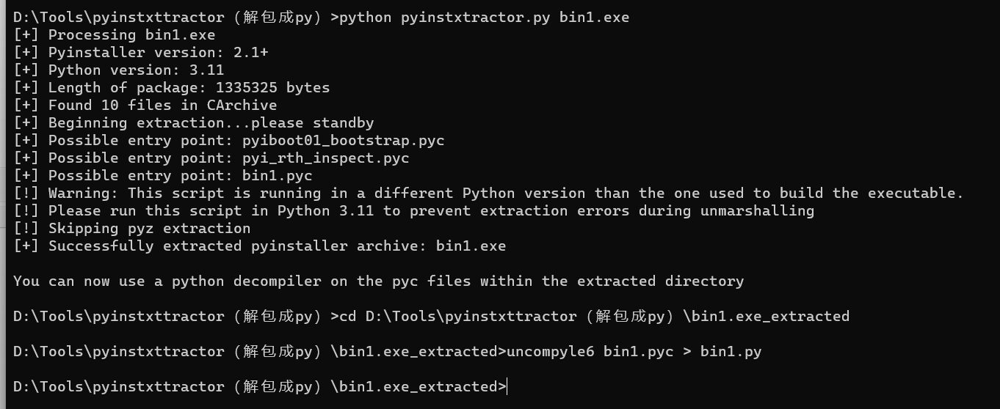

打开py文件

```python
Unknown magic number 3495 in bin1.pyc
```

这里注意到bin1.exe文件的python解释器是3.11版本，uncompyle6反汇编是python3.8及以下
因此需要找其他工具--pycdc [Python 反编译：pycdc工具的使用-CSDN博客](https://blog.csdn.net/qq_63585949/article/details/127080253)

配置好pycdc后反编译bin1.pyc文件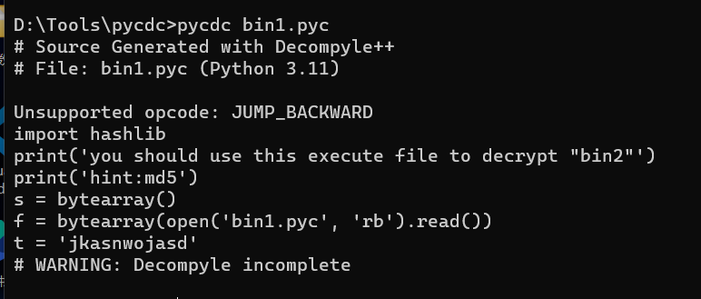

结果还是没有反汇编完全，但是提到了要用这个去解密bin2文件，提到了md5，给了一串数据
用pycdas打开bin1.pyc得到字节码

```apl
bin1.pyc (Python 3.11)
[Code]
    File Name: bin1.py
    Object Name: <module>
    Qualified Name: <module>
    Arg Count: 0
    Pos Only Arg Count: 0
    KW Only Arg Count: 0
    Stack Size: 10
    Flags: 0x00000000
    [Names]
        'hashlib'
        'print'
        'bytearray'
        's'
        'open'
        'read'
        'f'
        't'
        'range'
        'i'
        'ord'
        'len'
        'append'
        'md5'
        'bytes'
        'hexdigest'
        'md5_hash'
    [Locals+Names]
    [Constants]
        0
        None
        'you should use this execute file to decrypt "bin2"'
        'hint:md5'
        'bin1.pyc'
        'rb'
        'jkasnwojasd'
        15
        6
        256
    [Disassembly]
        0       RESUME                          0
        2       LOAD_CONST                      0: 0
        4       LOAD_CONST                      1: None
        6       IMPORT_NAME                     0: hashlib
        8       STORE_NAME                      0: hashlib
        10      PUSH_NULL
        12      LOAD_NAME                       1: print
        14      LOAD_CONST                      2: 'you should use this execute file to decrypt "bin2"'
        16      PRECALL                         1
        20      CALL                            1
        30      POP_TOP
        32      PUSH_NULL
        34      LOAD_NAME                       1: print
        36      LOAD_CONST                      3: 'hint:md5'
        38      PRECALL                         1
        42      CALL                            1
        52      POP_TOP
        54      PUSH_NULL
        56      LOAD_NAME                       2: bytearray
        58      PRECALL                         0
        62      CALL                            0
        72      STORE_NAME                      3: s
        74      PUSH_NULL
        76      LOAD_NAME                       2: bytearray
        78      PUSH_NULL
        80      LOAD_NAME                       4: open
        82      LOAD_CONST                      4: 'bin1.pyc'
        84      LOAD_CONST                      5: 'rb'
        86      PRECALL                         2
        90      CALL                            2
        100     LOAD_METHOD                     5: read
        122     PRECALL                         0
        126     CALL                            0
        136     PRECALL                         1
        140     CALL                            1
        150     STORE_NAME                      6: f
        152     LOAD_CONST                      6: 'jkasnwojasd'
        154     STORE_NAME                      7: t
        156     PUSH_NULL
        158     LOAD_NAME                       8: range
        160     LOAD_CONST                      0: 0
        162     LOAD_CONST                      7: 15
        164     PRECALL                         2
        168     CALL                            2
        178     GET_ITER
        180     FOR_ITER                        106 (to 394)
        182     STORE_NAME                      9: i
        184     LOAD_NAME                       6: f
        186     LOAD_NAME                       9: i
        188     BINARY_SUBSCR
        198     LOAD_NAME                       6: f
        200     LOAD_NAME                       9: i
        202     LOAD_CONST                      8: 6
        204     BINARY_OP                       6 (%)
        208     BINARY_SUBSCR
        218     BINARY_OP                       0 (+)
        222     PUSH_NULL
        224     LOAD_NAME                       10: ord
        226     LOAD_NAME                       7: t
        228     LOAD_NAME                       9: i
        230     LOAD_CONST                      8: 6
        232     BINARY_OP                       6 (%)
        236     BINARY_SUBSCR
        246     PRECALL                         1
        250     CALL                            1
        260     PUSH_NULL
        262     LOAD_NAME                       10: ord
        264     LOAD_NAME                       7: t
        266     LOAD_NAME                       9: i
        268     PUSH_NULL
        270     LOAD_NAME                       11: len
        272     LOAD_NAME                       7: t
        274     PRECALL                         1
        278     CALL                            1
        288     BINARY_OP                       6 (%)
        292     BINARY_SUBSCR
        302     PRECALL                         1
        306     CALL                            1
        316     BINARY_OP                       0 (+)
        320     BINARY_OP                       12 (^)
        324     LOAD_CONST                      9: 256
        326     BINARY_OP                       6 (%)
        330     LOAD_NAME                       6: f
        332     LOAD_NAME                       9: i
        334     STORE_SUBSCR
        338     LOAD_NAME                       3: s
        340     LOAD_METHOD                     12: append
        362     LOAD_NAME                       6: f
        364     LOAD_NAME                       9: i
        366     BINARY_SUBSCR
        376     PRECALL                         1
        380     CALL                            1
        390     POP_TOP
        392     JUMP_BACKWARD                   107 (to 180)
        394     PUSH_NULL
        396     LOAD_NAME                       1: print
        398     LOAD_NAME                       3: s
        400     PRECALL                         1
        404     CALL                            1
        414     POP_TOP
        416     PUSH_NULL
        418     LOAD_NAME                       0: hashlib
        420     LOAD_ATTR                       13: md5
        430     PUSH_NULL
        432     LOAD_NAME                       14: bytes
        434     LOAD_NAME                       3: s
        436     PRECALL                         1
        440     CALL                            1
        450     PRECALL                         1
        454     CALL                            1
        464     LOAD_METHOD                     15: hexdigest
        486     PRECALL                         0
        490     CALL                            0
        500     STORE_NAME                      16: md5_hash
        502     LOAD_CONST                      1: None
```

丢给AI得到：

```python
import hashlib

print('you should use this execute file to decrypt "bin2"')
print('hint:md5')
s = bytearray()
f = bytearray(open('bin1.pyc', 'rb').read())
t = 'jkasnwojasd'  # decompyle by hand
for i in range(0, 15):
    f[i] = (f[i] + f[i % 6] ^ ord(t[i % 6]) + ord(t[i % len(t)])) % 256
    s.append(f[i])
print(s)
md5_hash = hashlib.md5(bytes(s)).hexdigest()
print(md5_hash)

# a405b5d321e446459d8f9169d027bd92
```

 但是不知道用得到的数据应该如何与bin2操作，看了wp知道是异或（这个思路是guess的）
搓一个脚本：

```python
with open("bin2","rb") as file:
    realfile = file.read()
key = 'a405b5d321e446459d8f9169d027bd92'
result = bytearray()
for i in range(len(realfile)):
    result.append(realfile[i] ^ ord(key[i % len(key)]))

with open("out.txt","wb") as output_file:
    output_file.write(result)
```

得到的out.text文件打开，开头为MZ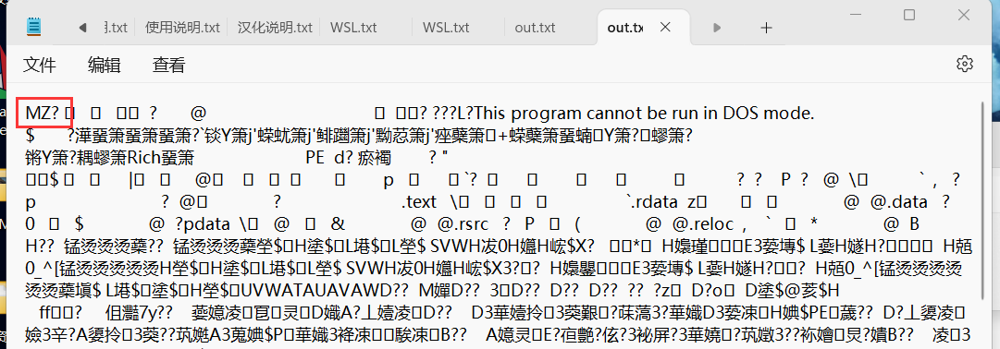

改为exe文件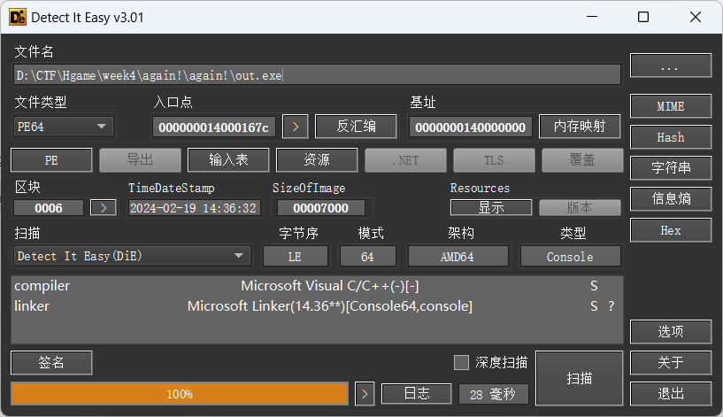
丢入IDA

```apl
int __cdecl main(int argc, const char **argv, const char **envp)
{
  __int64 v3; // rdx
  __int64 v4; // rcx
  __int64 v5; // rax
  int v7[6]; // [rsp+20h] [rbp-18h] BYREF

  sub_140001020("plz input your flag:");
  sub_140001080("%32s");
  v7[0] = 4660;
  v7[1] = 9025;
  v7[2] = 13330;
  v7[3] = 16675;
  sub_1400010E0(v4, v3, v7);
  v5 = 0i64;
  while ( dword_1400030A8[v5] == *(_DWORD *)((char *)&unk_140002290 + v5 * 4) )
  {
    if ( ++v5 >= 8 )
    {
      sub_140001020("Congratulations!");
      return 0;
    }
  }
  sub_140001020("Wrong!try again...");
  return 0;
}
```

分析过后能知道加密函数sub_1400010E0是魔改delta的xxtea加密
得到密钥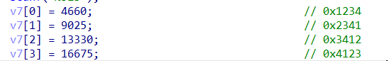

提取密文：

```python
cipher = [0xC3, 0xB5, 0x6F, 0x50, 0x45, 0x8F, 0x35, 0xB9, 0xC7, 0xE8, 0x1A, 0xC9, 0x80, 0xE2, 0x20, 0x38, 0x83, 0xBA, 0x3A, 0xD1, 0x54, 0xF5, 0x5C, 0x97, 0x6B, 0x03, 0x52, 0x43, 0x47, 0x04, 0xD2, 0x1C]
```

搓脚本得到：

```c
#define _CRT_SECURE_NO_WARNINGS 1
#include <stdio.h>
#include <stdint.h>
int key[] = {0x1234, 0x2341, 0x3412, 0x4123};
unsigned char right[] =
    {
        0xC3, 0xB5, 0x6F, 0x50, 0x45, 0x8F, 0x35, 0xB9, 0xC7, 0xE8,
        0x1A, 0xC9, 0x80, 0xE2, 0x20, 0x38, 0x83, 0xBA, 0x3A, 0xD1,
        0x54, 0xF5, 0x5C, 0x97, 0x6B, 0x03, 0x52, 0x43, 0x47, 0x04,
        0xD2, 0x1C};
void jiemi(unsigned int *right, unsigned int *key)
{
    int round = 12;
    unsigned int delta = 0x7937B99E;
    unsigned int sum = delta * 12; // 0xAE9CB368 进调试看
    do
    {
        right[7] -= ((sum ^ right[0]) + (right[6] ^ key[7 & 3 ^ ((sum >> 2) & 3)])) ^ (((16 * right[6]) ^ (right[0] >> 3)) + (((right[6] >> 5) ^ (4 * right[0]))));
        for (int i = 6; i > 0; i--)
        {
            right[i] -= ((sum ^ right[i + 1]) + (right[i - 1] ^ key[i & 3 ^ ((sum >> 2) & 3)])) ^ (((16 * right[i - 1]) ^ (right[i + 1] >> 3)) + (((right[i - 1] >> 5) ^ (4 * right[i + 1]))));
        }
        right[0] -= ((sum ^ right[1]) + (right[7] ^ key[0 & 3 ^ ((sum >> 2) & 3)])) ^
                    (((16 * right[7]) ^ (right[1] >> 3)) + (((right[7] >> 5) ^ (4 * right[1]))));
        sum -= delta;
        round--;
    } while (round);
}
int main()
{
    jiemi((unsigned int *)right, (unsigned int *)key);
    for (int i = 0; i < sizeof(right); i++)
        printf("%c", right[i]);
    return 0;
}

# hgame{btea_is_a_hard_encryption}
```

