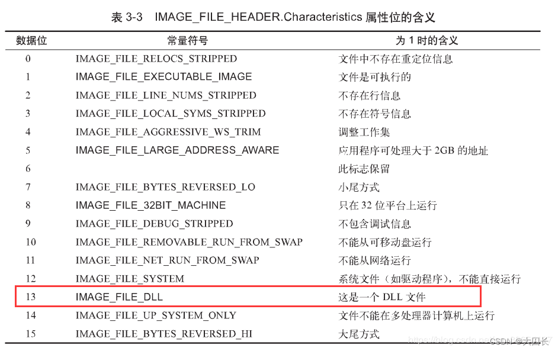
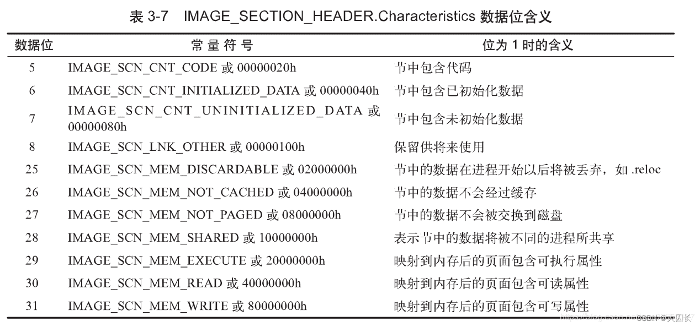
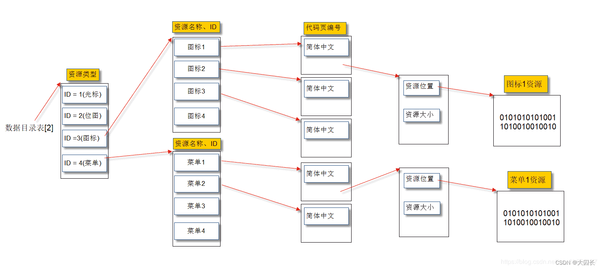
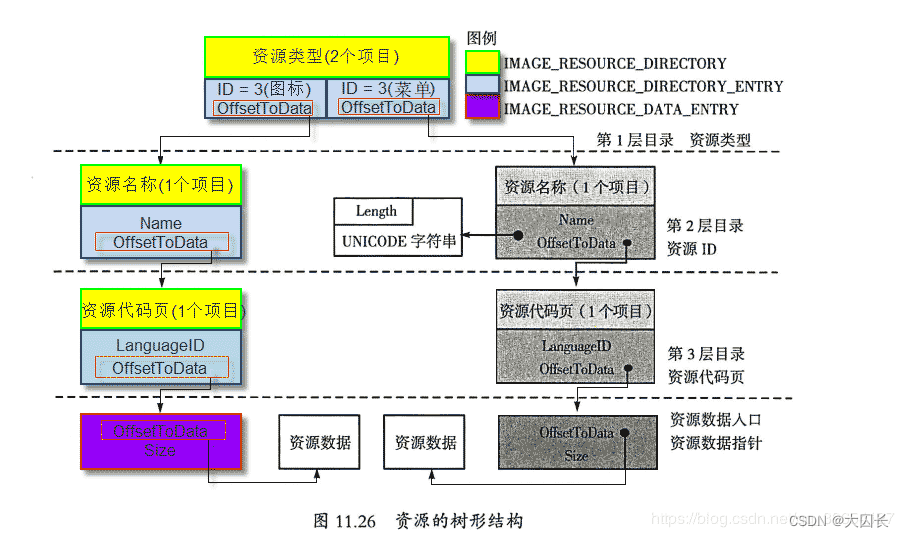
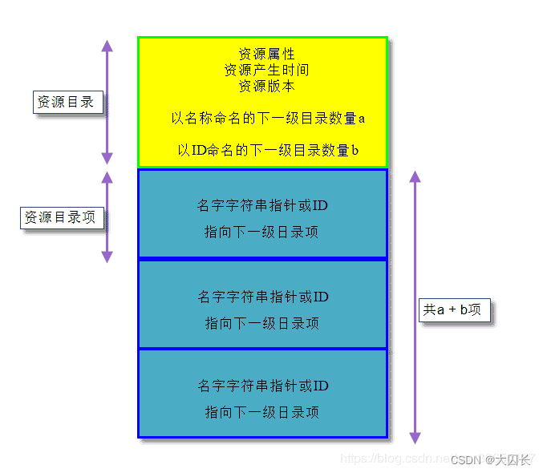
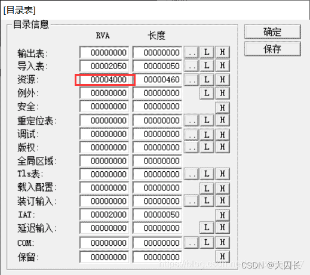
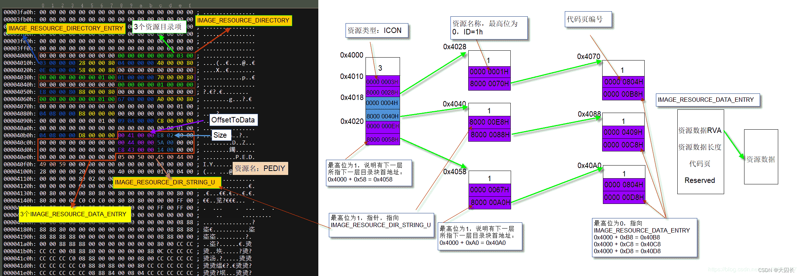
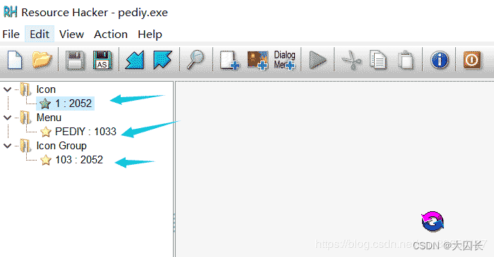

# 一、PE文件基础

## 1. 可执行文件

- Windows：PE(Portable Executable)
  - 意为可移植的可执行文件

- Linux：ELF(Executeable and Linking Format)
  - 意为可执行可链接格式

为方便学习，编译一个`Release`的32位PE程序


## 2. PE文件整体


这里将一个PE文件的主要部分列为4部分，这里可以先有模糊概念，后面会详细解释

“节”或“块”或”区块“都是一个意思,后文会穿插使用

下面从二进制层面整体把握其结构，看看一个PE文件的组成

## 3. PE文件特征

识别一个文件是不是PE文件不应该只看文件后缀名，还应该通过`PE指纹`

使用`010editor`打开上面编译好的程序


发现文件的头两个字节都是MZ，0x3C位置保存着一个地址，查该地址处发现保存着“PE”，这样基本可以认定改文件是一个PE文件

通过这些重要的信息（“MZ”和“PE”）验证文件是否为PE文件，这些信息即PE指纹。


## 4. PE文件到内存的映射

PE文件存储在磁盘时的结构和加载到内存后的结构有所不同。

当PE文件通过Windows加载器载入内存后，内存中的版本称为模块（Module）。

映射文件的起始地址称为模块句柄（hModule），也称为基地址（ImageBase）。

（模块句柄是不是和其他句柄不太一样呢？）

文件数据一般512字节（1扇区）对齐（现也多4k），32位内存一般4k（1页）对齐，512D = 200H，4096D = 1000H

文件中块的大小为200H的整数倍，内存中块的大小为1000H的整数倍，映射后实际数据的大小不变，多余部分可用0填充

PE文件头部（DOS头+PE头）到块表之间没有间隙，然而他们却和块之间有间隙，大小取决于对齐参数

VC编译器默认编译时，exe文件基地址是0x400000，DLL文件基地址是0x10000000

VA：虚拟内存地址

RVA：相对虚拟地址即相对于基地址的偏移地址

FOA: 文件偏移地址

## 5. DOS头

DOS MZ文件头实际是一个结构体（IMAGE_DOS_HEADER），占64字节


其中重要的部分就是上图框起来的

`4D 5A`是DOS签名，不可更改

`e_lfanew`指向PE头开始的地址

`DOS存根`指的是PE头开始地方到e_lfanew之间的地方，没有什么作用


## 6. PE文件头(PE Header)

PE文件头是一个结构体(IMAGE_NT_HEADERS32)，里面还包含两个其它结构体，占用4B + 20B + 224B

```c
typedef struct _IMAGE_NT_HEADERS {
  DWORD Signature;             // PE文件标识 4Bytes
  IMAGE_FILE_HEADER FileHeader;      // 40 Bytes
  IMAGE_OPTIONAL_HEADER32 OptionalHeader; // 224 Bytes  PE32可执行文件
} IMAGE_NT_HEADERS32, *PIMAGE_NT_HEADERS32;
```

Signature字段设置为0x00004550，ANCII码字符是“PE00”，标识PE文件头的开始，PE标识不能破坏

### 6.1 标准PE头(IMAGE_FILE_HEADER)

结构包含PE文件的一些基本信息


关注圈起来的部分

- NumberOfSections : 对应文件节区数，一眼看到文件有几个节区
- SizeOfptionalHeader : 对应扩展PE头的大小，一般32位是0xE0，64位是0xF0
- Characteristics : 文件属性，如下表



### 6.2 扩展PE头(IMAGE_OPTIONAL_HEADER)

是标准PE头的扩展，其大小由`标准PE头`的`SizeOfptionalHeader`决定，一般32位为0xE0，64位为0xF0


看起来很复杂，其实需要关注的也只有圈起来的哪些

- magic : 32位对应0x10，64位对应0x20
- AddressOfEntryPoint : 程序入口地址
- ImageBase : 内存镜像基地址
- FileAlignment : 文件对齐
- SectionAlignment : 内存对齐

还有最后一个数据目录表

DataDirectory[16]：数据目录表，由数个相同的IMAGE_DATA_DIRECTORY结构组成，

指向输出表、输入表、资源块，重定位表等（后面详解这里先跳过）

```c
typedef struct _IMAGE_DATA_DIRECTORY {
  DWORD  VirtualAddress;  //对应表的起始RVA
  DWORD  Size;       //对应表长度
} IMAGE_DATA_DIRECTORY, *PIMAGE_DATA_DIRECTORY;
```


## 7. 块表

块表是一个IMAGE_SECTION_HEADER的结构数组，每个IMAGE_SECTION_HEADER结构40字节。

每个IMAGE_SECTION_HEADER结构包含了它所关联的区块的信息，例如位置、长度、属性。

```c
#define IMAGE_SIZEOF_SHORT_NAME       8
  
typedef struct _IMAGE_SECTION_HEADER {
  BYTE  Name[IMAGE_SIZEOF_SHORT_NAME]; 
  //块名。多数块名以一个“.”开始（例如.text），这个“.”不是必需的
  union {
      DWORD  PhysicalAddress; //常用第二个字段
      DWORD  VirtualSize;   
      //加载到内存实际区块的大小（对齐前），为什么会变呢？可能是有时未初始化的全局变量不放bss段而是通过扩展这里
  } Misc;
  DWORD  VirtualAddress;  
  //该块装载到内存中的RVA（内存对齐后，数值总是SectionAlignment的整数倍）
  DWORD  SizeOfRawData;  
  //该块在文件中所占的空间(文件对齐后)，VirtualSize的值可能会比SizeOfRawData大 例如bss节（SizeOfRawData为0），data节（关键看未初始化的变量放哪）
  DWORD  PointerToRawData; //该块在文件中的偏移（FOA）
  DWORD  PointerToRelocations; //在“.obj”文件中使用，指向重定位表的指针
  DWORD  PointerToLinenumbers;
  WORD  NumberOfRelocations;  //重定位表的个数（在OBJ文件中使用）。
  WORD  NumberOfLinenumbers;
  DWORD  Characteristics; 
  //块的属性 该字段是一组指出块属性（例如代码/数据、可读/可写等）的标志
} IMAGE_SECTION_HEADER, *PIMAGE_SECTION_HEADER;
```

重要字段：Name[8]，VirtualSize，VirtualAddress，SizeOfRawData，PointerToRawData，Characteristics

IMAGE_FILE_HEADER的NumberOfSections字段是不是记录着当前文件的节数呢？

31C80H代表载入内存代码块对齐前大小；1000H代表代码块装载到内存RVA1000H；

31E00H代表文件对齐后代码块大小；400H代表代码块在文件中的偏移

60000020H代表代码块属性（‭0110 0000 0000 0000 0000 0000 0010 0000‬）查下表得到属性为可读可执行的代码



## **8、RVA与FOA的转换**

RVA：相对虚拟地址，FOA：文件偏移地址。

计算步骤：

① 计算RVA = 虚拟内存地址 - ImageBase

② 若RVA是否位于PE头：FOA == RVA

③ 判断RVA位于哪个节：

RVA >= 节.VirtualAddress (节在内存对齐后RVA )

RVA <= 节.VirtualAddress + 当前节内存对齐后的大小

偏移量 = RVA - 节.VirtualAddress；

④ FOA = 节.PointerToRawData + 偏移量；

应用举例：

有初始值的全局变量初始值会存储在PE文件中，想要修改文件中全局变量的数据值即

需要找到文件中存储全局变量值的地方，然后修改即可

# 二、输出表和输入表

可选PE头(扩展PE头)的最后一个字段DataDirectory[16]代表数据目录表，由16个相同的IMAGE_DATA_DIRECTORY结构组成，成员分别指向输出表、输入表、资源块等

```c
typedef struct _IMAGE_DATA_DIRECTORY {
  DWORD  VirtualAddress;  //对应表的起始RVA
  DWORD  Size;       //对应表大小（包含子表）
} IMAGE_DATA_DIRECTORY, *PIMAGE_DATA_DIRECTORY;
```

## 1、导出表

创建一个DLL时，实际上创建了一组能让EXE或其他DLL调用的函数

DLL文件通过输出表（Export Table）向系统提供输出函数名、序号和入口地址等信息。

数据目录表的第1个成员指向输出表。

特别说明：

① 如果文件对齐与内存对齐都是4k则不需要地址转换 

② 输出表大小是指输出表大小与其子表大小和

输出表实际是一个40字节的结构体（IMAGE_EXPORT_DIRECTORY），输出表的结构如下

```c
typedef struct _IMAGE_EXPORT_DIRECTORY {
  DWORD  Characteristics; //未定义，总是为0。
  DWORD  TimeDateStamp; //输出表创建的时间（GMT时间）
  WORD  MajorVersion;  //输出表的主版本号。未使用，设置为0。
  WORD  MinorVersion;  //输出表的次版本号。未使用，设置为0。
  DWORD  Name; 
  //指向一个ASCII字符串的RVA。这个字符串是与这些输出函数相关联的DLL的名字（例如"KERNEL32.DLL"）
  DWORD  Base; 
  //导出函数起始序号（基数）。当通过序数来查询一个输出函数时，这个值从序数里被减去，其结果将作为进入输出地址表（EAT）的索引
  DWORD  NumberOfFunctions; 
  //输出函数地址表（Export Address Table，EAT）中的条目数量（最大序号 - 最小序号）
  DWORD  NumberOfNames;   //输出函数名称表（Export Names Table，ENT）里的条目数量
  DWORD  AddressOfFunctions;   // EAT的RVA(输出函数地址表RVA)
  DWORD  AddressOfNames;     
  // ENT的RVA(输出函数名称表RVA)，每一个表成员指向ANCII字符串 表成员的排列顺序取决于字符串的排序 
  DWORD  AddressOfNameOrdinals; // 输出函数序号表RVA，每个表成员2字节
} IMAGE_EXPORT_DIRECTORY, *PIMAGE_EXPORT_DIRECTORY;
```

重要字段： Name，Base，NumberOfNames，AddressOfFunctions，AddressOfNames，AddressOfNameOrdinals

注意：输出序号表存放的是索引值而不是序号，真正的序号是Base+索引值

## 2、导入表

PE 文件映射到内存后，Windows 将相应的 DLL文件装入，EXE 文件通过“输入表”找到相应的 DLL 中的导入函数，从而完成程序的正常运行

数据目录表的第2个成员指向输入表。当前文件依赖几个模块就会有几张输入表且是连续排放的。

如何找到输入表？

输入表实际是个20字节的结构体 IMAGE_IMPORT_DESCRIPTOR

```c
typedef struct _IMAGE_IMPORT_DESCRIPTOR {
  union {
    DWORD  Characteristics;      // 0 for terminating null import descriptor
    DWORD  OriginalFirstThunk;     // RVA to original unbound IAT (PIMAGE_THUNK_DATA)
  } DUMMYUNIONNAME;
  DWORD  TimeDateStamp;         // 0 if not bound,
                      // -1 if bound, and real date\time stamp
                      //   in IMAGE_DIRECTORY_ENTRY_BOUND_IMPORT (new BIND)
                      // O.W. date/time stamp of DLL bound to (Old BIND)
  DWORD  ForwarderChain;         // -1 if no forwarders
  DWORD  Name;
  DWORD  FirstThunk;           // RVA to IAT (if bound this IAT has actual addresses)
} IMAGE_IMPORT_DESCRIPTOR;

```

重要字段：

Name：DLL（依赖模块）名字的指针。是一个以“00”结尾的ASCII字符的RVA地址。

OriginalFirstThunk：包含指向输入名称表（INT）的RVA。

```
  INT是一个IMAGE\_THUNK\_DATA结构的数组，数组中的每个IMAGE\_THUNK\_DATA结构都指向

  IMAGE\_IMPORT\_BY\_NAME结构，数组以一个内容为0的IMAGE\_THUNK\_DATA结构结束。
```

FirstThunk：包含指向输入地址表（IAT）的RVA。IAT是一个IMAGE_THUNK_DATA结构的数组。

IMAGE_THUNK_DATA结构实际只占4字节

```c
typedef struct _IMAGE_THUNK_DATA32 {
  union {
    DWORD ForwarderString;   // 指向一个转向者字符串的RVA
    DWORD Function;       // 被输入的函数的内存地址
    DWORD Ordinal;       // 被输入的API的序数
    DWORD AddressOfData;    // 指向IMAGE_IMPORT BY NAME
  } u1;
} IMAGE_THUNK_DATA32;
```

如果IMAGE_THUNK_DATA32的最高位为1，则低31位代表函数的导出序号，

否则4个字节是一个RVA，指向IMAGE_IMPORT_BY_NAME结构

IMAGE_IMPORT_BY_NAME结构字面仅有4个字节，存储了一个输入函数的相关信息

```c
typedef struct _IMAGE_IMPORT_BY_NAME {
  WORD  Hint;  // 输出函数地址表的索引（不是导出序号），（究竟是啥没试验，因为看的很多资料说是序号），不必须，链接器可能将其置0
  CHAR  Name[1]; // 函数名字字符串，以“\0”作为字符串结束标志，大小不确定
} IMAGE_IMPORT_BY_NAME, *PIMAGE_IMPORT_BY_NAME;
```

## **3、重定位表**

如果PE文件不在首选的地址（ImageBase）载入，那么文件中的每一个绝对地址都需要被修正。

需要修正的地址有很多，可以在文件中使用**重定位表**记录这些绝对地址的位置，在载入内存后若载入基地址与ImageBase不同再进行修正，若相同就不需要修正这些地址。

数据目录项的第6个结构，指向重定位表（Relocation Table）

重定位表由一个个的重定位块组成，每个块记录了4KB（一页）的内存中需要重定位的地址。

每个重定位数据块的大小必须以DWORD（4字节）对齐。它们以一个IMAGE_BASE_RELOCATION结构开始，格式如下

```c
typedef struct _IMAGE_BASE_RELOCATION {
  DWORD  VirtualAddress; //记录内存页的基址RVA 
  DWORD  SizeOfBlock;  //当前重定位块结构的大小。这个值减8就是TypeOffset数组的大小
   
  /*下面字段可加与不加*/
  /*数组每项大小为2字节。代表页内偏移，16位分为高4位和低12位。高4位代表重定位类型；
   低12位是重定位地址（12位就可以寻址4k），与VitualAddress相加就是一个完整RVA
   */
  //WORD  TypeOffset[1]; 
} IMAGE_BASE_RELOCATION;
typedef IMAGE_BASE_RELOCATION UNALIGNED * PIMAGE_BASE_RELOCATION;

```

这些字段可能直接不好理解

虽然有多种重定位类型，但对x86可执行文件来说，所有的基址重定位类型都是IMAGE_REL_BASED_HIGHLOW。

在一组重定位结束的地方会出现一个类型IMAGE_REL_BASED_ABSOLUTE的重定位，这些重定位什么都不做，只用于填充，以便下一个MAGE_BASE_RELOCATION按4字节分界线对齐。

对于IA-64可执行文件，重定位类型似乎总是IMAGE_REL_BASED_DIR64。

有趣的是，尽管IA-64的EXE页大小是8KB，但基址重定位仍是4KB的块

所有重定位块以一个VitualAddress字段为0的MAGE_BASE_RELOCATION结构结束。

```c
//
// Based relocation types.
//
  
#define IMAGE_REL_BASED_ABSOLUTE       0  // 没有具体含义，只是为了让每个段4字节对齐
#define IMAGE_REL_BASED_HIGH         1
#define IMAGE_REL_BASED_LOW          2
#define IMAGE_REL_BASED_HIGHLOW        3  // 重定位指向的整个地址都需要修正，实际上大部分情况下都是这样的
#define IMAGE_REL_BASED_HIGHADJ        4
#define IMAGE_REL_BASED_MACHINE_SPECIFIC_5  5
#define IMAGE_REL_BASED_RESERVED       6
#define IMAGE_REL_BASED_MACHINE_SPECIFIC_7  7
#define IMAGE_REL_BASED_MACHINE_SPECIFIC_8  8
#define IMAGE_REL_BASED_MACHINE_SPECIFIC_9  9
#define IMAGE_REL_BASED_DIR64         10  // 出现在64位PE文件中，对指向的整个地址进行修正

```

## **4、资源**

Windows程序的各种界面称为资源，包括加速键（Accelerator）、位图（Bitmap）、光标（Cursor）、对话框（Dialog Box）、图标（Icon）、菜单（Menu）、串表（String Table）、工具栏（Toolbar）和版本信息（Version Information）等。

定义资源时，既可以使用字符串作为名称来标识一个资源，也可以通过ID号来标识资源

**资源分类**

\- 标准资源类型


\- 非标准资源类型

若资源类型的高位如果为1，说明对应的资源类别是一个非标准的新类型

------

数据目录项的第3个结构，指向资源表，不直接指向资源数据，而是以磁盘目录形式定位资源数据



资源表是一个四层的二叉排序树结构。



每一个节点都是由**资源目录**结构和紧随其后的数个**资源目录项**结构组成的，

两种结构组成了一个**资源目录结构单元（目录块）**



资源目录结构（IMAGE_RESOURCE_DIRECTORY）占16字节，其定义如下

```c
typedef struct _IMAGE_RESOURCE_DIRECTORY {
  DWORD  Characteristics;  //理论上是资源的属性标志，但是通常为0
  DWORD  TimeDateStamp;   //资源建立的时间
  WORD  MajorVersion;   //理论上是放置资源的版本，但是通常为0
  WORD  MinorVersion;
  
  //定义资源时，既可以使用字符串作为名称来标识一个资源，也可以通过ID号来标识资源。资源目录项的数量等于两者之和。
  WORD  NumberOfNamedEntries; //以字符串命名的资源数量
  WORD  NumberOfIdEntries;  //以整型数字（ID）命名的资源数量
// IMAGE_RESOURCE_DIRECTORY_ENTRY DirectoryEntries[];
} IMAGE_RESOURCE_DIRECTORY, *PIMAGE_RESOURCE_DIRECTORY;

```

资源目录项结构（IMAGE_RESOURCE_DIRECTORY_ENTRY），占8字节，包含2个字段，结构定义如下。

```c
//如果看不懂下面的结构建议复习一下C中的union，struct，位域
typedef struct _IMAGE_RESOURCE_DIRECTORY_ENTRY {
  union {
    struct {
      DWORD NameOffset:31;
      DWORD NameIsString:1;
    } DUMMYSTRUCTNAME;
    DWORD  Name;
    WORD  Id;
  } DUMMYUNIONNAME;
  union {
    DWORD  OffsetToData;
    struct {
      DWORD  OffsetToDirectory:31;
      DWORD  DataIsDirectory:1;
    } DUMMYSTRUCTNAME2;
  } DUMMYUNIONNAME2;
} IMAGE_RESOURCE_DIRECTORY_ENTRY, *PIMAGE_RESOURCE_DIRECTORY_ENTRY;

```

重要字段：

Name字段：定义目录项的名称或ID。

```
 - 当结构用于第1层目录时，定义的是资源类型；

 - 当结构用于第2层目录时，定义的是资源的名称；

 - 当结构用于第3层目录时，定义的是代码页编号。

 - 当最高位为0时，表示字段的值作为ID使用；由该字段的低16位组成整数标识符ID

 - 当最高位为1时，表示字段的低位作为指针使用，资源名称字符串使用Unicode编码，

   这个指针不直接指向字符串，而指向一个IMAGE\_RESOURCE\_DIR\_STRING\_U结构。

```

```c
typedef struct _IMAGE_RESOURCE_DIR_STRING_U {
  WORD  Length;  //字符串的长度
  WCHAR  NameString[ 1 ]; //Unicode字符串，按字对齐，长度可变；由Length 指明 Unicode字符串的长度
} IMAGE_RESOURCE_DIR_STRING_U, *PIMAGE_RESOURCE_DIR_STRING_U;
```

OffsetToData字段：是一个指针。

```
 - 当最高位（位31）为1时，低位数据指向下一层目录块的起始地址；

 - 当最高位为0时，指针指向IMAGE\_RESOURCE\_DATA\_ENTRY结构。
```

第3层目录结构中的OffsetToData将指向IMAGE_RESOURCE_DATA_ENTRY结构。

该结构描述了资源数据的位置和大小，其定义如下。

````c
typedef struct _IMAGE_RESOURCE_DATA_ENTRY {
  DWORD  OffsetToData;  //资源数据的RVA
  DWORD  Size;      //资源数据的长度
  DWORD  CodePage;    //代码页，一般为0
  DWORD  Reserved;    //保留字段
} IMAGE_RESOURCE_DATA_ENTRY, *PIMAGE_RESOURCE_DATA_ENTRY;
````

重要字段：

OffsetToData：指向资源数据的指针（RVA）

Size：资源数据的长度

实例分析：

定位资源在文件中的位置



由于当前exe文件对齐与内存对齐都是4k，RVA不需要转FOA



所以：

图标的真正资源数据RVA为4100h，大小为2E8h。

菜单的真正资源数据RVA为4400h，大小为5Ah。

图标组的真正资源数据RVA为43E8h，大小为14h。

使用工具验证



可以清晰看到根目录有3个资源目录项（Icon，Menu，Icon Group）

第二层为资源ID或资源名称

第三层为代码页ID为2052表简体中文，1033表美国英语

右下角图标为真正资源数据