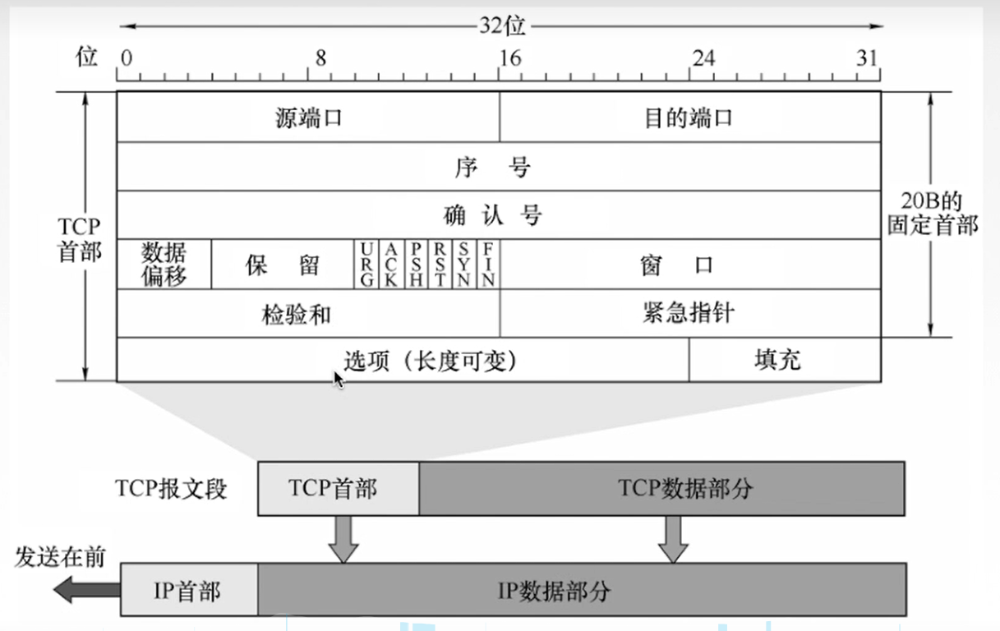
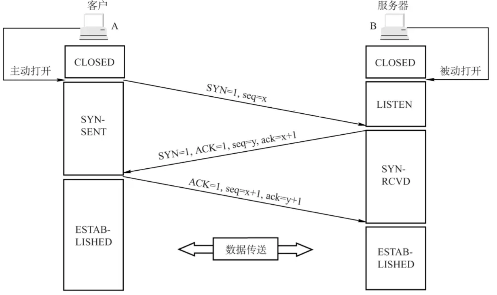
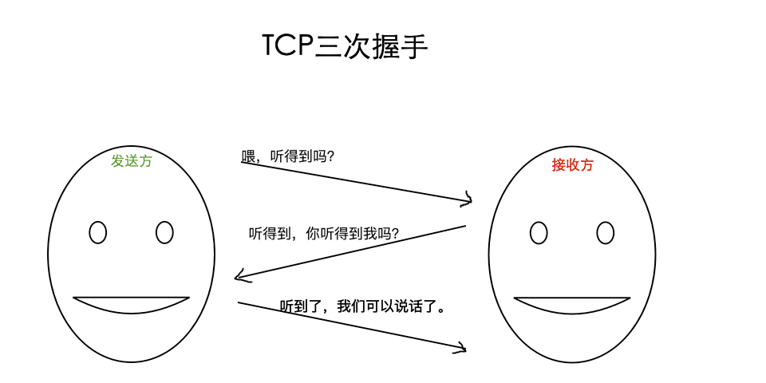

# TCP协议

**源端口和目的端口**：服务器的端口

**序列号**：解决TCP包乱序的问题，每发送一个包就累计加1

**确认应答号**：指下一次期望收到的序列号，发送端接收到确认应答号，就知道了之前的序列号都被接收，解决丢包问题

**ACK**：为1时，表示确认应答有效。TCP 规定除了最初建立连接时的 SYN 包之外该位必须设置为 1 。

**RST**：该位为 1 时，表示 TCP 连接中出现异常必须强制断开连接。

**SYN**：该位为 1 时，表示希望建立连接，并在其「序列号」的字段进行序列号初始值的设定。

**FIN**：该位为 1 时，表示今后不会再有数据发送，希望断开连接。当通信结束希望断开连接时，

**数据偏移（即首部长度）**：占 4 位，它指出 TCP 报文段的数据起始处距离 TCP 报文段的起始处有多远，也就是TCP首部的长度。

**窗口字段** ：占 2 字节，用来让对方设置发送窗口的依据，单位为字节，防止网路阻塞。

## TCP协议的三次握手：

1. 客户端首先连接服务器，发送SYN=1，seq=x，表示希望建立连接
2. 服务器接受了过后也会发送一个报文，SYN=1.seq=y，ack=x+1，表示自己接收到了报文，希望与客户端建立联系，并要求客户端发送ack报文
3. 客户端收到后发送ACK=1，seq=x+1，ack = y+1，连接建立。

ack的包是不需要确认收到的，如果第三步B没有收到，B应该重发第二部，这样A就知道了B没有收到自己的ACK报文

## 四次挥手：

1. 客户端发送FIN=1,seq=u 表示我要断开连接了，这里ACK不为1
2. 服务器接收到报文后，回复报文ACK =1,seq=v,ack = u+1，注意这里服务端还在发送数据，所以需要客户端回复收到了
3. 如果服务器没什么报文发送了，发送关闭报文,FIN=1，ACK=1，seq=w. ack=u+1
4. 客户端接收到消息后，并发送自己的ack报文后要等待2MSL(数据包在网络中存在的最大时间称为MSL，因为客户端发送ack的数据，如果服务器没有收到，服务器会重复的，一共就2次传输，最大需要这么久时间)，防止泄漏