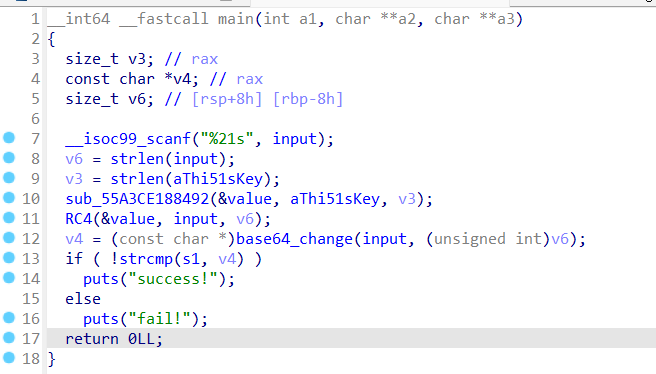
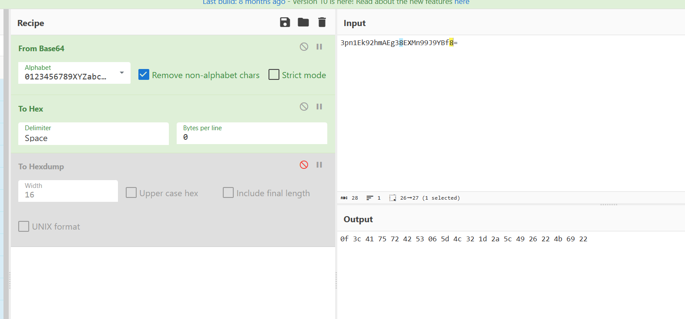
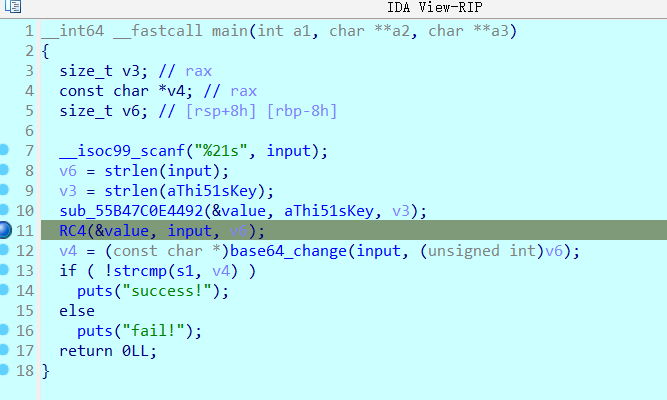
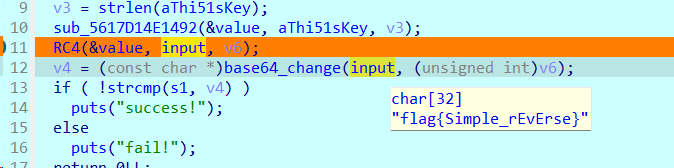
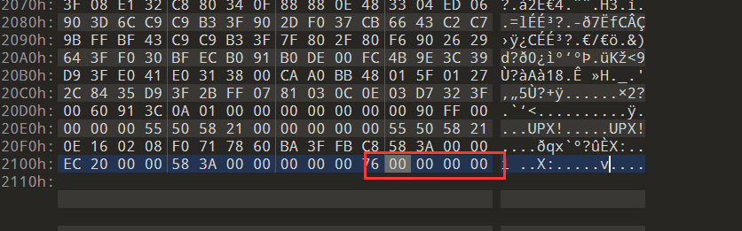
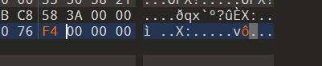
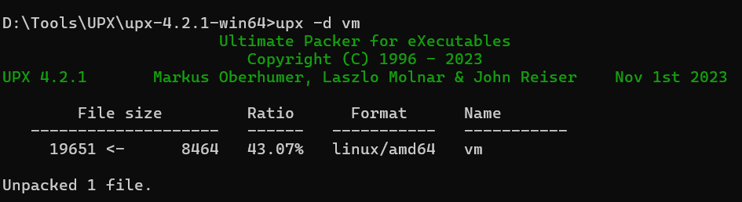
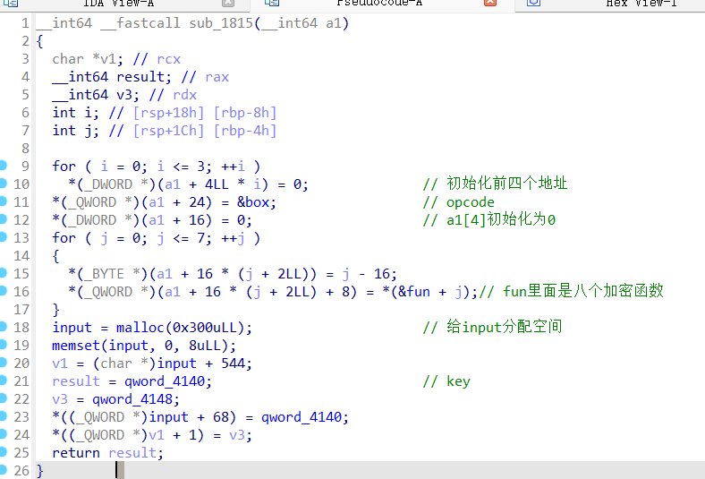
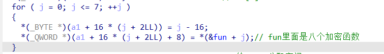

# ezre

- 首先打开题，找到main函数，简单分析发现有RC4加密以及变表base64加密
  

那么整道题围绕RC4进行

- 提取s1 = v4

```
3pn1Ek92hmAEg38EXMn99J9YBf8=
```

变表base64用厨子梭了


得到解密后的数据

```
0f3c4175724253065d4c321d2a5c4926224b6922
```



- 下断点进行调试，把刚刚的数据past data给input，再F8步过
  

得到flag


# vm？

DIE查询是有UPX壳的，UPX -d一键去壳没有成功(当时就卡开头了)

再次学习修改并去除魔改UPX壳[[原创\] UPX源码学习和简单修改-加壳脱壳-看雪-安全社区|安全招聘|kanxue.com](https://bbs.kanxue.com/thread-275753.htm#msg_header_h1_0)

再次010editor打开
这里overlay_offset值为p_info字段的文件偏移

改为F4 00 00 00就可以正常去壳了



找到main函数，审计可以得到

```apl
void __fastcall __noreturn main(int a1, char **a2, char **a3)
{
  __int64 v3[2]; // [rsp+0h] [rbp-10h] BYREF

  v3[1] = __readfsqword(0x28u);
  setvbuf(stdin, 0LL, 2, 0LL);
  setvbuf(stdout, 0LL, 2, 0LL);
  setvbuf(stderr, 0LL, 2, 0LL);                 // 初始化
  sub_19C9();                                   // print字符画
  v3[0] = 0LL;
  sub_1815((__int64)v3);                        // code
  printf("What's the flag? ");
  read(0, (char *)input + 512, 0x20uLL);        // scanf
  sub_1989(v3);
  sub_19E3();                                   // 校验flag
}
```

点开sub_1815

点开sub_1989


result == 0xF8这里0xF8是opcode的最后一位

这里分析出来opcode就是在box中储存，在fun中形成汇编语言进行加密

分析这段代码
上者在v3的地址4，6，8...18这八个位置存储了 -16，-15...，-9这几个值
下面的在v3地址5，7，9...19这八个位置存储了上面的八个函数

根据分析，在sub_1989函数里面的sub_1916函数用到了这十六个位置，条件就是如果这个result的值为*a1[3]（这个值就是box[0]是0xF0）的话返回v3奇数（函数）参数为a1，如果是其他值就返回v3偶数位

这时候使用动调得到了结论，box中的一条完整的指令是在 大于0xF0的机器码之间实现的，不同的0xF*就对应不同指令

继续动调，总结出八个函数对应指令

```apl
0xF0, 0xE0, 0x02, 0x00,
0xF0, 0xE0, 0x00, 0xE0, 0x02,
0xF0, 0xE1, 0xE0, 0x02, 0xE0, 0x02,
0xF0, 0xE0, 0x01, 0x10,
0xF2, 0xE0, 0x00, 0xE0, 0x01,   //F2:执行了 v1 = a1[0] % a1[1]
0xF1, 0xE0, 0x00, 0x20, 0x02,   //普通的F1:执行了((*(a1[3] + 4) << 8) + *(a1[3] + 3)) + *(a1 + v3);
0xF0, 0xE0, 0x00, 0xE1, 0xE0, 0x00, //长度为6的F0:两次E0判断，然后v3 = input[0] 
0xF0, 0xE0, 0x01, 0xE0, 0x02,   //长度为5的F0:a1[1] = a1[2]
0xF1, 0xE0, 0x01, 0x00, 0x01,    //F1翻译:a1[1] = 2 * a1[1]
0xF0, 0xE1, 0xE0, 0x01, 0xE0, 0x00,
0xF3, 0xE0, 0x02,               //F3:给寄存器a1[2]加1
0xF6, 0xE0, 0x02, 0x00, 0x01,   //F6:前者寄存器的值小于 256，那么就把a1[4]的值变成1
0xF7, 0x04,                     //循环跳转，如果没有大于256，那么就跳转到上面的第二行代码
 
0xF0, 0xE0, 0x02, 0x00,
0xF0, 0xE0, 0x03, 0x00,
0xF0, 0xE0, 0x00, 0xE1, 0xE0, 0x02, //循环跳转处
0xF1, 0xE0, 0x03, 0xE0, 0x00,  //遇到了0xE0的F1 :执行了*(a1 + *(a1[3] + 4)) + *(a1 + v3);
0xF0, 0xE0, 0x00, 0xE1, 0x02,
0xF1, 0xE0, 0x00, 0x00, 0x01,
0xF0, 0xE0, 0x00, 0xE1, 0xE0, 0x00,
0xF1, 0xE0, 0x03, 0xE0, 0x00,
0xF2, 0xE0, 0x03, 0x00, 0x01,
0xF0, 0xE0, 0x00, 0xE1, 0xE0, 0x02,
0xF0, 0xE0, 0x01, 0xE1, 0xE0, 0x03,
0xF0, 0xE1, 0xE0, 0x03, 0xE0, 0x00,
0xF0, 0xE1, 0xE0, 0x02, 0xE0, 0x01,
0xF3, 0xE0, 0x02,
0xF6, 0xE0, 0x02, 0x00, 0x01,   小于256
0xF7, 0x45,                //F7:结束之后跳转到到上面循环跳转处
 
0xF0, 0xE0, 0x02, 0x00,
0xF0, 0xE0, 0x03, 0x00,   //循环跳转处
0xF3, 0xE0, 0x02,
0xF2, 0xE0, 0x02, 0x00, 0x01,
0xF0, 0xE0, 0x00, 0xE1, 0xE0, 0x02,
0xF1, 0xE0, 0x03, 0xE0, 0x00,
0xF2, 0xE0, 0x03, 0x00, 0x01,
0xF0, 0xE0, 0x00, 0xE1, 0xE0, 0x02,
0xF0, 0xE0, 0x01, 0xE1, 0xE0, 0x03,
0xF0, 0xE1, 0xE0, 0x03, 0xE0, 0x00,
0xF0, 0xE1, 0xE0, 0x02, 0xE0, 0x01,
0xF1, 0xE0, 0x00, 0xE0, 0x01,
0xF2, 0xE0, 0x00, 0x00, 0x01,
0xF0, 0xE0, 0x00, 0xE1, 0xE0, 0x00,
0xF0, 0xE0, 0x01, 0xE0, 0x02,
0xF4, 0xE0, 0x01,                  //F4:让寄存器a1[1]减1
0xF1, 0xE0, 0x01, 0x00, 0x02,
0xF0, 0xE0, 0x01, 0xE1, 0xE0, 0x01,
0xF5, 0xE0, 0x00, 0xE0, 0x01,      //F5:异或操作 a1[0] ^= a1[1]
0xF1, 0xE0, 0x00, 0xE0, 0x02,      //这里是RC4魔改的地方，一般的RC4在最后的异或之后就会进行
0xF0, 0xE0, 0x01, 0xE0, 0x02,        下一次循环，这里还有别的操作。
0xF4, 0xE0, 0x01,
0xF1, 0xE0, 0x01, 0x00, 0x02,
0xF0, 0xE1, 0xE0, 0x01, 0xE0, 0x00,
0xF0, 0xE0, 0x01, 0xE0, 0x02,
0xF4, 0xE0, 0x01,
0xF6, 0xE0, 0x01, 0x20, 0x00,    //特殊的F6:这里是a1[1] < 0x20(36)就是我们的input长度
0xF7, 0x94,
 
0xF8,                              //结束指令
```

- F0 MOV
  F1 ADD
  F2 MOD取余
  F3 INC递加1
  F4 DEC递减1
  F5 XOR
  F6 CMP
  F7 JMP

翻译如下：(by [咸鱼渊Yuan](https://blog.csdn.net/xianyu_yuan))

```apl
0xF0, 0xE0, 0x02, 0x00,                mov a[2] 0
0xF0, 0xE0, 0x03, 0x00,   //循环跳转处  mov a[3] 0 新的寄存器
0xF3, 0xE0, 0x02,                      a[2] ++  //推断出a2就是循环加的i
0xF2, 0xE0, 0x02, 0x00, 0x01,          a[2] %= (256 + 0)  a3可能就是循环的j
0xF0, 0xE0, 0x00, 0xE1, 0xE0, 0x02,    a[0] = input[a[2]]        
0xF1, 0xE0, 0x03, 0xE0, 0x00,          a[3] += a[0] 
0xF2, 0xE0, 0x03, 0x00, 0x01,          a[3] %= (256 + 0)  
0xF0, 0xE0, 0x00, 0xE1, 0xE0, 0x02,    a[0] = input[a[2]]     交
0xF0, 0xE0, 0x01, 0xE1, 0xE0, 0x03,    a[1] = input[a[3]]     换
0xF0, 0xE1, 0xE0, 0x03, 0xE0, 0x00,    input[a[3]] = a[0]     函  input其实就是box的角色
0xF0, 0xE1, 0xE0, 0x02, 0xE0, 0x01,    input[a[2]] = a[1]     数
0xF1, 0xE0, 0x00, 0xE0, 0x01,          a[0] += a[1] 
0xF2, 0xE0, 0x00, 0x00, 0x01,          a[0] %= (256 + 0)
0xF0, 0xE0, 0x00, 0xE1, 0xE0, 0x00,    a[0] = input[a[0]]
0xF0, 0xE0, 0x01, 0xE0, 0x02,          a[1] = a[2]
0xF4, 0xE0, 0x01,                      a[1] --
0xF1, 0xE0, 0x01, 0x00, 0x02,          a[1] += 0x200 （512）
0xF0, 0xE0, 0x01, 0xE1, 0xE0, 0x01,    a[1] = input[a[1]]
下面是RC4异或加密部分:
0xF5, 0xE0, 0x00, 0xE0, 0x01,            a1[0] ^= a1[1]   a0貌似才是我们输入的数据
0xF1, 0xE0, 0x00, 0xE0, 0x02,            a1[0] += a1[2]   关键就是这里，他在这多了一步加密
0xF0, 0xE0, 0x01, 0xE0, 0x02, mov a1 a2  a1[1]  = a1[2]
0xF4, 0xE0, 0x01,               sub      a1[1]--
0xF1, 0xE0, 0x01, 0x00, 0x02,            a1[1] += 0x200 （512）
0xF0, 0xE1, 0xE0, 0x01, 0xE0, 0x00,      input[a1[1]] = a1[0]         属于i=6的mov
0xF0, 0xE0, 0x01, 0xE0, 0x02,            a1[1] = a1[2]    
0xF4, 0xE0, 0x01,               sub      a1[1]--
0xF6, 0xE0, 0x01, 0x20, 0x00,            a1[1] < 36    
0xF7, 0x94
```

魔改的RC4就是**a1[0] += a1[2]** 这一步的代码

加密的最后一步异或相当于**a1[0] = (a1[0] ^ a1[1]) + a1[2]**

提取出key和data

得到脚本:

```c
#include <stdio.h>
#include <string.h>

void rc4_init(unsigned char *s, unsigned char *key, unsigned long Len_k)
{
    int i = 0, j = 0;
    char k[256] = {0};
    unsigned char tmp = 0;
    for (i = 0; i < 256; i++)
    {
        s[i] = i;
        k[i] = key[i % Len_k];
    }
    for (i = 0; i < 256; i++)
    {
        j = (j + s[i] + k[i]) % 256;
        tmp = s[i];
        s[i] = s[j];
        s[j] = tmp;
    }
}

void rc4_crypt(unsigned char *Data, unsigned long Len_D, unsigned char *key, unsigned long Len_k) 
{
    unsigned char s[256];
    rc4_init(s, key, Len_k);
    int i = 0, j = 0, t = 0;
    unsigned long k = 0;
    unsigned char tmp;
    int cc;
    for (k = 0; k < Len_D; k++)
    {
        i = (i + 1) % 256;
        cc = (Data[k] - i);
        j = (j + s[i]) % 256;
        tmp = s[i];
        s[i] = s[j];
        s[j] = tmp;
        t = (s[i] + s[j]) % 256;
        Data[k] = cc ^ s[t];
    }
}
void main()
{
    unsigned char key[] = "This_1s_f1lLllag";
    unsigned long key_len = sizeof(key) - 1;
    unsigned char data[] = {0x56, 0x54, 0xD9, 0xB5, 0xF3, 0xB1, 0xFD, 0x67, 0x15, 0xEE, 0xB0, 0x68, 0xB7, 0x2B, 0x4A, 0x64,
                            0x10, 0x27, 0x52, 0xDE, 0x43, 0x26, 0x0F, 0x2A, 0x41, 0x30, 0x75, 0x30, 0x98, 0x9E, 0x79, 0x5E};
    rc4_crypt(data, sizeof(data), key, key_len);
    for (int i = 0; i < 32; i++)
    {
        printf("%c", data[i]);
    }
    return;
}

// flag{711df52879efbcb8964b6056d926ea35}
```

