# Reverse

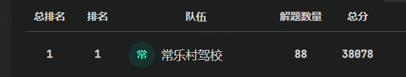

## 聪明的信使

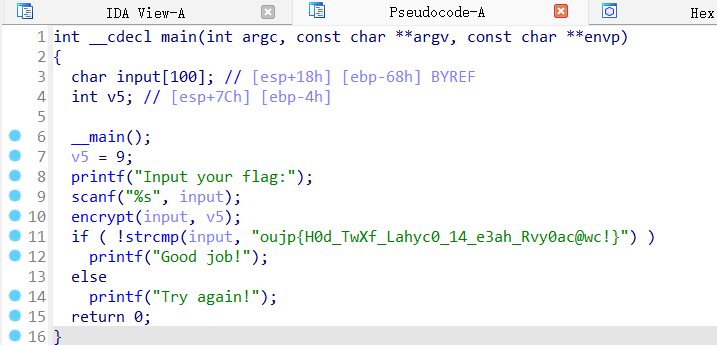
逻辑清晰，密文已知，加密只有encrypt函数

exp:

```python
cipher = 'oujp{H0d_TwXf_Lahyc0_14_e3ah_Rvy0ac@wc!}'
flag = ''

def encode(j):
    if 65 <= j <= 90:
        j = (j + 9 - 65) % 26 + 65
    elif 97 <= j <= 122:
        j = (j + 9 - 97) % 26 + 97
    return chr(j)
for i in range(len(cipher)):
    found = False
    for j in range(128):
        if encode(j) == cipher[i]:
            flag += chr(j)
            found = True
            break
    if not found:
        flag += cipher[i]

print(flag)

# flag{Y0u_KnOw_Crypt0_14_v3ry_Imp0rt@nt!}

```

## 喵喵喵的flag碎了一地

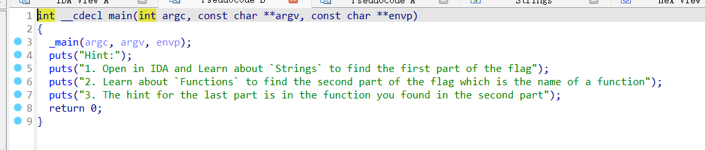

main函数给我提示去获得flag
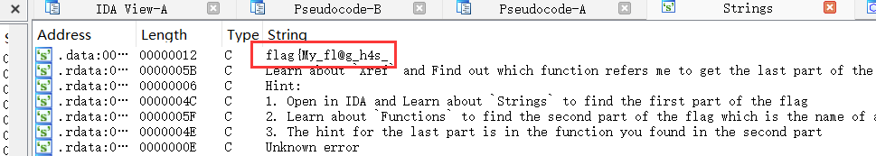

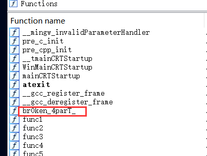

第三段让我找交叉引用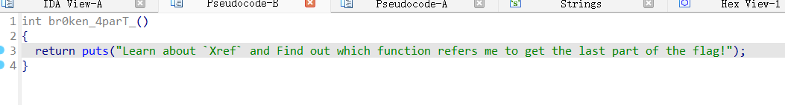

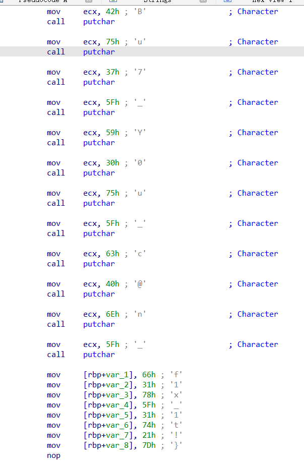

```python
 # flag{My_fl@g_h4s_br0ken_4parT_Bu7_Y0u_c@n_f1x_1t!}
```

## 你真的是大学生吗？

```apl
dseg:0000 0D                            unk_10000 db  0Dh                       ; DATA XREF: start+5↓o
dseg:0001 0A                            db  0Ah
dseg:0002 69                            db  69h ; i
dseg:0003 6E                            db  6Eh ; n
dseg:0004 70                            db  70h ; p
dseg:0005 75                            db  75h ; u
dseg:0006 74                            db  74h ; t
dseg:0007 20                            db  20h
dseg:0008 73                            db  73h ; s
dseg:0009 74                            db  74h ; t
dseg:000A 72                            db  72h ; r
dseg:000B 69                            db  69h ; i
dseg:000C 6E                            db  6Eh ; n
dseg:000D 67                            db  67h ; g
dseg:000E 3A                            db  3Ah ; :
dseg:000F 24                            db  24h ; $
dseg:0010 0D                            unk_10010 db  0Dh                       ; DATA XREF: start+15↓o
dseg:0011 0A                            db  0Ah
dseg:0012 24                            db  24h ; $
dseg:0013 0D                            unk_10013 db  0Dh                       ; DATA XREF: start+52↓o
dseg:0014 0A                            db  0Ah
dseg:0015 59                            db  59h ; Y
dseg:0016 65                            db  65h ; e
dseg:0017 73                            db  73h ; s
dseg:0018 24                            db  24h ; $
dseg:0019 76                            unk_10019 db  76h ; v                   ; DATA XREF: start+3D↓o
dseg:001A 0E                            db  0Eh
dseg:001B 77                            db  77h ; w
dseg:001C 14                            db  14h
dseg:001D 60                            db  60h ; `
dseg:001E 06                            db    6
dseg:001F 7D                            db  7Dh ; }
dseg:0020 04                            db    4
dseg:0021 6B                            db  6Bh ; k
dseg:0022 1E                            db  1Eh
dseg:0023 41                            db  41h ; A
dseg:0024 2A                            db  2Ah ; *
dseg:0025 44                            db  44h ; D
dseg:0026 2B                            db  2Bh ; +
dseg:0027 5C                            db  5Ch ; \
dseg:0028 03                            db    3
dseg:0029 3B                            db  3Bh ; ;
dseg:002A 0B                            db  0Bh
dseg:002B 33                            db  33h ; 3
dseg:002C 05                            db    5
dseg:002D 15                            unk_1002D db  15h                       ; DATA XREF: start+D↓o
dseg:002E 00                            byte_1002E db 0                         ; DATA XREF: start+21↓r
dseg:002F 00                            unk_1002F db    0                       ; DATA XREF: start+39↓o
dseg:0030 00                            db    0
dseg:0031 00                            db    0
dseg:0032 00                            db    0
dseg:0033 00                            db    0
dseg:0034 00                            db    0
dseg:0035 00                            db    0
dseg:0036 00                            db    0
dseg:0037 00                            db    0
dseg:0038 00                            db    0
dseg:0039 00                            db    0
dseg:003A 00                            db    0
dseg:003B 00                            db    0
dseg:003C 00                            db    0
dseg:003D 00                            db    0
dseg:003E 00                            db    0
dseg:003F 00                            db    0
dseg:0040 00                            db    0
dseg:0041 00                            db    0
dseg:0042 00                            db    0
dseg:0043 00                            db    0
dseg:0044 00                            db    0
dseg:0045 00                            db    0
dseg:0046 00                            db    0
dseg:0047 00                            db    0
dseg:0048 00                            db    0
dseg:0049 00                            db    0
dseg:004A 00                            db    0
dseg:004B 00                            db    0
dseg:004C 00                            db    0
dseg:004D 00                            db    0
dseg:004E 00                            db    0
dseg:004F 00                            db    0
dseg:004F                               dseg ends
dseg:004F
seg001:0000                               ; ===========================================================================
seg001:0000
seg001:0000                               ; Segment type: Pure code
seg001:0000                               seg001 segment byte public 'CODE' use16
seg001:0000                               assume cs:seg001
seg001:0000                               assume es:nothing, ss:dseg, ds:nothing, fs:nothing, gs:nothing
seg001:0000
seg001:0000                               ; =============== S U B R O U T I N E =======================================
seg001:0000
seg001:0000                               ; Attributes: noreturn
seg001:0000
seg001:0000                               public start
seg001:0000                               start proc near
seg001:0000 B8 00 10                      mov     ax, seg dseg
seg001:0003 8E D8                         mov     ds, ax
seg001:0005                               assume ds:dseg
seg001:0005 8D 16 00 00                   lea     dx, unk_10000
seg001:0009 B4 09                         mov     ah, 9
seg001:000B CD 21                         int     21h                             ; DOS - PRINT STRING
seg001:000B                                                                       ; DS:DX -> string terminated by "$"
seg001:000B
seg001:000D 8D 16 2D 00                   lea     dx, unk_1002D
seg001:0011 B4 0A                         mov     ah, 0Ah
seg001:0013 CD 21                         int     21h                             ; DOS - BUFFERED KEYBOARD INPUT
seg001:0013                                                                       ; DS:DX -> buffer
seg001:0013
seg001:0015 8D 16 10 00                   lea     dx, unk_10010
seg001:0019 B4 09                         mov     ah, 9
seg001:001B CD 21                         int     21h                             ; DOS - PRINT STRING
seg001:001B                                                                       ; DS:DX -> string terminated by "$"
seg001:001B
seg001:001D 33 C9                         xor     cx, cx
seg001:001F 33 C0                         xor     ax, ax
seg001:0021 8A 0E 2E 00                   mov     cl, byte_1002E
seg001:0025 BE 2F 00                      mov     si, 2Fh ; '/'
seg001:0028 8A 04                         mov     al, [si]
seg001:002A 03 F1                         add     si, cx
seg001:002A
seg001:002C
seg001:002C                               loc_1007C:                              ; CODE XREF: start+37↓j
seg001:002C 83 EE 01                      sub     si, 1
seg001:002F 30 04                         xor     [si], al
seg001:0031 8A 04                         mov     al, [si]
seg001:0033 49                            dec     cx
seg001:0034 83 F9 00                      cmp     cx, 0
seg001:0037 75 F3                         jnz     short loc_1007C
seg001:0037
seg001:0039 8D 36 2F 00                   lea     si, unk_1002F
seg001:003D 8D 3E 19 00                   lea     di, unk_10019
seg001:003D
seg001:0041
seg001:0041                               loc_10091:                              ; CODE XREF: start+50↓j
seg001:0041 8A 04                         mov     al, [si]
seg001:0043 8A 1D                         mov     bl, [di]
seg001:0045 83 C6 01                      add     si, 1
seg001:0048 47                            inc     di
seg001:0049 3A C3                         cmp     al, bl
seg001:004B 75 0D                         jnz     short loc_100AA
seg001:004B
seg001:004D 83 F9 00                      cmp     cx, 0
seg001:0050 75 EF                         jnz     short loc_10091
seg001:0050
seg001:0052 8D 16 13 00                   lea     dx, unk_10013
seg001:0056 B4 09                         mov     ah, 9
seg001:0058 CD 21                         int     21h                             ; DOS - PRINT STRING
seg001:0058                                                                       ; DS:DX -> string terminated by "$"
seg001:0058
seg001:005A
seg001:005A                               loc_100AA:                              ; CODE XREF: start+4B↑j
seg001:005A B4 4C                         mov     ah, 4Ch
seg001:005C CD 21                         int     21h                             ; DOS - 2+ - QUIT WITH EXIT CODE (EXIT)
seg001:005C                                                                       ; AL = exit code
seg001:005C
seg001:005C                               start endp
seg001:005C
seg001:005C                               seg001 ends
seg001:005C
seg001:005C
seg001:005C                               end start
```

没有找到其他方法，硬读汇编

start是获取input，对其加密(发生在loc_1007c)，通过将每一个字节与后一个字节进行异或运算来加密

```python
cipher = [0x76, 0x0E, 0x77, 0x14, 0x60, 0x06, 0x7D, 0x04, 0x6B, 0x1E, 0x41, 0x2A, 0x44, 0x2B, 0x5C, 0x03, 0x3B, 0x0B, 0x33, 0x05]
for i in range(len(cipher) - 1):
    cipher[i] = cipher[i] ^ cipher[i + 1]
flag = ''
for i in range(len(cipher)):
    if i != (len(cipher) - 1):
        flag += chr(cipher[i])
    else:
        flag += chr(cipher[i] ^ 0x15)
print(flag)
# xyctf{you_know_8086}
```

## DebugMe

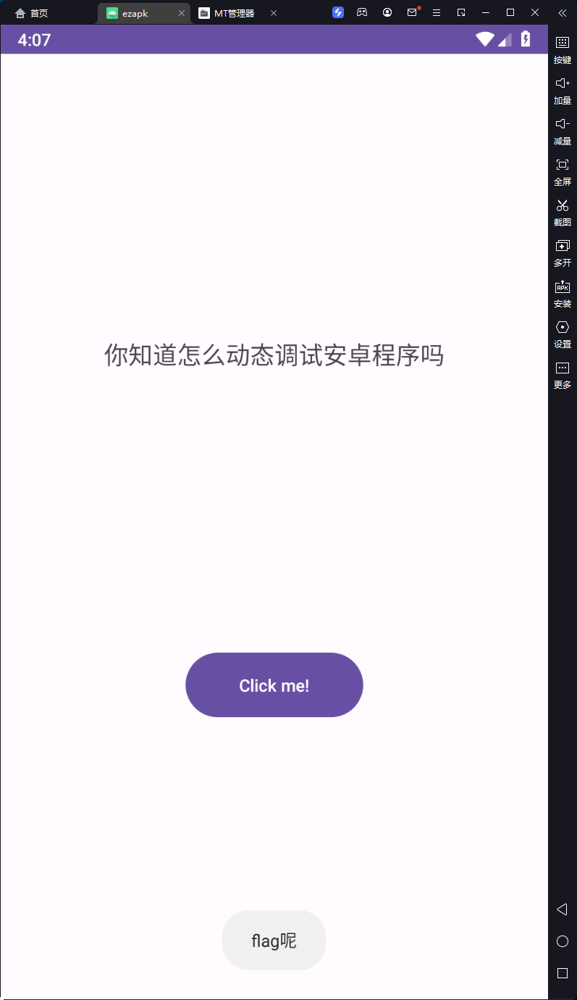

只告诉要动态调试，回显“flag呢”

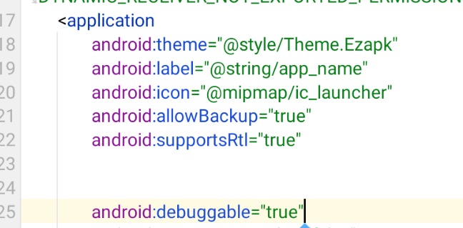

添加debug

找到包名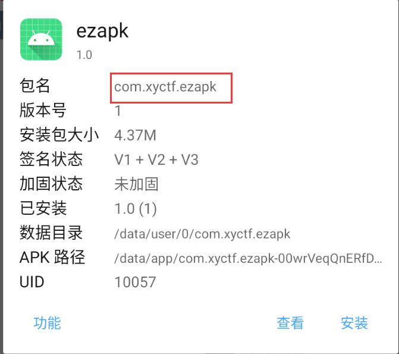

找到类名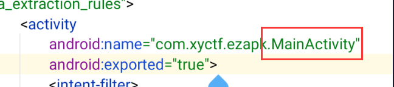

进行adb调试

jeb运行到调试结束处，得到flag
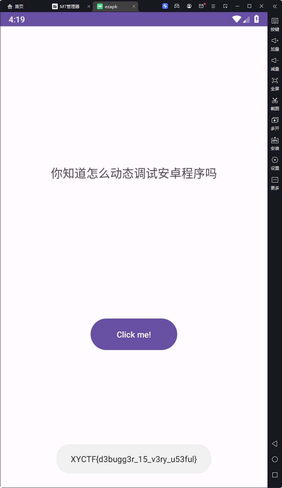

## trustme

参考文章：[adb连接MuMu、逍遥、夜神、雷电模拟器以及腾讯手游助手以及断开连接_雷电adb连接地址-CSDN博客](https://blog.csdn.net/L_fly_J/article/details/110948248)

```java
package com.swdd.trustme;

import android.os.Bundle;
import android.view.View;
import android.widget.TextView;
import android.widget.Toast;
import androidx.appcompat.app.AppCompatActivity;
import kotlin.UByte;

/* loaded from: classes.dex */
public class MainActivity extends AppCompatActivity {
    /* JADX INFO: Access modifiers changed from: protected */
    @Override // androidx.fragment.app.FragmentActivity, androidx.activity.ComponentActivity, androidx.core.app.ComponentActivity, android.app.Activity
    public void onCreate(Bundle bundle) {
        super.onCreate(bundle);
        setContentView(R.layout.activity_main);
    }

    public void onClick(View view) {
        ((TextView) findViewById(R.id.username)).getText().toString();
        if (bytesToHex(RC4(((TextView) findViewById(R.id.password)).getText().toString().getBytes(), "XYCTF".getBytes())).equals("5a3c46e0228b444decc7651c8a7ca93ba4cb35a46f7eb589bef4")) {
            Toast.makeText(this, "成功!", 0);
        }
    }

    public static byte[] RC4(byte[] bArr, byte[] bArr2) {
        int[] iArr = new int[256];
        byte[] bArr3 = new byte[256];
        byte[] bArr4 = new byte[bArr.length];
        for (int i = 0; i < 256; i++) {
            iArr[i] = i;
            bArr3[i] = bArr2[i % bArr2.length];
        }
        int i2 = 0;
        for (int i3 = 0; i3 < 256; i3++) {
            int i4 = iArr[i3];
            i2 = (i2 + i4 + bArr3[i3]) & 255;
            iArr[i3] = iArr[i2];
            iArr[i2] = i4;
        }
        int i5 = 0;
        for (int i6 = 0; i6 < bArr.length; i6++) {
            i5 = (i5 + 1) & 255;
            int i7 = iArr[i5];
            i2 = (i2 + i7) & 255;
            iArr[i5] = iArr[i2];
            iArr[i2] = i7;
            bArr4[i6] = (byte) (iArr[(iArr[i5] + i7) & 255] ^ bArr[i6]);
        }
        return bArr4;
    }

    public static String bytesToHex(byte[] bArr) {
        StringBuilder sb = new StringBuilder();
        for (byte b : bArr) {
            String hexString = Integer.toHexString(b & UByte.MAX_VALUE);
            if (hexString.length() == 1) {
                sb.append('0');
            }
            sb.append(hexString);
        }
        return sb.toString();
    }
}
```

MainActivity告诉了用户名的计算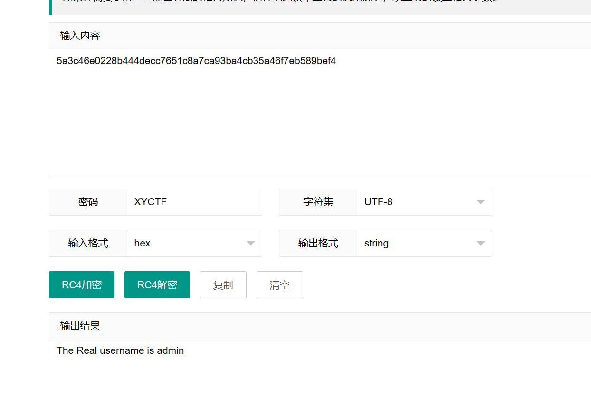

- 用户名：admin

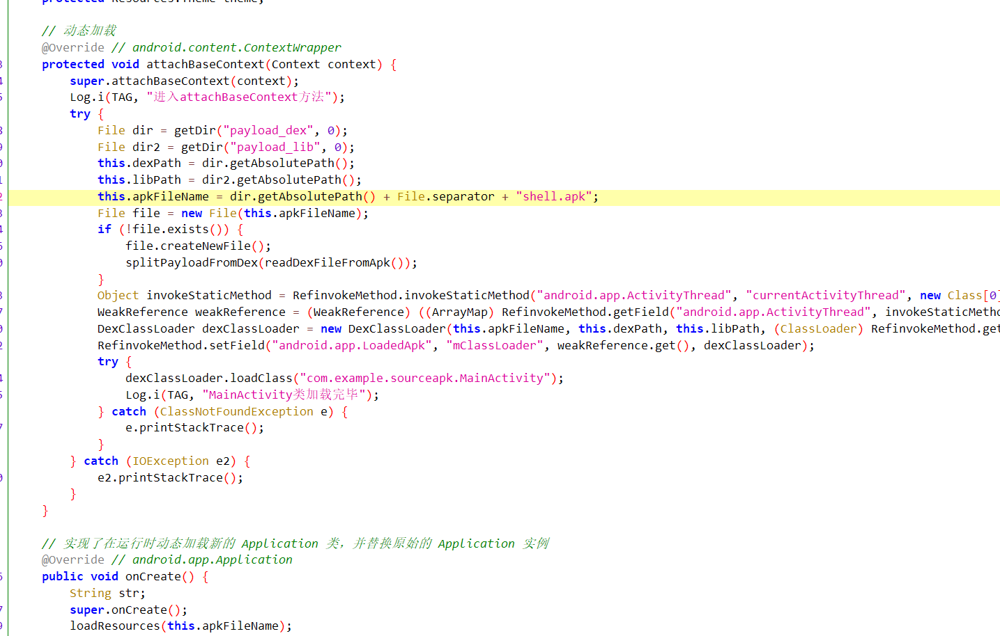

ProxyApplication方法则是利用java反射，将密文藏在shell.apk里
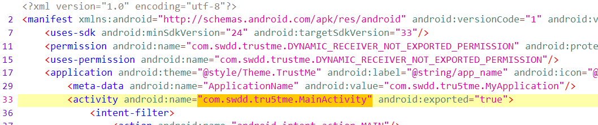

这里有藏着真正的方法路径

提shell.apk大概有两种思路：

1. MT管理器找
2. 连上手机，adb pull出来（没有测试机所以没搞）

数据是放在数据库的，直接找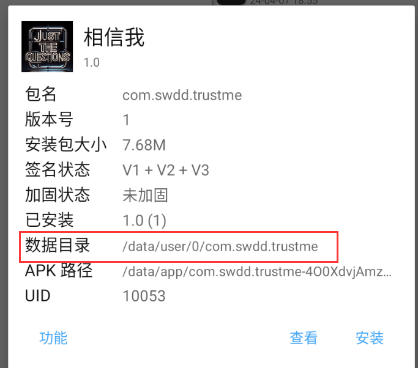

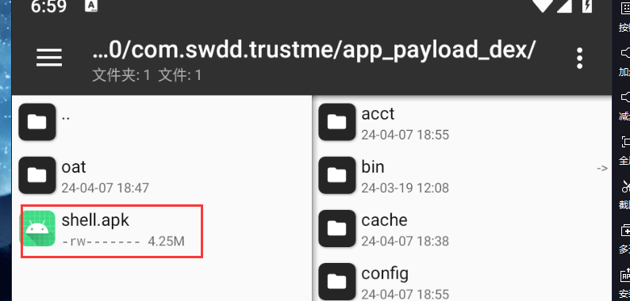

安装下来，丢进jadx分析，找到真正的“密文”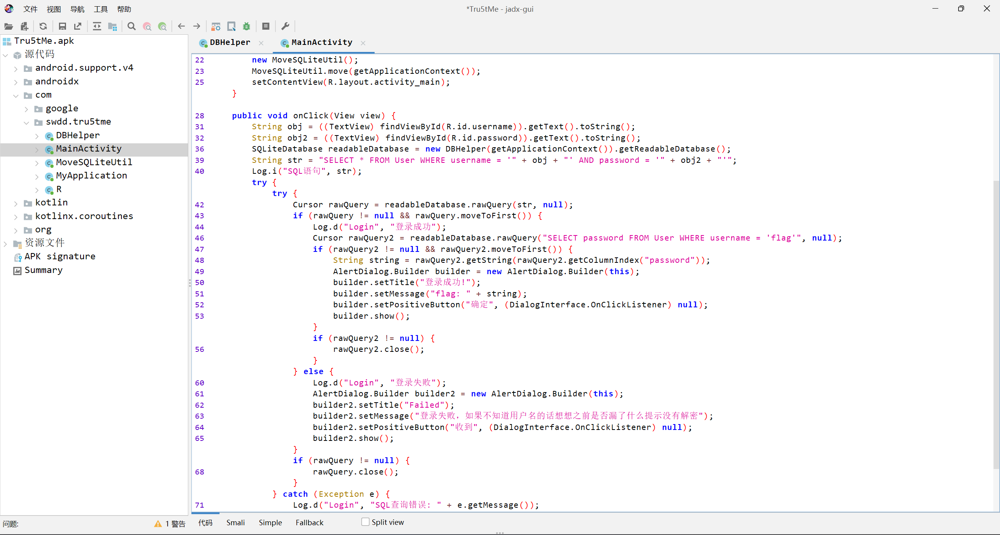

这里的意思是密码和flag数据在database数据库里，账号密码输入正确则回显flag出来
有两种解法：

(一)连接手机，利用**"SELECT password FROM User WHERE username = 'flag'"**frida提出flag
exp：

```js
function hookFunctionWithWihit(className, allowFunction) {
    Java.perform(function () {
        // 指定要hook的类名
        var targetClassName = className;
        if (allowFunction == null) {
            return;
        }
        console.log(targetClassName)
        // 获取类的引用
        var targetClass = Java.use(targetClassName);
        // 获取目标类的构造函数
        // var constructors = targetClass.$init.overloads;
        // 遍历类的所有声明方法
        var methods = targetClass.class.getDeclaredMethods();
        for (var i = 0; i < methods.length; i++) {
            var method = methods[i];

            // console.log(method)
            if (!allowFunction.includes(method.getName())) {
                continue;
            }
            // 对每个方法进行hook
            hookMethod(targetClass, method);
            // console.log("hook targetClass", targetClass, "的方法:", method)
        }
    });
}
// 函数用于hook一个方法
function hookMethod(targetClass, method, arg) {
    // 获取方法名和参数类型
    var methodName = method.getName();
    // Hook方法
    var overloadCount = targetClass[methodName].overloads.length;


    // 对每个重载进行Hook
    for (var k = 0; k < overloadCount; k++) {
        targetClass[methodName].overloads[k].implementation = function () {
            var result = this[methodName].apply(this, arguments);
            if (("" + targetClass).includes("android.database.sqlite.SQLiteOpenHelper")) {
                var rawQuery2 = result.rawQuery("SELECT password FROM User WHERE username = 'flag'", null)
                rawQuery2.moveToFirst()
                console.log(rawQuery2.getString(0))
            }
            return result;
        };
    }
}

var delayTime = 500;
// 延迟执行hook操作
setTimeout(function () {
    hookFunctionWithWihit("android.database.sqlite.SQLiteOpenHelper", ["getReadableDatabase"])

}, 500);
setTimeout(function () {

    // hookFunctionWithWihit("android.util.Base64", ["encode"]);
}, 30000)
```

（二）MT管理器直接找

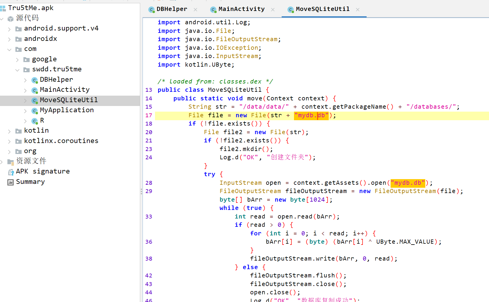

下面的方法有提供找数据库的路径，直接MT管理器一把梭：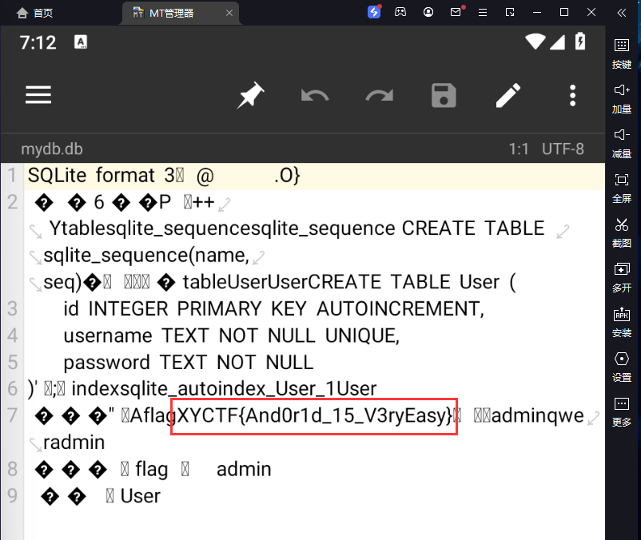

同时也得到密码：qweradmin

## ez_cube

```c
__int64 sub_7FF629032930()
{
  int i; // [rsp+44h] [rbp+24h]
  char input_steps; // [rsp+64h] [rbp+44h]
  int v3; // [rsp+84h] [rbp+64h]

  sub_7FF629031384((__int64)&unk_7FF6290440A2);
  for ( i = 0; i < 9; ++i )                     // 初始化cube
  {
    surface1[i] = &Red;
    surface2[i] = "Blue";
    surface3[i] = "Green";
    surface4[i] = "Orange";
    surface5[i] = "Yellow";
    surface6[i] = "White";
  }
  surface2[1] = &Red;
  surface1[1] = "Green";
  surface3[1] = "Blue";
  while ( 1 )
  {
    do
      input_steps = getchar();
    while ( input_steps == 10 );                // 读取回车就下一步
    switch ( input_steps )
    {
      case 'R':
        sub_7FF629031375();
        break;
      case 'U':
        sub_7FF6290313BB();
        break;
      case 'r':
        sub_7FF629031366();
        break;
      case 'u':
        sub_7FF62903115E();
        break;
    }
    ++steps;
    v3 = cmp();
    if ( v3 == 1 )
      break;
    if ( v3 == 2 )
      goto LABEL_19;
  }
  printf(aGreatYouAreAGo);
LABEL_19:
  system("pause");
  return 0i64;
}
```

魔方题，先找线索：（每一面的数字代表每一块颜色）

```
7FF62903CC24h 红色   1(正面)

7FF62903CC28h 蓝色   2

7FF62903CC30h 绿色   3

7FF62903CC38h 橙色   4

7FF62903CC40h 黄色   5

7FF62903CC48h 白色   6
```

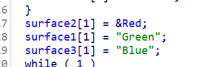

进行魔方打乱：
蓝色（2）面第一排第二个变成红色
红色（1）面第一排第二个变成绿色
绿色（3）面第一排第二个变成蓝色

分析RUru步骤：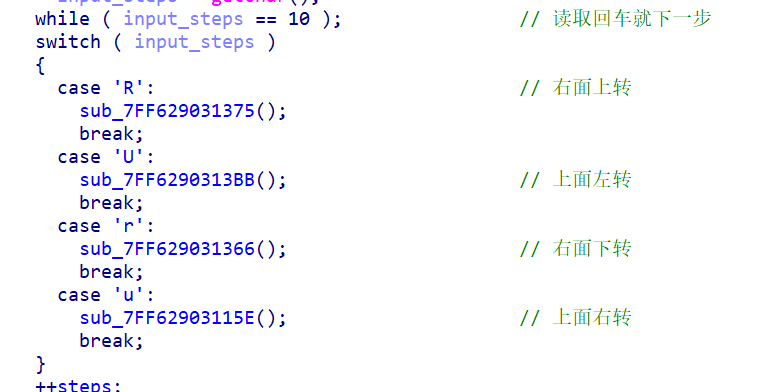

cmp函数是验证是否复原，以及复原步骤是否<=12

拿魔方手操：RuRURURuruRR

## 今夕是何年

这道题没什么难点，就是先认出是龙芯架构下运行的文件，用qemu配置龙芯系统

用die查了是ELF文件，然后ubuntu运行

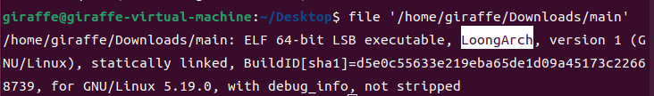

配置龙芯架构，跑一遍就出[小白也能懂之如何在自己的Windows电脑上使用QEMU虚拟机启动龙芯Loongnix系统的操作办法_龙芯qemu-CSDN博客](https://blog.csdn.net/clancy_pinkie/article/details/135250263)

## baby unity

不一样的unity引擎，正常是moon架构，找得到Assembly-Csharp直接逆，这题是il2cpp架构，根据提示

通过https://github.com/Perfare/Il2CppDumper/下载工具

说明里面提到的命令行格式为：

```
Il2CppDumper.exe executable-file  global-metadata  output-directory
```

but dump失败

发现三个dll文件都有upx壳，将GameAssembly.dll脱壳

直接使用下载好的工具里面的Il2CppDumper.exe打开
在下载的题目的路径里面依次选中GameAssembly.dll以及"\baby unity_Data\il2cpp_data\Metadata\global-metadata.dat"

运行成功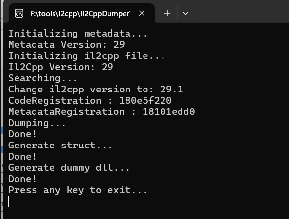

dump出Dummydll文件和output文件

使用dnspy打开Dummydll / Assembly-Csharp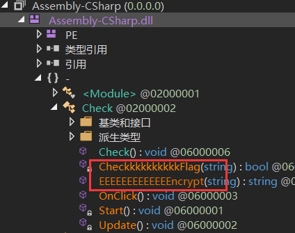

找到关键函数名称
IDA打开GameAssembly.dll
使用script file 导入文件，导入工具里的ida_py3 和 output的script.json

找到对应的两个函数，分析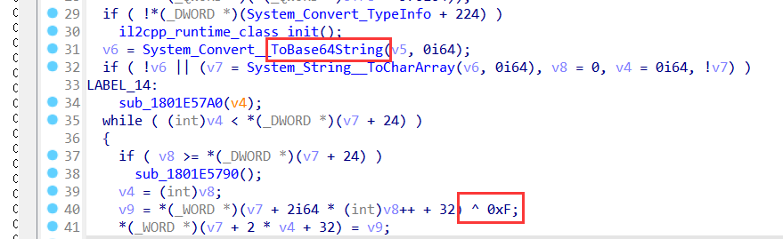

其实只进行了这两段加密

exp:

```python
import base64

cipher = "XIcKYJU8Buh:UeV:BKN{U[JvUL??VuZ?CXJ;AX^{Ae]gA[]gUecb@K]ei^22"

decoded_bytes = bytes([char ^ 0xF for char in cipher.encode()])

decoded_string = base64.b64decode(decoded_bytes).decode()

print(decoded_string)
# XYCTF{389f6900-e12d-4c54-a85d-64a54af9f84c}
```

## ez_rand

```c
int __cdecl main(int argc, const char **argv, const char **envp)
{
  unsigned __int64 v3; // rbx
  unsigned __int16 v4; // ax
  int v5; // edi
  __int64 v6; // rsi
  int v7; // eax
  int cipher[7]; // [rsp+20h] [rbp-50h]
  char cipher7; // [rsp+3Ch] [rbp-34h]
  __int16 v11; // [rsp+3Dh] [rbp-33h]
  __int128 input; // [rsp+40h] [rbp-30h]
  __int64 v13; // [rsp+50h] [rbp-20h]
  int v14; // [rsp+58h] [rbp-18h]
  __int16 v15; // [rsp+5Ch] [rbp-14h]
  char v16; // [rsp+5Eh] [rbp-12h]

  v13 = 0i64;
  input = 0i64;
  v14 = 0;
  v15 = 0;
  v16 = 0;
  printf((char *)&Flag_);
  scanf("%s");
  cipher[0] = 0xEA6C0C5D;
  v11 = 0;
  v3 = -1i64;
  cipher[1] = 0x34FC1946;
  cipher[2] = 0x72362B2;
  cipher[3] = 0xFB6E2262;
  cipher[4] = 0xA9F2E8B4;
  cipher[5] = 0x86211291;
  cipher[6] = 0x43E98EDB;
  cipher7 = 0x4D;
  do
    ++v3;
  while ( *((_BYTE *)&input + v3) );
  v4 = time64(0i64);
  srand(v4);
  v5 = 0;
  if ( v3 )
  {
    v6 = 0i64;
    do
    {
      v7 = rand();
      if ( (*((_BYTE *)&input + v6) ^ (unsigned __int8)(v7
                                                      + ((((unsigned __int64)(2155905153i64 * v7) >> 32) & 0x80000000) != 0i64)
                                                      + ((int)((unsigned __int64)(2155905153i64 * v7) >> 32) >> 7))) != *((_BYTE *)cipher + v6) )
      {
        printf("Error???\n");
        exit(0);
      }
      ++v5;
      ++v6;
    }
    while ( v5 < v3 );
  }
  printf("Right???\n");
  system("pause");
  return 0;
}
```

v4是种子，srand函数和rand函数根据种子来生成随机数，input加密逻辑使用v7
那么首先想到的是爆破种子，来推flag

再看v4，**unsigned __int16 v4**无符号16位整数型，v4范围为0~2**16-1(65535)，结合flag固定格式XYCTF{}

exp：

```c
#include <stdio.h>
#include <string.h>
#include <stdlib.h>
#include <time.h>

int containsXYCTF(const char *str)
{
    if (strstr(str, "XYCTF") != NULL)
    {
        return 1; // 包含"XYCTF"
    }
    else
    {
        return 0; // 不包含"XYCTF"
    }
}

int main()
{
    unsigned char cipher[29] = {0x5D, 0x0C, 0x6C, 0xEA, 0x46, 0x19, 0xFC, 0x34, 0xB2, 0x62, 0x23, 0x07, 0x62, 0x22, 0x6E, 0xFB, 0xB4, 0xE8, 0xF2, 0xA9, 0x91, 0x12, 0x21, 0x86, 0xDB, 0x8E, 0xE9, 0x43, 0x4D};
    unsigned int v7;
    char flag[29] = {0};

    for (unsigned int seed = 0; seed < 65536; seed++)
    {
        srand(seed);
        for (int i = 0; i < 29; i++)
        {
            v7 = rand();
            int num = (int)((unsigned __int64)(2155905153 * v7) >> 32);
            unsigned __int8 data = (unsigned __int8)(v7 + ((num & 0x80000000) != 0) + (num >> 7));
            flag[i] = cipher[i] ^ data;
        }
        if (containsXYCTF(flag))
        {
            printf("success\n");
            printf("seed = %d\n", seed);
            puts(flag);
        }
    }
}
// seed = 21308
// XYCTF{R@nd_1s_S0_S0_S0_easy!}
```

## 何须相思煮余年

打开是一堆十六进制数据和cipher

写个脚本将十六进制数据转化为二进制数据，然后写入二进制文件
再将输出的文件丢进IDA

```python
hex_data = "0x55 0x8b 0xec 0x81 0xec 0xa8 0x0 0x0 0x0 0xa1 0x0 0x40 0x41 0x0 0x33 0xc5 0x89 0x45 0xfc 0x68 0x9c 0x0 0x0 0x0 0x6a 0x0 0x8d 0x85 0x60 0xff 0xff 0xff 0x50 0xe8 0x7a 0xc 0x0 0x0 0x83 0xc4 0xc 0xc7 0x85 0x58 0xff 0xff 0xff 0x27 0x0 0x0 0x0 0xc7 0x85 0x5c 0xff 0xff 0xff 0x0 0x0 0x0 0x0 0xeb 0xf 0x8b 0x8d 0x5c 0xff 0xff 0xff 0x83 0xc1 0x1 0x89 0x8d 0x5c 0xff 0xff 0xff 0x83 0xbd 0x5c 0xff 0xff 0xff 0x27 0xf 0x8d 0xed 0x0 0x0 0x0 0x8b 0x95 0x5c 0xff 0xff 0xff 0x81 0xe2 0x3 0x0 0x0 0x80 0x79 0x5 0x4a 0x83 0xca 0xfc 0x42 0x85 0xd2 0x75 0x25 0x8b 0x85 0x5c 0xff 0xff 0xff 0x8b 0x8c 0x85 0x60 0xff 0xff 0xff 0x3 0x8d 0x5c 0xff 0xff 0xff 0x8b 0x95 0x5c 0xff 0xff 0xff 0x89 0x8c 0x95 0x60 0xff 0xff 0xff 0xe9 0xac 0x0 0x0 0x0 0x8b 0x85 0x5c 0xff 0xff 0xff 0x25 0x3 0x0 0x0 0x80 0x79 0x5 0x48 0x83 0xc8 0xfc 0x40 0x83 0xf8 0x1 0x75 0x22 0x8b 0x8d 0x5c 0xff 0xff 0xff 0x8b 0x94 0x8d 0x60 0xff 0xff 0xff 0x2b 0x95 0x5c 0xff 0xff 0xff 0x8b 0x85 0x5c 0xff 0xff 0xff 0x89 0x94 0x85 0x60 0xff 0xff 0xff 0xeb 0x73 0x8b 0x8d 0x5c 0xff 0xff 0xff 0x81 0xe1 0x3 0x0 0x0 0x80 0x79 0x5 0x49 0x83 0xc9 0xfc 0x41 0x83 0xf9 0x2 0x75 0x23 0x8b 0x95 0x5c 0xff 0xff 0xff 0x8b 0x84 0x95 0x60 0xff 0xff 0xff 0xf 0xaf 0x85 0x5c 0xff 0xff 0xff 0x8b 0x8d 0x5c 0xff 0xff 0xff 0x89 0x84 0x8d 0x60 0xff 0xff 0xff 0xeb 0x38 0x8b 0x95 0x5c 0xff 0xff 0xff 0x81 0xe2 0x3 0x0 0x0 0x80 0x79 0x5 0x4a 0x83 0xca 0xfc 0x42 0x83 0xfa 0x3 0x75 0x20 0x8b 0x85 0x5c 0xff 0xff 0xff 0x8b 0x8c 0x85 0x60 0xff 0xff 0xff 0x33 0x8d 0x5c 0xff 0xff 0xff 0x8b 0x95 0x5c 0xff 0xff 0xff 0x89 0x8c 0x95 0x60 0xff 0xff 0xff 0xe9 0xf7 0xfe 0xff 0xff 0x33 0xc0 0x8b 0x4d 0xfc 0x33 0xcd 0xe8 0x4 0x0 0x0 0x0 0x8b 0xe5 0x5d 0xc3"
# 去除空格并将十六进制数据字符串分割成十六进制值的列表
hex_values = hex_data.split()
# 将每个十六进制值转换为相应的整数值
int_values = [int(value, 16) for value in hex_values]
# 将整数值列表转换为字节
binary_data = bytes(int_values)
# 将二进制数据写入文件
with open("output", "wb") as f:
    f.write(binary_data)

```

得到汇编指令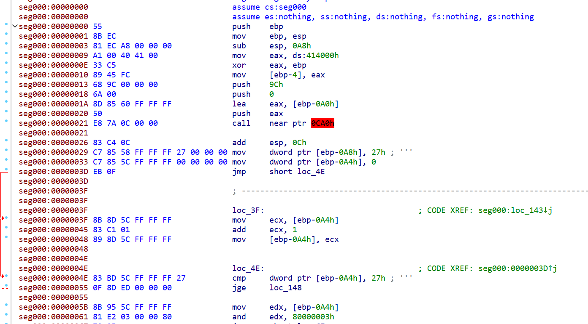

这里的call和下面的call的地址一眼假，当作花指令nop掉
u、p操作复原函数

```c
int sub_0()
{
  int i; // [esp+4h] [ebp-A4h]
  int v2[39]; // [esp+8h] [ebp-A0h]

  for ( i = 0; i < 39; ++i )
  {
    if ( i % 4 )
    {
      switch ( i % 4 )
      {
        case 1:
          v2[i] -= i;
          break;
        case 2:
          v2[i] *= i;
          break;
        case 3:
          v2[i] ^= i;
          break;
      }
    }
    else
    {
      v2[i] += i;
    }
  }
  return 0;
}
```

加密逻辑清晰
exp：

```python
cipher = [88, 88, 134, 87, 74, 118, 318, 101, 59, 92, 480, 60, 65, 41, 770, 110, 73, 31, 918, 39, 120, 27, 1188, 47, 77,
          24, 1352, 44, 81, 23, 1680, 46, 85, 15, 1870, 66, 91, 16, 4750]
flag = ''
for i in range(len(cipher)):
    if i % 4 == 0:
        flag += chr(cipher[i] - i)
    elif i % 4 == 1:
        flag += chr(cipher[i] + i)
    elif i % 4 == 2:
        flag += chr(int(cipher[i] / i))
    elif i % 4 == 3:
        flag += chr(cipher[i] ^ i)

print(flag)

# XYCTF{5b3e07567a9034d06851475481507a75}
```

## 砸核桃

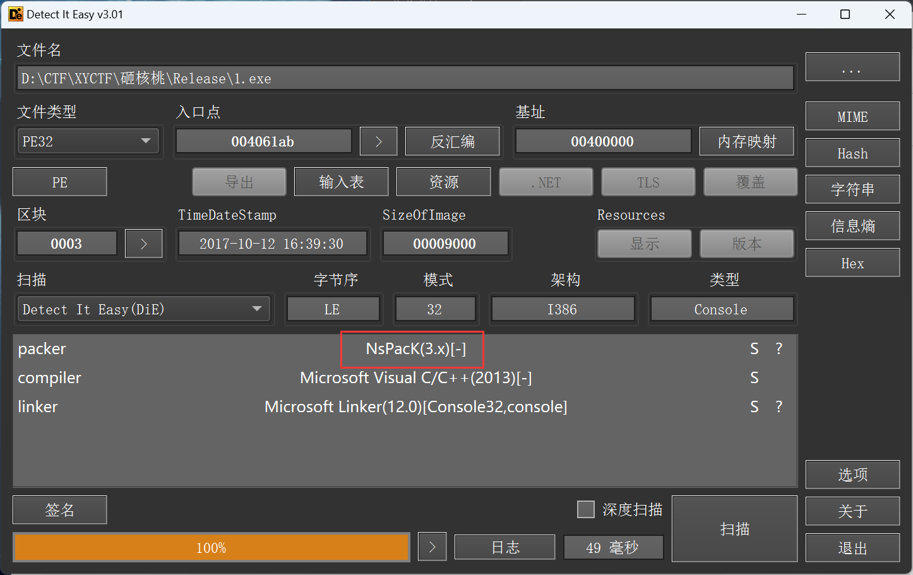

北斗兄弟3.X壳，网上找文章[[原创\]NsPack 3.7 浅析 （7.3更新脱壳机和源码）-加壳脱壳-看雪-安全社区|安全招聘|kanxue.com](https://bbs.kanxue.com/thread-115901.htm)

下载对应工具后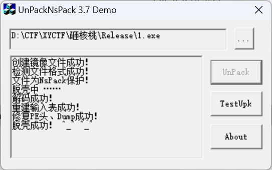

IDA打开：

```c
int __cdecl main(int argc, const char **argv, const char **envp)
{
  int v4; // eax
  char input[52]; // [esp+4h] [ebp-38h] BYREF

  memset(input, 0, 50);
  printf("Please Input Flag:");
  gets_s(input, 0x2Cu);
  if ( strlen(input) == 42 )
  {
    v4 = 0;
    while ( (input[v4] ^ byte_402130[v4 % 16]) == cipher[v4] )
    {
      if ( ++v4 >= 42 )
      {
        printf("right!\n");
        return 0;
      }
    }
    printf("error!\n");
    return 0;
  }
  else
  {
    printf("error!\n");
    return -1;
  }
}
```

提取cipher和byte_402130
exp:

```python
true_cipher = [0x00000012, 0x00000004, 0x00000008, 0x00000014, 0x00000024, 0x0000005C, 0x0000004A, 0x0000003D,
               0x00000056, 0x0000000A, 0x00000010, 0x00000067, 0x00000000, 0x00000041, 0x00000000, 0x00000001,
               0x00000046, 0x0000005A, 0x00000044, 0x00000042, 0x0000006E, 0x0000000C, 0x00000044, 0x00000072,
               0x0000000C, 0x0000000D, 0x00000040, 0x0000003E, 0x0000004B, 0x0000005F, 0x00000002, 0x00000001,
               0x0000004C, 0x0000005E, 0x0000005B, 0x00000017, 0x0000006E, 0x0000000C, 0x00000016, 0x00000068,
               0x0000005B, 0x00000012, 0x00000000, 0x00000000, 0x00000048]

XOR = [0x74, 0x68, 0x69, 0x73, 0x5F, 0x69, 0x73, 0x5F, 0x6E, 0x6F, 0x74, 0x5F, 0x66, 0x6C, 0x61, 0x67, 0x00]
flag = ''
for j in range(len(true_cipher)):
    flag += chr(true_cipher[j] ^ XOR[j % 16])
print(flag)

# flag{59b8ed8f-af22-11e7-bb4a-3cf862d1ee75}
```

## ez_enc

```c
__int64 sub_7FF6BCD11960()
{
  signed int i; // [rsp+44h] [rbp+24h]
  int j; // [rsp+64h] [rbp+44h]

  sub_7FF6BCD1137F((__int64)&unk_7FF6BCD23008);
  printf(Format);
  printf(asc_7FF6BCD1AE60);
  printf(asc_7FF6BCD1AF20);
  printf(asc_7FF6BCD1B1A0);
  printf(asc_7FF6BCD1B290);
  printf(asc_7FF6BCD1B640);
  printf(asc_7FF6BCD1AE18);
  scanf((__int64)&s_, (__int64)flag);
  for ( i = 0; i < (int)(j_strlen(flag) - 1); ++i )
    flag[i] = key[i % 6] ^ (flag[i + 1] + (unsigned __int8)flag[i] % 20);
  for ( j = 0; j < (int)j_strlen(flag); ++j )
  {
    if ( flag[j] != cipher[j] )
    {
      printf("Wrong");
      return 0i64;
    }
  }
  printf("Right,but where is my Imouto?\n");
  return 0i64;
}
```

根据分析进行修改，得到以上内容，前几个printf打印德国骨科相关内容，真正的加密只有第一个for循环

因为不好逆，所以采用正向爆破，但是这里有一定特殊性，爆破后的数据一定在0~19范围内。为了得到正确的flag，将cipher的值+20的倍数进行计算，对应爆破的flag数据也对应+20的倍数，得到正确合理数据为止
exp:

```python
cipher = [0x27, 0x24, 0x17, 0x0B, 0x50, 0x03, 0xC8, 0x0C, 0x1F, 0x17, 0x36, 0x55, 0xCB, 0x2D, 0xE9, 0x32, 0x0E, 0x11,
          0x26, 0x02, 0x0C, 0x07, 0xFC, 0x27, 0x3D, 0x2D, 0xED, 0x35, 0x59, 0xEB, 0x3C, 0x3E, 0xE4, 0x7D]
key = "IMouto"
i = len(cipher) - 2
while i >= 0:
    for j in range(20):
        if cipher[i] == ord(key[i % 6]) ^ cipher[i + 1] + (j % 20):
            cipher[i] = j
            print(j)
            break
        elif cipher[i] == ord(key[i % 6]) ^ (cipher[i + 1] + 20) + (j % 20):
            cipher[i] = j
            print(cipher[i + 1] + 20)
            break
        elif cipher[i] == ord(key[i % 6]) ^ (cipher[i + 1] + 40) + (j % 20):
            cipher[i] = j
            print(cipher[i + 1] + 40)
            break
        elif cipher[i] == ord(key[i % 6]) ^ (cipher[i + 1] + 60) + (j % 20):
            cipher[i] = j
            print(cipher[i + 1] + 60)
            break
        elif cipher[i] == ord(key[i % 6]) ^ (cipher[i + 1] + 80) + (j % 20):
            cipher[i] = j
            print(cipher[i + 1] + 80)
            break
        elif cipher[i] == ord(key[i % 6]) ^ (cipher[i + 1] + 100) + (j % 20):
            cipher[i] = j
            print(cipher[i + 1] + 100)
            break
        elif cipher[i] == ord(key[i % 6]) ^ (cipher[i + 1] + 120) + (j % 20):
            cipher[i] = j
            print(cipher[i + 1] + 120)
            break
    i -= 1
# 14  不用管这个数据，为了得到114而生成的错误数据
# 114
# 101
# 116
# 36
# 49
# 115
# 95
# 101
# 55
# 117
# 99
# 95
# 64
# 95
# 116
# 110
# 52
# 119
# 95
# 121
# 49
# 49
# 97
# 101
# 51
# 114
# 95
# 33
# 123
# 103
# 97
# 108
```

再对爆破出的数据处理

```python
a = [114, 101, 116, 36, 49, 115, 95, 101, 55, 117, 99, 95, 64, 95, 116, 110, 52, 119, 95, 121, 49, 49, 97, 101, 51, 114,
     95, 33, 123, 103, 97, 108]

print("长度为:" + str(len(a)))
flag = ""
for i in a:
    flag += chr(i)
print(flag[::-1] + '}')

# flag{!_r3ea11y_w4nt_@_cu7e_s1$ter}
```

## ezmath

python解释器编译的exe文件，解包出pyc，再反编译成py文件

```python
# uncompyle6 version 3.9.0
# Python bytecode version base 3.8.0 (3413)
# Decompiled from: Python 3.9.0 (tags/v3.9.0:9cf6752, Oct  5 2020, 15:23:07) [MSC v.1927 32 bit (Intel)]
# Embedded file name: ezmath.py
flag = [ord(i) for i in input('flag:')]
if len(flag) == 32:
    if sum([flag[23] for _ in range(flag[23])]) + sum([flag[12] for _ in range(flag[12])]) + sum([flag[1] for _ in range(flag[1])]) - sum([flag[24] for _ in range(222)]) + sum([flag[22] for _ in range(flag[22])]) + sum([flag[31] for _ in range(flag[31])]) + sum([flag[26] for _ in range(flag[26])]) - sum([flag[9] for _ in range(178)]) - sum([flag[29] for _ in range(232)]) + sum([flag[17] for _ in range(flag[17])]) - sum([flag[23] for _ in range(150)]) - sum([flag[6] for _ in range(226)]) - sum([flag[7] for _ in range(110)]) + sum([flag[19] for _ in range(flag[19])]) + sum([flag[2] for _ in range(flag[2])]) - sum([flag[0] for _ in range(176)]) + sum([flag[10] for _ in range(flag[10])]) - sum([flag[12] for _ in range(198)]) + sum([flag[24] for _ in range(flag[24])]) + sum([flag[9] for _ in range(flag[9])]) - sum([flag[3] for _ in range(168)]) + sum([flag[8] for _ in range(flag[8])]) - sum([flag[2] for _ in range(134)]) + sum([flag[14] for _ in range(flag[14])]) - sum([flag[13] for _ in range(170)]) + sum([flag[4] for _ in range(flag[4])]) - sum([flag[10] for _ in range(142)]) + sum([flag[27] for _ in range(flag[27])]) + sum([flag[15] for _ in range(flag[15])]) - sum([flag[15] for _ in range(224)]) + sum([flag[16] for _ in range(flag[16])]) - sum([flag[11] for _ in range(230)]) - sum([flag[1] for _ in range(178)]) + sum([flag[28] for _ in range(flag[28])]) - sum([flag[5] for _ in range(246)]) - sum([flag[17] for _ in range(168)]) + sum([flag[30] for _ in range(flag[30])]) - sum([flag[21] for _ in range(220)]) - sum([flag[22] for _ in range(212)]) - sum([flag[16] for _ in range(232)]) + sum([flag[25] for _ in range(flag[25])]) - sum([flag[4] for _ in range(140)]) - sum([flag[31] for _ in range(250)]) - sum([flag[28] for _ in range(150)]) + sum([flag[11] for _ in range(flag[11])]) + sum([flag[13] for _ in range(flag[13])]) - sum([flag[14] for _ in range(234)]) + sum([flag[7] for _ in range(flag[7])]) - sum([flag[8] for _ in range(174)]) + sum([flag[3] for _ in range(flag[3])]) - sum([flag[25] for _ in range(242)]) + sum([flag[29] for _ in range(flag[29])]) + sum([flag[5] for _ in range(flag[5])]) - sum([flag[30] for _ in range(142)]) - sum([flag[26] for _ in range(170)]) - sum([flag[19] for _ in range(176)]) + sum([flag[0] for _ in range(flag[0])]) - sum([flag[27] for _ in range(168)]) + sum([flag[20] for _ in range(flag[20])]) - sum([flag[20] for _ in range(212)]) + sum([flag[21] for _ in range(flag[21])]) + sum([flag[6] for _ in range(flag[6])]) + sum([flag[18] for _ in range(flag[18])]) - sum([flag[18] for _ in range(178)]) + 297412 == 0:
        print('yes')
# okay decompiling ezmath.pyc

```

多元一次方程，z3脚本一把梭

```python
from z3.z3 import Int, Solver, sat

flag = [Int(f"flag[{i}]") for i in range(32)]
solver = Solver()

solver.add(
    flag[23] * (flag[23]) +
    flag[12] * (flag[12]) +
    flag[1] * (flag[1]) -
    flag[24] * 222 +
    flag[22] * (flag[22]) +
    flag[31] * (flag[31]) +
    flag[26] * (flag[26]) -
    flag[9] * 178 -
    flag[29] * 232 +
    flag[17] * (flag[17]) -
    flag[23] * 150 -
    flag[6] * 226 -
    flag[7] * 110 +
    flag[19] * (flag[19]) +
    flag[2] * (flag[2]) -
    flag[0] * 176 +
    flag[10] * (flag[10]) -
    flag[12] * 198 +
    flag[24] * (flag[24]) +
    flag[9] * (flag[9]) -
    flag[3] * 168 +
    flag[8] * (flag[8]) -
    flag[2] * 134 +
    flag[14] * (flag[14]) -
    flag[13] * 170 +
    flag[4] * (flag[4]) -
    flag[10] * 142 +
    flag[27] * (flag[27]) +
    flag[15] * (flag[15]) -
    flag[15] * 224 +
    flag[16] * (flag[16]) -
    flag[11] * 230 -
    flag[1] * 178 +
    flag[28] * (flag[28]) -
    flag[5] * 246 -
    flag[17] * 168 +
    flag[30] * (flag[30]) -
    flag[21] * 220 -
    flag[22] * 212 -
    flag[16] * 232 +
    flag[25] * (flag[25]) -
    flag[4] * 140 -
    flag[31] * 250 -
    flag[28] * 150 +
    flag[11] * (flag[11]) +
    flag[13] * (flag[13]) -
    flag[14] * 234 +
    flag[7] * (flag[7]) -
    flag[8] * 174 +
    flag[3] * (flag[3]) -
    flag[25] * 242 +
    flag[29] * (flag[29]) +
    flag[5] * (flag[5]) -
    flag[30] * 142 -
    flag[26] * 170 -
    flag[19] * 176 +
    flag[0] * (flag[0]) -
    flag[27] * 168 +
    flag[20] * (flag[20]) -
    flag[20] * 212 +
    flag[21] * (flag[21]) +
    flag[6] * (flag[6]) +
    flag[18] * (flag[18]) -
    flag[18] * 178 +
    297412 == 0
)

if solver.check() == sat:
    model = solver.model()
    print(model)
    solution = [model.evaluate(flag[i] for i in range(32))]
    print("Solution found:")
    print(solution)
    for i in range(32):
        print(chr(int(str(model[flag[i]]))), end="")
else:
    print("No solution found.")

# flag[18] = 89,
# flag[6] = 113,
# flag[10] = 71,
# flag[17] = 84,
# flag[5] = 123,
# flag[21] = 110,
# flag[12] = 99,
# flag[20] = 106,
# flag[7] = 55,
# flag[24] = 111,
# flag[2] = 67,
# flag[26] = 85,
# flag[23] = 75,
# flag[1] = 89,
# flag[16] = 116,
# flag[25] = 121,
# flag[30] = 71,
# flag[14] = 117,
# flag[4] = 70,
# flag[11] = 115,
# flag[3] = 84,
# flag[28] = 75,
# flag[9] = 89,
# flag[15] = 112,
# flag[22] = 106,
# flag[8] = 87,
# flag[13] = 85,
# flag[29] = 116,
# flag[31] = 125,
# flag[0] = 88,
# flag[27] = 84,
# flag[19] = 88
```

整理得到flag

```python
flag = {
    0: 88, 1: 89, 2: 67, 3: 84, 4: 70, 5: 123, 6: 113, 7: 55, 8: 87, 9: 89,
    10: 71, 11: 115, 12: 99, 13: 85, 14: 117, 15: 112, 16: 116, 17: 84, 18: 89,
    19: 88, 20: 106, 21: 110, 22: 106, 23: 75, 24: 111, 25: 121, 26: 85, 27: 84,
    28: 75, 29: 116, 30: 71, 31: 125
}
end = ''
for i in range(32):
    end += chr(flag[i])
print(end)

# XYCTF{q7WYGscUuptTYXjnjKoyUTKtG}
```

## 给阿姨倒一杯卡布奇诺

```c
int __cdecl main(int argc, const char **argv, const char **envp)
{
  uint32_t temp[2]; // [rsp+28h] [rbp-78h] BYREF
  char input[33]; // [rsp+30h] [rbp-70h] BYREF
  uint32_t key[4]; // [rsp+60h] [rbp-40h] BYREF
  uint32_t array[8]; // [rsp+70h] [rbp-30h]
  int i; // [rsp+9Ch] [rbp-4h]

  _main();
  array[0] = -1691816635;
  array[1] = 341755625;
  array[2] = 1529325251;
  array[3] = -442599979;
  array[4] = -399760128;
  array[5] = -1541333614;
  array[6] = -846574750;
  array[7] = -1503071168;
  key[0] = 1702259047;
  key[1] = 1970239839;
  key[2] = 1886741343;
  key[3] = 1634038879;
  memset(input, 0, sizeof(input));
  puts("please input your flag: ");
  scanf("%s", input);
  if ( strlen(input) != 32 )
  {
    puts("length error!!");
    exit(0);
  }
  for ( i = 0; i <= 7; i += 2 )
  {
    temp[0] = *(_DWORD *)&input[4 * i];
    temp[1] = *(_DWORD *)&input[4 * i + 4];
    encrypt(temp, key);                         // tea加密
    if ( temp[0] != array[i] || temp[1] != array[i + 1] )
    {
      printf("sorry, your flag is wrong!");
      exit(0);
    }
  }
  printf("success!!your flag is flag{your input}");
  return 0;
}
```

tea加密，多了一点异或，直接搓解密

```c
#include <stdio.h>

unsigned int data1 = 0x5F797274;
unsigned int data2 = 0x64726168;

void decrypto(unsigned int *cipher, unsigned int *key)
{
    unsigned int v0, v1;
    unsigned int t0, t1;
    unsigned long long int sum = 0x6E75316CULL * 32;

    v0 = *cipher;
    v1 = cipher[1];
    t0 = v0;
    t1 = v1;
    for (int i = 31; i >= 0; --i)
    {
        v1 -= ((v0 >> 5) + key[3]) ^ (v0 + sum) ^ (key[2] + 16 * v0) ^ (sum + i);
        v0 -= ((v1 >> 5) + key[1]) ^ (v1 + sum) ^ (*key + 16 * v1) ^ (sum + i);
        sum -= 0x6E75316C;
    }
    *cipher = v0 ^ data1;
    cipher[1] = v1 ^ data2;
    data1 = t0;
    data2 = t1;
}

int main()
{
    unsigned int cipher[8];
    unsigned int key[4];
    int length, i;
    cipher[0] = 2603150661;
    cipher[1] = 0x145EC6E9;
    cipher[2] = 0x5B27A6C3;
    cipher[3] = 0xE59E75D5;
    cipher[4] = 0xE82C2500;
    cipher[5] = 0xA4211D92;
    cipher[6] = 0xCD8A4B62;
    cipher[7] = 0xA668F440;

    key[0] = 0x65766967;
    key[1] = 0x756F795F;
    key[2] = 0x7075635F;
    key[3] = 0x6165745F;

    length = sizeof(cipher);
    unsigned int *in = (unsigned int *)cipher;
    unsigned char *out = (unsigned char *)cipher;

    for (i = 0; i < 8; i += 2)
        decrypto(in + i, key);
    printf("flag{");
    for (i = 0; i < length; i++)
        printf("%c", out[i]);
    printf("}");
    return 0;
}

// flag{133bffe401d223a02385d90c5f1ca377}
```

## what's this

DIE查询发现是lua编译的，网上搜lua在线反编译得到源码
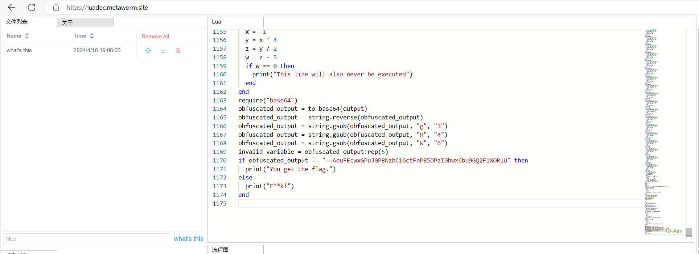

一千多行代码，实际有用的只有最后那段

```lua
function Xor(num1, num2)
  local tmp1 = num1
  local tmp2 = num2
  local str = ""
  repeat
    local s1 = tmp1 % 2
    local s2 = tmp2 % 2
    if s1 == s2 then
      str = "0" .. str
    else
      str = "1" .. str
    end
    tmp1 = math.modf(tmp1 / 2)
    tmp2 = math.modf(tmp2 / 2)
  until tmp1 == 0 and tmp2 == 0
  return tonumber(str, 2)
end
value = ""
output = ""
i = 1
while true do
  local temp = string.byte(flag, i)
  temp = string.char(Xor(temp, 8) % 256)
  value = value .. temp
  i = i + 1
  if i > string.len(flag) then
    break
  end
end
for _ = 1, 1000 do
  x = 3
  y = x * 3
  z = y / 4
  w = z - 5
  if w == 0 then
    print("This line will never be executed")
  end
end
for i = 1, string.len(flag) do
  temp = string.byte(value, i)
  temp = string.char(temp + 3)
  output = output .. temp
end
result = output:rep(10)
invalid_list = {
  1,
  2,
  3
}
for _ = 1, 20 do
  table.insert(invalid_list, 4)
end
for _ = 1, 50 do
  result = result .. "A"
  table.insert(invalid_list, 4)
end
for i = 1, string.len(output) do
  temp = string.byte(output, i)
  temp = string.char(temp - 1)
end
for _ = 1, 30 do
  result = result .. string.lower(output)
end
for _ = 1, 950 do
  x = 3
  y = x * 3
  z = y / 4
  w = z - 5
  if w == 0 then
    print("This line will never be executed")
  end
end
for _ = 1, 50 do
  x = -1
  y = x * 4
  z = y / 2
  w = z - 3
  if w == 0 then
    print("This line will also never be executed")
  end
end
require("base64")
obfuscated_output = to_base64(output)
obfuscated_output = string.reverse(obfuscated_output)
obfuscated_output = string.gsub(obfuscated_output, "g", "3")
obfuscated_output = string.gsub(obfuscated_output, "H", "4")
obfuscated_output = string.gsub(obfuscated_output, "W", "6")
invalid_variable = obfuscated_output:rep(5)
if obfuscated_output == "==AeuFEcwxGPuJ0PBNzbC16ctFnPB5DPzI0bwx6bu9GQ2F1XOR1U" then
  print("You get the flag.")
else
  print("F**k!")
end
```

使用XOR函数将字符与数字8进行异或操作，再加上3，base64加密，再进行字符替换
直接逆向逻辑，exp：

```python
import base64

cipher = "==AeuFEcwxGPuJ0PBNzbC16ctFnPB5DPzI0bwx6bu9GQ2F1XOR1U"

new_cipher = cipher[::-1]
new_cipher = new_cipher.replace("3", "g")
new_cipher = new_cipher.replace("4", "H")
new_cipher = new_cipher.replace("6", "W")


def Xor(num1, num2):
    tmp1 = num1
    tmp2 = num2
    str_result = ""
    while tmp1 != 0 or tmp2 != 0:
        s1 = tmp1 % 2
        s2 = tmp2 % 2
        if s1 == s2:
            str_result = "0" + str_result
        else:
            str_result = "1" + str_result
        tmp1 = tmp1 // 2
        tmp2 = tmp2 // 2
    return int(str_result, 2)


d_cipher = base64.b64decode(new_cipher)

flag = ""
for char in d_cipher:
    flag += chr(Xor(char - 3, 8))

print(flag)

# XYCTF{5dcbaed781363fbfb7d8647c1aee6c}
```

## 馒头

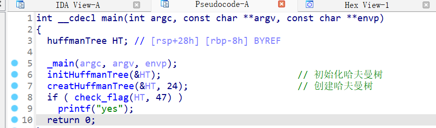

哈夫曼树学习参考：[哈夫曼树编码的实现+图解（含全部代码）-CSDN博客](https://blog.csdn.net/Initial_Mind/article/details/124354318)

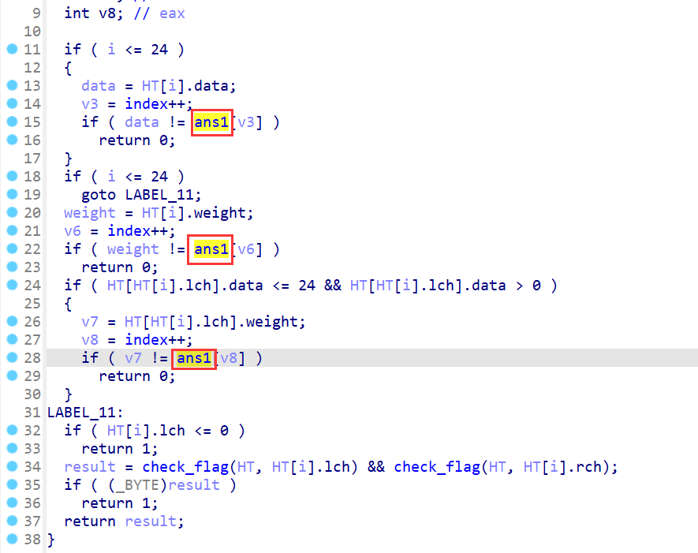

直接再check_flag里找到密文，里面包含了最终哈夫曼树的部分检测点以及data

```python
data = [0x000008DE, 0x00000395, 0x000001BE, 0x000000D9, 0x0000006A, 0x00000033, 0x00000014, 0x0000000F, 0x00000011,
        0x000000E5, 0x00000072, 0x00000010, 0x0000000B, 0x000001D7, 0x000000E9, 0x00000074, 0x0000000E, 0x0000000D,
        0x000000EE, 0x00000076, 0x0000000C, 0x00000007, 0x00000549, 0x0000022D, 0x000000F8, 0x0000007B, 0x00000006,
        0x00000018, 0x00000135, 0x00000089, 0x00000043, 0x00000003, 0x00000005, 0x000000AC, 0x00000054, 0x00000004,
        0x00000001, 0x0000031C, 0x0000017F, 0x000000BA, 0x00000059, 0x00000002, 0x00000008, 0x000000C5, 0x00000061,
        0x00000030, 0x00000017, 0x0000000A, 0x00000015, 0x0000019D, 0x000000CB, 0x00000065, 0x00000016, 0x00000009,
        0x000000D2, 0x00000068, 0x00000013, 0x00000012]
num = []
print(len(data))
for i in range(len(data)):
    num.append(data[i])
print(num)

#[2270, 917, 446, 217, 106, 51, 20, 15, 17, 229, 114, 16, 11, 471, 233, 116, 14, 13, 238, 118, 12, 7, 1353, 557, 248, 123, 6, 24, 309, 137, 67, 3, 5, 172, 84, 4, 1, 796, 383, 186, 89, 2, 8, 197, 97, 48, 23, 10, 21, 413, 203, 101, 22, 9, 210, 104, 19, 18]

```

这里使用sorted函数排列一遍，可以发现data从1~24完整，那么，我们可以根据ans1的数据，画出哈夫曼树来解决
为了方便，可以简单处理下数据：

```python
# [2270, 917,446,     217, 106(j), 51(3), 20, 15, 17,     229,114(r), 16,11,     471, 233, 116(t), 14,13,     238, 118(v), 12 , 7,       1353,      557,     248, 123({), 6, 24,     309,     137, 67(C), 3, 5,   172, 84(T), 4, 1,      796, 383, 186, 89(Y), 2, 8,   197, 97(a), 48(0), 23, 10, 21,   413, 203, 101(e), 22, 9,     210,104(h), 19, 18]

```

我们可以根据分析粗略得到部分flag数据，继续画出完整哈夫曼树：
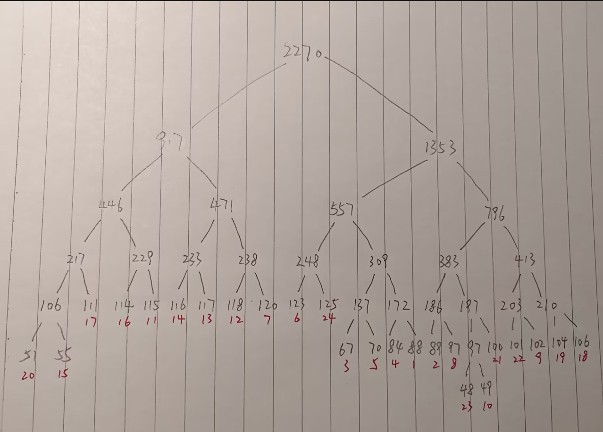

手撕，整理一下得到flag：

```c
1 ---- X
2 ---- Y
3 ---- C
4 ---- T
5 ---- F
6 ---- {
7 ---- x
8 ---- a
9 ---- f
10 --- 1
11 --- s
12 --- v
13 --- u
14 --- t
15 --- 7
16 --- r
17 --- o
18 --- j
19 --- h
20 --- 3
21 --- d
22 --- e
23 --- 0
24 --- }
// XYCTF{xaf1svut7rojh3de0}
```

## 舔狗四部曲-简爱

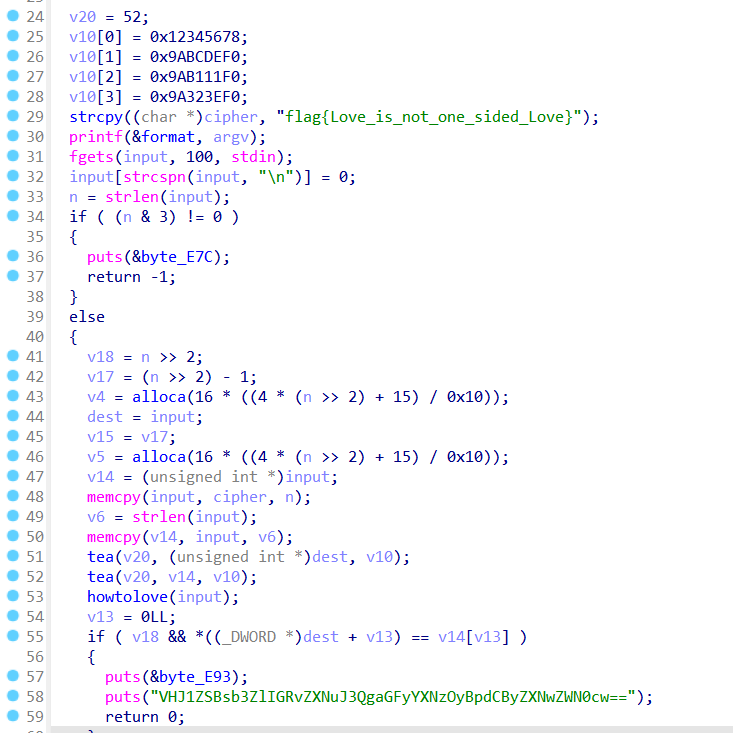

一眼过去应该是tea和howtolove函数有用，分析逻辑可以知道，两个tea分别对input和cipher进行同样的加密，所以无意义

锁定howtolove函数，有opcode那味儿，仿照vm思路来写，打出操作步骤

```c
#include<stdio.h>
#include<string.h>
#include <stdlib.h>  
#include <time.h>
char box[512];
char FileNamein[40];
char Filenameout[40];

int howtolove(char *flag)
{
  int v2[1802]; // [rsp+10h] [rbp-1C30h] BYREF
  int v3; // [rsp+1C38h] [rbp-8h]
  int v4; // [rsp+1C3Ch] [rbp-4h]
  int count1,count2;
  memset(v2, 0, 0x1C20uLL);
  v2[32] = 2;
  v2[65] = 2;
  v2[66] = 4;
  v2[98] = 2;
  v2[99] = 5;
  v2[185] = 2;
  v2[186] = 2;
  v2[187] = 1;
  v2[188] = 1;
  v2[189] = 1;
  v2[190] = 1;
  v2[191] = 1;
  v2[192] = 1;
  v2[193] = 1;
  v2[194] = 1;
  v2[195] = 1;
  v2[196] = 1;
  v2[197] = 1;
  v2[198] = 1;
  v2[199] = 1;
  v2[200] = 1;
  v2[201] = 1;
  v2[202] = 1;
  v2[203] = 1;
  v2[204] = 1;
  v2[205] = 1;
  v2[206] = 1;
  v2[207] = 1;
  v2[208] = 1;
  v2[209] = 1;
  v2[210] = 1;
  v2[211] = 1;
  v2[212] = 1;
  v2[213] = 1;
  v2[214] = 1;
  v2[215] = 1;
  v2[216] = 1;
  v2[217] = 1;
  v2[218] = 1;
  v2[219] = 1;
  v2[220] = 1;
  v2[221] = 1;
  v2[222] = 1;
  v2[223] = 1;
  v2[224] = 1;
  v2[225] = 1;
  v2[226] = 1;
  v2[227] = 1;
  v2[228] = 1;
  v2[229] = 2;
  v2[232] = 2;
  v2[256] = 2;
  v2[257] = 5;
  v2[303] = 1;
  v2[304] = 1;
  v2[305] = 1;
  v2[306] = 1;
  v2[307] = 2;
  v2[308] = 5;
  v2[328] = 1;
  v2[329] = 1;
  v2[330] = 1;
  v2[331] = 1;
  v2[332] = 1;
  v2[333] = 1;
  v2[334] = 1;
  v2[335] = 1;
  v2[336] = 1;
  v2[337] = 1;
  v2[338] = 1;
  v2[339] = 1;
  v2[340] = 1;
  v2[341] = 1;
  v2[342] = 2;
  v2[353] = 2;
  v2[354] = 5;
  v2[430] = 2;
  v2[431] = 2;
  v2[432] = 5;
  v2[523] = 2;
  v2[524] = 5;
  v2[564] = 2;
  v2[565] = 5;
  v2[627] = 2;
  v2[628] = 1;
  v2[629] = 1;
  v2[630] = 1;
  v2[631] = 1;
  v2[632] = 1;
  v2[633] = 1;
  v2[634] = 1;
  v2[635] = 1;
  v2[636] = 1;
  v2[637] = 1;
  v2[638] = 1;
  v2[639] = 1;
  v2[640] = 1;
  v2[641] = 1;
  v2[642] = 1;
  v2[643] = 1;
  v2[644] = 1;
  v2[645] = 1;
  v2[646] = 1;
  v2[647] = 2;
  v2[648] = 4;
  v2[649] = 1;
  v2[650] = 1;
  v2[651] = 1;
  v2[652] = 1;
  v2[653] = 2;
  v2[680] = 2;
  v2[687] = 2;
  v2[688] = 4;
  v2[698] = 2;
  v2[766] = 2;
  v2[767] = 5;
  v2[818] = 2;
  v2[819] = 1;
  v2[820] = 2;
  v2[827] = 2;
  v2[828] = 5;
  v2[846] = 2;
  v2[847] = 5;
  v2[890] = 2;
  v2[891] = 1;
  v2[892] = 1;
  v2[893] = 1;
  v2[894] = 1;
  v2[895] = 1;
  v2[896] = 1;
  v2[897] = 1;
  v2[898] = 1;
  v2[899] = 1;
  v2[900] = 1;
  v2[901] = 1;
  v2[902] = 1;
  v2[903] = 1;
  v2[904] = 1;
  v2[905] = 1;
  v2[906] = 1;
  v2[907] = 1;
  v2[908] = 1;
  v2[909] = 1;
  v2[910] = 1;
  v2[911] = 1;
  v2[912] = 1;
  v2[913] = 1;
  v2[914] = 1;
  v2[915] = 1;
  v2[916] = 1;
  v2[917] = 1;
  v2[918] = 1;
  v2[919] = 1;
  v2[920] = 1;
  v2[921] = 1;
  v2[922] = 1;
  v2[923] = 1;
  v2[924] = 1;
  v2[925] = 1;
  v2[926] = 1;
  v2[927] = 1;
  v2[928] = 1;
  v2[929] = 1;
  v2[930] = 1;
  v2[931] = 1;
  v2[932] = 1;
  v2[933] = 2;
  v2[934] = 5;
  v2[989] = 2;
  v2[994] = 2;
  v2[995] = 1;
  v2[996] = 1;
  v2[997] = 1;
  v2[998] = 1;
  v2[999] = 1;
  v2[1000] = 1;
  v2[1001] = 1;
  v2[1002] = 1;
  v2[1003] = 1;
  v2[1013] = 1;
  v2[1014] = 1;
  v2[1015] = 1;
  v2[1016] = 1;
  v2[1017] = 1;
  v2[1018] = 1;
  v2[1019] = 1;
  v2[1020] = 1;
  v2[1021] = 1;
  v2[1022] = 1;
  v2[1023] = 1;
  v2[1024] = 1;
  v2[1025] = 1;
  v2[1026] = 1;
  v2[1027] = 2;
  v2[1028] = 3;
  v4 = 0;
  v3 = 0;
  while ( 1 )
  {
    while ( 1 )
    {
      count2 = 0;
      while ( 1 )
      {
        count1 = 0;
        while ( !v2[v3] )
        {
          ++v3;
          ++flag[v4];
          count1++;
        }
        if(count1 != 0)
            printf("flag[%d] -= %d;\n",v4,count1);
        if ( v2[v3] != 1 )
          break;
        ++v3;
        count2++;
        --flag[v4];
      }
        if(count2 != 0)
            printf("flag[%d] += %d;\n",v4,count2);
      if ( v2[v3] != 2 )
        break;
      ++v3;
      ++v4;
    }
    if ( v2[v3] == 3 )
      break;
    if ( v2[v3] == 4 )
    {
      flag[v4] = flag[v4] + flag[v4 + 1] - 70;
      printf("flag[%d] = flag[%d] + 70 - flag[%d];\n",v4,v4,v4+1);
      ++v3;
    }
    else if ( v2[v3] == 5 )
    {
      flag[v4] = flag[v4] - flag[v4 + 1] + 70;
      printf("flag[%d] = flag[%d] - 70 + flag[%d];\n",v4,v4,v4+1);
      ++v3;
    }
  }
  return 0;
}

int main(){
    char flag[33] = "xxxxxxxxxxxxxxxxxxxxxxxxxxxxxxxx";
  howtolove(flag);
  return 0;
}
```

打印出来直接逆
exp：

```c
#include <stdio.h>

int main()
{
    unsigned char flag[] = "flag{Love_is_not_one_sided_Love}";
    flag[28] -= 54;
    flag[29] -= 4;
    flag[30] -= 9;
    flag[30] += 23;
    flag[28] = flag[28] - 70 + flag[29];
    flag[26] -= 42;
    flag[27] += 42;
    flag[26] = flag[26] - 70 + flag[27];
    flag[25] -= 17;
    flag[25] = flag[25] - 70 + flag[26];
    flag[22] -= 50;
    flag[23] += 1;
    flag[24] -= 6;
    flag[22] = flag[22] - 70 + flag[23];
    flag[20] -= 9;
    flag[21] -= 67;
    flag[20] = flag[20] + 70 - flag[21];
    flag[17] += 4;
    flag[18] -= 26;
    flag[19] -= 6;
    flag[17] = flag[17] + 70 - flag[18];
    flag[15] -= 61;
    flag[16] += 19;
    flag[15] = flag[15] - 70 + flag[16];
    flag[14] -= 39;
    flag[14] = flag[14] - 70 + flag[15];
    flag[13] -= 90;
    flag[13] = (flag[13] + 256) % 256;
    flag[11] -= 75;
    flag[11] = flag[11] - 70 + flag[12];
    flag[9] -= 19;
    flag[9] += 14;
    flag[10] -= 10;
    flag[9] = flag[9] - 70 + flag[10];
    flag[8] -= 45;
    flag[8] += 4;
    flag[8] = flag[8] - 70 + flag[9];
    flag[3] -= 85;
    flag[5] += 42;
    flag[6] -= 2;
    flag[7] -= 23;
    flag[3] = flag[3] - 70 + flag[4];
    flag[2] -= 31;
    flag[2] = flag[2] + 70 - flag[3];
    flag[1] -= 32;
    flag[0] -= 32;
    int i = 0;
    for (; i < 32; i++)
        printf("%c", flag[i]);
    return 0;
}
// FLAG{vm_is_A_ecreT_l0Ve_revers}
// FLAG{vm_is_A_3ecreT_l0Ve_revers}
```

最后有个字节错了，脑洞一下就OK了

## 舔狗四部曲-相逢已是上上签

.exe文件用DIE扫出来是MODOS文件，丢进010editor看看

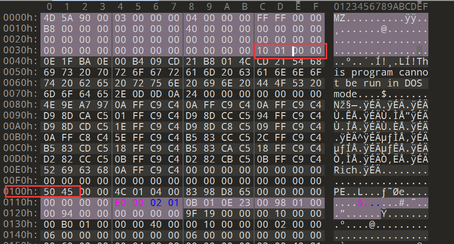

e_lfanew段有明显的问题，未找到正确pe头位置

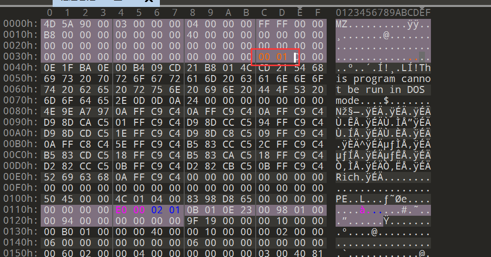

改掉，此时可以看的DIE扫出来是32PE文件

```c
int __cdecl main(int argc, const char **argv, const char **envp)
{
  int d8; // [esp+8h] [ebp-50h]
  int i; // [esp+Ch] [ebp-4Ch]
  int v6[8]; // [esp+10h] [ebp-48h]
  char (*input)[33]; // [esp+30h] [ebp-28h] BYREF
  int v8; // [esp+34h] [ebp-24h]
  int v9; // [esp+38h] [ebp-20h]
  int v10; // [esp+3Ch] [ebp-1Ch]
  int v11; // [esp+40h] [ebp-18h]
  int v12; // [esp+44h] [ebp-14h]
  int v13; // [esp+48h] [ebp-10h]
  int v14; // [esp+4Ch] [ebp-Ch]
  char v15; // [esp+50h] [ebp-8h]

  input = 0;
  v8 = 0;
  v9 = 0;
  v10 = 0;
  v11 = 0;
  v12 = 0;
  v13 = 0;
  v14 = 0;
  v15 = 0;
  v6[0] = 0x66697271;
  v6[1] = 0x896E2285;
  v6[2] = 0xC5188C1B;
  v6[3] = 0x72BCFD03;
  v6[4] = 0x538011CA;
  v6[5] = 0x4DA146AC;
  v6[6] = 0x86630D6B;
  v6[7] = 0xF89797F0;
  printf("Please enter your key:");
  scanf("%s", key);
  if ( 532 * key[5] + 829 * key[4] + 258 * key[3] + 811 * key[2] + 997 * key[1] + 593 * key[0] == 292512
    && 576 * key[5] + 695 * key[4] + 602 * key[3] + 328 * key[2] + 686 * key[1] + 605 * key[0] == 254496
    && 580 * key[5] + 448 * key[4] + 756 * key[3] + 449 * key[2] + (key[1] << 9) + 373 * key[0] == 222479
    && 597 * key[5] + 855 * key[4] + 971 * key[3] + 422 * key[2] + 635 * key[1] + 560 * key[0] == 295184
    && 524 * key[5] + 324 * key[4] + 925 * key[3] + 388 * key[2] + 507 * key[1] + 717 * key[0] == 251887
    && 414 * key[5] + 495 * key[4] + 518 * key[3] + 884 * key[2] + 368 * key[1] + 312 * key[0] == 211260 )
  {
    printf(&unk_EAB19C);
  }
  else
  {
    _loaddll(0);
  }
  printf("Please enter your flag:");
  scanf("%s", (const char *)&input);
  if ( strlen((const char *)&input) != 32 )
  {
    printf("Wrong length\n");
    _loaddll(0);
  }
  d8 = (int)strlen((const char *)&input) / 4;
  xxtea(&input, d8);
  for ( i = 0; i < d8; ++i )
  {
    if ( (char (*)[33])v6[i] != *(&input + i) )
    {
      printf("Wrong!!!\n");
      _loaddll(0);
    }
  }
  printf("congratulations\n");
  sub_E9B48E("pause");
  return 0;
}
```

上面的key可以用z3求解

```python
from z3.z3 import Int, Solver, sat

key = [Int(f'key{i}') for i in range(6)]
solver = Solver()
solver.add(
    532 * key[5] + 829 * key[4] + 258 * key[3] + 811 * key[2] + 997 * key[1] + 593 * key[0] == 292512,
    576 * key[5] + 695 * key[4] + 602 * key[3] + 328 * key[2] + 686 * key[1] + 605 * key[0] == 254496,
    580 * key[5] + 448 * key[4] + 756 * key[3] + 449 * key[2] + (key[1] * (2**9)) + 373 * key[0] == 222479,
    597 * key[5] + 855 * key[4] + 971 * key[3] + 422 * key[2] + 635 * key[1] + 560 * key[0] == 295184,
    524 * key[5] + 324 * key[4] + 925 * key[3] + 388 * key[2] + 507 * key[1] + 717 * key[0] == 251887,
    414 * key[5] + 495 * key[4] + 518 * key[3] + 884 * key[2] + 368 * key[1] + 312 * key[0] == 211260
)

if solver.check() == sat:
    m = solver.model()
    print("Solution:")
    for i in range(6):
        print(f"key[{i}] = {m[key[i]]}")
else:
    print("No solution found")
# key[0] = 88
# key[1] = 89
# key[2] = 67
# key[3] = 84
# key[4] = 70
# key[5] = 33
# XYCTF!
```

魔改的xxtea加密，先手动复刻一遍加密逻辑

```c
void xxtea_encrypt(unsigned int *input, int n) 
{
    int v2;           
    int v3;        
    int v4;          
    int v5;          
    int rounds;      
    unsigned int sum;
    unsigned int z;   
    unsigned int i;  

    if (n > 1)
    {
        rounds = 52 / n + 6;
        sum = 0;
        z = input[n - 1];
        do
        {
            sum -= 0x61C88647;
            v5 = (sum >> 2) & 5;
            for (i = 0; i < n - 1; ++i)
            {
                v2 = ((z ^ key[v5 ^ i & 5]) + (input[i + 1] ^ sum)) ^ (((16 * z) ^ (input[i + 1] >> 3)) + ((4 * input[i + 1]) ^ (z >> 5)));
                v3 = input[i];
                input[i] = v2 + v3;
                z = v2 + v3;
            }
            v4 = (((z ^ key[v5 ^ i & 5]) + (*input ^ sum)) ^ (((16 * z) ^ (*input >> 3)) + ((4 * *input) ^ (z >> 5)))) + input[n - 1];
            input[n - 1] = v4;
            z = v4;
            --rounds;
        } while (rounds);
    }
}
```

动调验证加密逻辑正确之后，得到exp：

```c
#include <stdio.h>

unsigned int key[] = {88, 89, 67, 84, 70, 33};

void xxtea_decrypt(unsigned int *cipher, int n)
{
    int v2;
    int v3;
    int v4 = cipher[7];
    int v5;
    int num;
    int i = 7;
    int rounds = 12;
    unsigned int sum = 0x6a99b4ac;
    unsigned int z = cipher[7];
    printf("\ndecrypt:\n");
    do
    {
        v5 = (sum >> 2) & 5;
        v4 = cipher[7];
        z = cipher[6];
        cipher[7] = v4 - (((z ^ key[v5 ^ i & 5]) + (cipher[0] ^ sum)) ^ (((16 * z) ^ (cipher[0] >> 3)) + ((4 * cipher[0]) ^ (z >> 5))));
        for (i = n - 2; i >= 0; i--)
        {
            num = (i + 6) % 7;
            if (i == 0)
            {
                num = 7;
            }
            z = cipher[num];
            v2 = ((z ^ key[v5 ^ i & 5]) + (cipher[i + 1] ^ sum)) ^ (((16 * z) ^ (cipher[i + 1] >> 3)) + ((4 * cipher[i + 1]) ^ (z >> 5)));
            v3 = cipher[i] - v2;
            cipher[i] = v3;
        }
        v4 = cipher[num];
        sum += 1640531527;
        --rounds;
    } while (rounds);
}

int main()
{
    unsigned int cipher[8];
    cipher[0] = 0x66697271;
    cipher[1] = 0x896E2285;
    cipher[2] = 0xC5188C1B;
    cipher[3] = 0x72BCFD03;
    cipher[4] = 0x538011CA;
    cipher[5] = 0x4DA146AC;
    cipher[6] = 0x86630D6B;
    cipher[7] = 0xF89797F0;

    xxtea_decrypt(cipher, 8);

    printf("Decrypted input:\n");
    for (int i = 0; i < 8; i++)
    {
        printf("%x ", cipher[i]);
    }
    printf("\n");

    return 0;
}
// 54435958 58587b46 5f414554 5f444e41 315f335a 30535f73 7361655f 7d212179
```

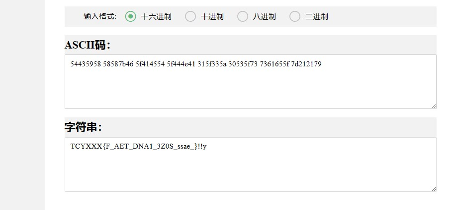

```python
s = "TCYXXX{F_AET_DNA1_3Z0S_ssae_}!!y"
# 每四个一组，分割字符串
chunks = [s[i:i+4] for i in range(0, len(s), 4)]
# 反转
reversed_chunks = [''.join(reversed(chunk)) for chunk in chunks]
result = ''.join(reversed_chunks)
print(result)

# XYCTF{XXTEA_AND_Z3_1s_S0_easy!!}
```

## easy language

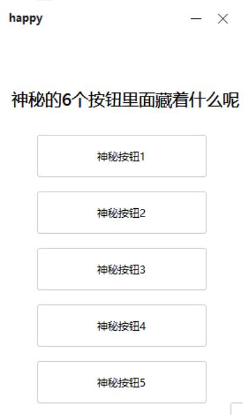

可以看到右下角有明显的图标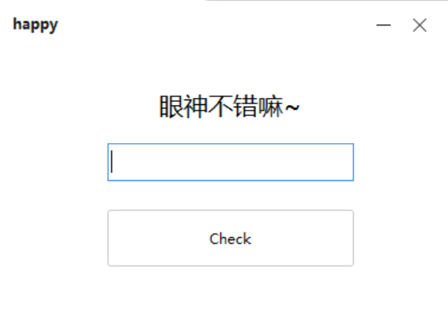

然后就没找到啥逆向逻辑了，全是脑洞，想了好久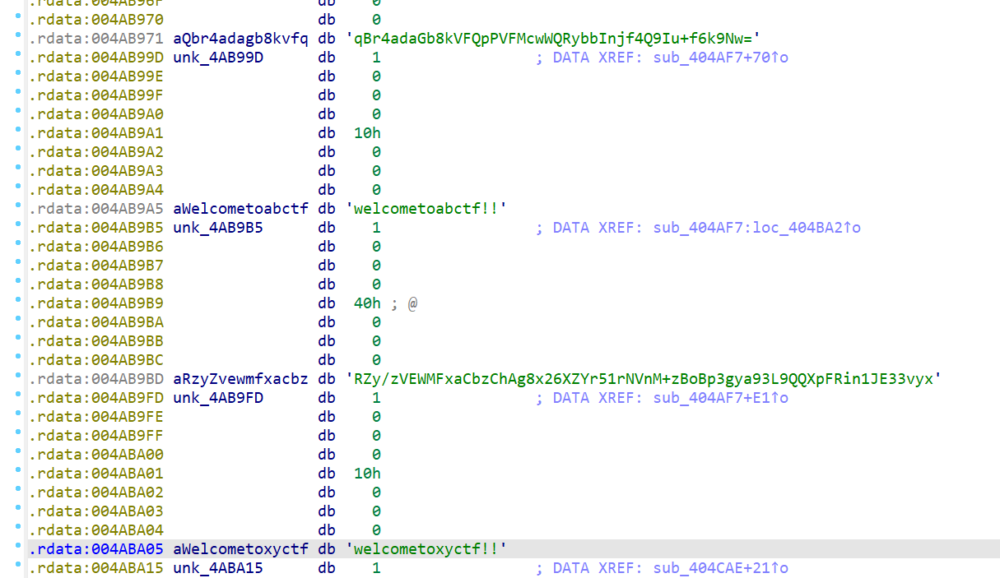

这里找到四个数据，长度分别为44、16、64、16
数据长度结合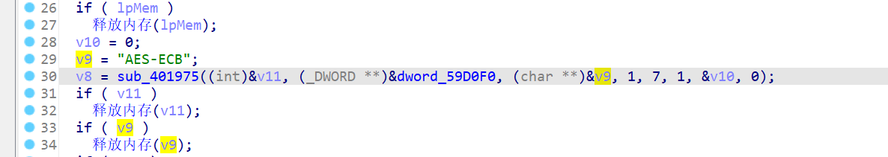

猜测是标准AES-ECB加密

shift+F12，第一个内容就像是在暗示base64加密

那么解密就是先进行base64解密，再AES-ECB解密

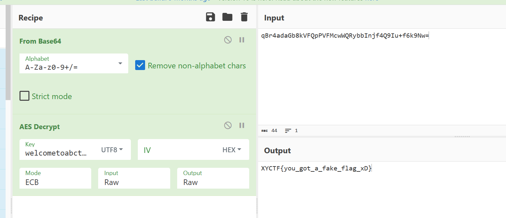

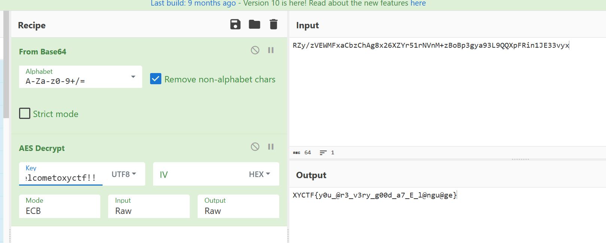


## 舔狗四部曲-我的白月光

点击运行得到第一段flag：flag{L0v3_   ，并告诉还有两段flag

IDA找到main，前面全是winapi触发messagebox，触发弹框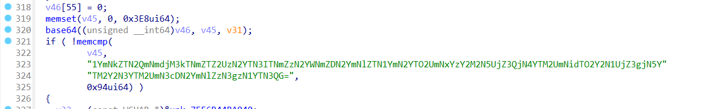

最后这段明显感觉是base64解密，直接解发现是错的，点进base64看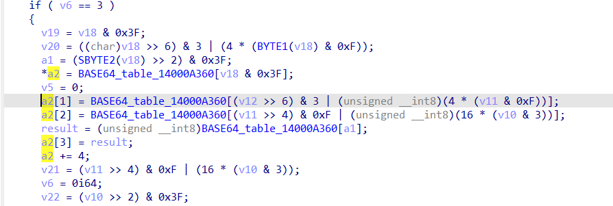

原来是魔改的base64，把3 * 8改成了4 * 6拆分

修改base64解密得到

```python
def change_base64_decode(cipher):
    table = "ABCDEFGHIJKLMNOPQRSTUVWXYZabcdefghijklmnopqrstuvwxyz0123456789+/"
    plaintext = ""
    cipher = cipher.replace("=", "")

    # 将每四个字符解码为三个字节
    for i in range(0, len(cipher), 4):
        chunk = cipher[i:i + 4]
        binary = bin(table.index(chunk[1]) & 0b11)[2:].zfill(2) + bin(table.index(chunk[0]) & 0b111111)[2:].zfill(6)
        plaintext += int(binary, 2).to_bytes(1, byteorder='big').decode('utf-8')
        binary = bin(table.index(chunk[2]) & 0b1111)[2:].zfill(4) + bin(
            (table.index(chunk[1]) >> 2) & 0b1111)[2:].zfill(4)
        plaintext += int(binary, 2).to_bytes(1, byteorder='big').decode('utf-8')
        binary = bin(table.index(chunk[3]) & 0b111111)[2:].zfill(6) + bin(
            (table.index(chunk[2]) >> 4) & 0b11)[2:].zfill(2)
        plaintext += int(binary, 2).to_bytes(1, byteorder='big').decode('utf-8')

    return plaintext

cipher = '1YmNkZTN2QmNmdjM3kTNmZTZ2UzN2YTN3ITNmZzN2YWNmZDN2YmNlZTN1YmN2YTO2UmNxYzY2M2N5UjZ3QjN4YTM2UmNidTO2Y2N1UjZ3gjN5YTM2Y2N3YTM2UmN3cDN2YmNlZzN3gzN1YTN'
plaintext = change_base64_decode(cipher)
print(plaintext)

# 5f6d656d6f72795f6e657665725f676f5f646f6e655f66696e616c6c795f7468616e6b796f755f7869616f77616e67746f6e67787565
# hex to ascii:   _memory_never_go_done_finally_thankyou_xiaowangtongxue
```

与第一段连不上，拿到的应该是第三段flag


V11本来是VirtualProtect的messagebox，在这里hook了sub_7FF6B44B1470函数

在里面发现了messageboxW以及一段疑似加密逻辑：

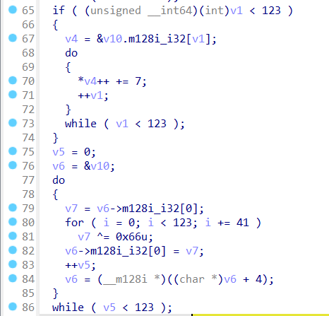

原始数据在上面v11数组那里，为了方便，动调+IDApython打出内容

```python
import idc 
print(chr(idc.get_reg_value("ecx")),end="")
```

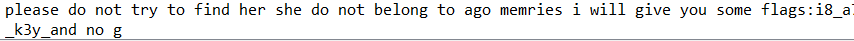

得到第二段flag

```python
# flag{L0v3_i8_a_k3y_and_memory_never_go_done_finally_thankyou_xiaowangtongxue}
```

