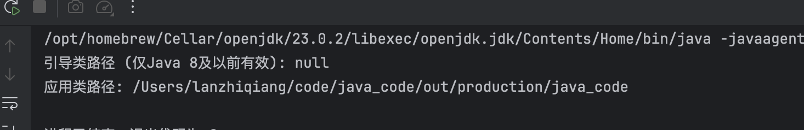
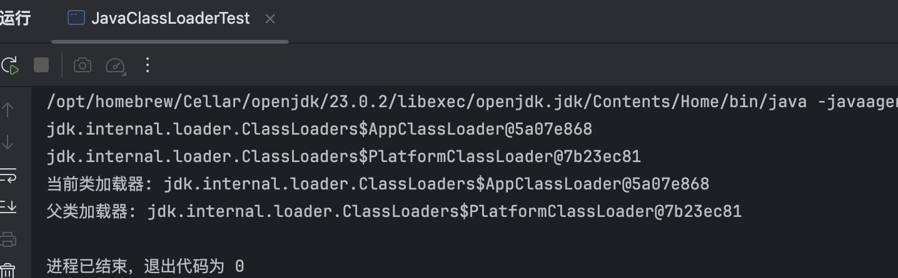
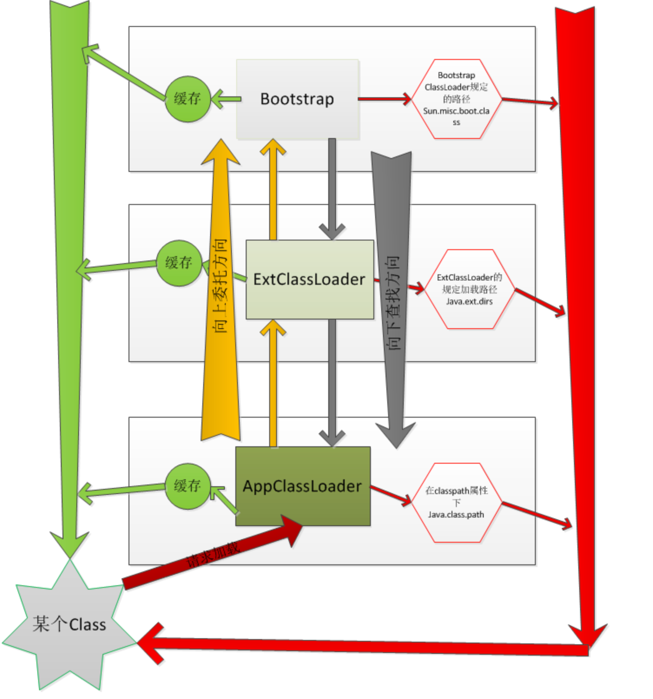

> 本文为安卓壳前置知识，点到为止

# 1、java中的classloader

classLoader的具体作用就是把class文件加载到JVM里面去，程序才可以正常运行

但是，jvm加载class的时候，并不会一次性加载所有的class文件，而是根据需要去动态加载

所以了解classloader，就需要了解这些类加载器的作用和运行顺序

## (1)classLoader的分类

Java的ClassLoader分为两种:

- **系统类加载器**（下面从左到右也是系统类加载器的运行顺序）

  BootstrapClassLoader, ExtensionsClassLoader, ApplicationClassLoader

- **自定义类加载器**

  Custom ClassLoader, 通过继承java.lang.ClassLoader实现

这里是java8及以前的classloader，java9+开始把第二层ExtensionsClassLoader变为了platformclassloader

### Bootstrap ClassLoader (引导类加载器)

是使用C/C++实现的加载器(不能被Java代码访问),用于加载JDK的核心类库,例如java.lang和java.util等系统类

JVM虚拟机的启动就是通过BootstrapClassLoader创建的初始类完成的

在 Java 9 及以后的版本中，`sun.boot.class.path` 系统属性已被弃用，取而代之的是 `java.class.path`。

```java
package Test;

public class Test0 {
    public static void main(String[] args) {
        // 获取引导类加载器路径（Java 8及以前）
        String bootClassPath = System.getProperty("sun.boot.class.path");

        // 获取应用类路径（Java 9+ 推荐方式）
        String classPath = System.getProperty("java.class.path");

        System.out.println("引导类路径 (仅Java 8及以前有效): " + bootClassPath);
        System.out.println("应用类路径: " + classPath);
    }
}
```



我的JDK版本比较高，可以看出获取不了了

### Extensions ClassLoader (拓展类加载器)/Platform ClassLoader（平台类加载器）

| **维度**     | **Platform ClassLoader (Java 9+)**                           | **Extension ClassLoader (Java 8及以前)**                     |
| ------------ | ------------------------------------------------------------ | ------------------------------------------------------------ |
| **存在版本** | Java 9 及以后版本（JPMS 模块化系统）                         | Java 8 及以前版本（传统类路径系统）                          |
| **父加载器** | Bootstrap ClassLoader                                        | Bootstrap ClassLoader                                        |
| **子加载器** | Application ClassLoader                                      | Application ClassLoader                                      |
| **加载内容** | 平台模块（如 `java.sql`、`java.desktop` 等非 `java.base` 模块） | `jre/lib/ext` 目录下的扩展 JAR 文件                          |
| **作用**     | 加载 Java 平台中 **非核心模块**（如 `java.sql`、`java.desktop`），这些模块不包含在 `java.base` 中。 | 加载 JRE 扩展目录（`$JAVA_HOME/jre/lib/ext`）下的所有 JAR 文件，使标准库之外的第三方类库可被 JVM 全局访问。 |

### Application ClassLoader (应用程序类加载器)

对应的实现类为AppClassLoader,又可以称作System ClassLoader(系统类加载器),因为它可以通过ClassLoader.getSystemClassLoader()方法获取

用于加载程序的Classpath目录和系统属性java.class.path指定的目录

### Custom ClassLoader (自定义加载器)

除了以上3个系统提供的类加载器之外,还可以通过继承java.lang.ClassLoader实现自定义类加载器

Extensions和Application ClassLoader也继承了该类

## (2)类加载器继承关系

我们可以看一下运行一个java代码需要哪些classloader

```java
package Test;

public class JavaClassLoaderTest {
    public static void main(String[] args) {
        ClassLoader loader=JavaClassLoaderTest.class.getClassLoader();
        while(loader!=null){
            System.out.println(loader);
            loader=loader.getParent();
        }
        ClassLoader cl = Test0.class.getClassLoader();
        System.out.println("当前类加载器: " + cl);
        System.out.println("父类加载器: " + cl.getParent());
    }
}
```



打印出了AppClassLoader和PlatformClassLoader，如前面所说，由于BootstrapClassLoader由C/C++编写，并非Java类，所以无法在Java中获取它的引用

**注意**:

1. 系统提供的类加载器有3种类型,但是系统提供的ClassLoader不止3个
2. 并且,AppClassLoader的父类加载器为ExtClassLoader,不代表AppClassLoader继承自ExtClassLoader

咱们以JAVA8来理一下java的classloader

## (3)java classloader的**双亲委托机制**

委托过程从下到上，查找过程从上到下

1. 先判断该Class是否加载,如果没有则先**委托**父类加载器查找,并依次递归直到顶层的Bootstrap ClassLoader
2. 如果Bootstrap ClassLoader找到了则返回该Class,否则依次向下**查找**
3. 如果所有父类都没找到Class则调用自身findClass进行查找

注意：

- 委托过程中classloader是查看自己的缓存中是否有资源，没有就向上委托
- 查找过程中才是在classloader对应的路径下去寻找

# 2、android中的classloader

Java中的ClassLoader可以加载jar和class文件（本质都是加载class文件）

而在Android中,无论DVM还是ART加载的文件都是dex文件,所以需要重新设计ClassLoader的相关类.

## (1)分类

- 系统类加载器

  包括 BootClassLoader, PathClassLoader, DexClassLoader等

- 自定义加载器

  通过继承BaseDexClassLoader实现,它们的继承关系如图所示:

## (2)作用

各个ClassLoader的作用:

1. **ClassLoader**

   抽象类,定义了ClassLoader的主要功能.

2. **BootClassLoader**（系统类加载器）

   继承自ClassLoader,用于Android系统启动时预加载常用类.

3. **SecureClassLoader**

   继承自ClassLoader扩展了类权限方面的功能,加强了安全性.

4. **URLClassLoader**

   继承自SecureClassLoader,用于通过URL路径加载类和资源.

5. **BaseDexClassLoader**

   继承自ClassLoader,是抽象类ClassLoader的具体实现类.

6. **InMemoryDexClassLoader**（Android8.0新增）

   继承自BaseDexClassLoader,用于加载内存中的dex文件.

7. **PathClassLoader**（系统类加载器）

   继承自BaseDexClassLoader,用于加载已安装的apk的dex文件.

8. **DexClassLoader**（系统类加载器）

   继承自BaseDexClassLoader,用于加载已安装的apk的dex文件,以及从SD卡中加载未安装的apk的dex文件.

## (3)在加固中的作用

实现Android加固时,壳程序动态加载被保护程序的dex文件主要使用以下3个类加载器:

1. **DexClassLoader** 可以加载未安装apk的dex文件

   它是一代加固——整体加固（落地加载）的核心之一

2. **InMemoryDexClassLoader** 可以加载内存中的dex文件

   它是二代加固——整体加固（不落地加载）的核心之一

3. **BaseDexClassLoader**是ClassLoader的具体实现类

   实际上DexClassLoader,PathClassLoader以及InMemoryDexClassLoader加载类时,均通过委托BaseDexClassLoader实现

# 3、ClassLoader加载Dex流程简介

> 看不懂，先存这儿，后面再用

Dex文件的加载依赖于前文提到的PathClassLoader,DexClassLoader和InMemoryDexClassLoader

加载Dex文件的功能均通过委托父加载器BaseDexClassLoader实现.其中PathClassLoader和DexClassLoader调用相同的BaseDexClassLoader构造函数,InMemoryDexClassLoader调用另一个构造函数.

最终通过ArtDexFileLoader::OpenCommon方法在ART虚拟机中创建DexFile::DexFile对象,该对象是Dex文件在内存中的表示,用于安卓程序运行时加载类以及执行方法代码,也是后续第三代加固——代码抽取加固,进行指令回填时的关键对象.

三种ClassLoader加载Dex文件的流程如下(基于Android10.0):

1. Java层

   **PathClassLoader**和**DexClassLoader**委托BaseDexClassLoader最终执行JNI方法DexFile.openDexFileNative进入Native层.

   而**InMemoryDexClassLoader**委托BaseDexClassLoader后则执行DexFile.openInMemoryDexFiles进入Native层.

   

2. Native层

   PathClassLoader和DexClassLoader这条委托链会根据不同情况,调用ArtDexFileLoader::Open的不同重载,或者调用OpenOneDexFileFromZip.

   InMemoryDexClassLoader调用ArtDexFileLoader::Open的第3种重载.

   无论是调用哪个函数,最终都会调用ArtDexFileLoader::OpenCommon.

   

   经过以上调用流程后进入ArtDexFileLoader::OpenCommon,经过DexFile的初始化和验证操作后便成功创建了DexFile对象:

   

创建DexFile对象后,Class对应的文件便被加载到ART虚拟机中

# 4、ClassLoader加载Class流程简介

> 同上

前文通过ClassLoader.loadClass讲解了双亲委托机制,那么一个Class具体是如何被加载到JVM中的呢？

首先,继承自BaseDexClassLoader的3种ClassLoader调用自身loadClass方法时,委托父类查找,委托到ClassLoader.loadClass时返回.

BaseDexClassLoader.findClass调用DexPathList.findClass,其内部调用Element.findClass,最终调用DexFile.loadClassBinaryName进入DexFile中,该流程如图所示:

进入DexFile后,主要执行以下操作:

1. DexFile

   通过JNI函数defineClassNative进入Native层.

2. DexFile_defineClassNative

   通过FindClassDef枚举DexFile的所有DexClassDef结构并使用ClassLinker::DefineClass创建对应的Class对象.

   之后调用ClassLinker::InsertDexFileInToClassLoader将对应的DexFile对象添加到ClassLoader的ClassTable中.

3. ClassLinker::DefineClass

   调用LoadField加载类的相关字段,之后调用LoadMethod加载方法,再调用LinkCode执行方法代码的链接.

该流程如图所示:

综上所述,ClassLoader最终通过ClassLinker::DefineClass创建Class对象,并完成Field和Method的加载以及Code的链接.

调用链中有一个核心函数——ClassLinker::LoadMethod,通过该函数可以获取方法字节码在DexFile中的偏移值code_off,它是实现指令回填的核心之一