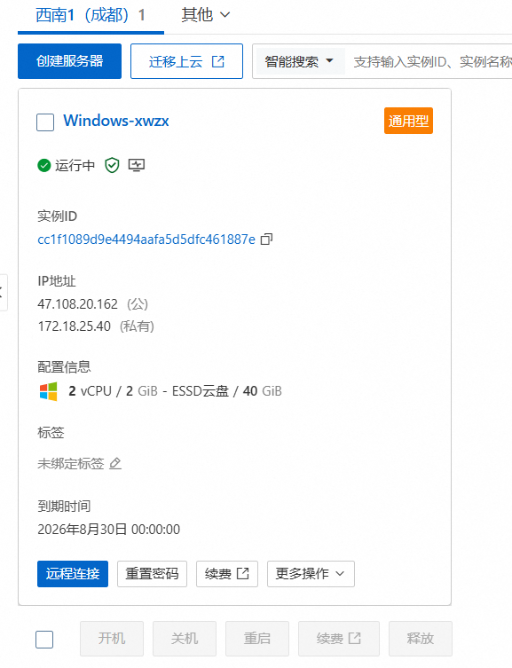

# 0、准备工作

要了解dex肯定要生成dex文件

1. 先写一段java代码（Test.java）

   ```java
   public class Test{
       int a = 0;
       static String b = "Hello";
   
       public int getNumber(int i, int j) {
           int c = 3;
           return c + i + j;
       }
   
       public static void main(String[] args){
           int d = 1;
           int e = 2;
           Test test = new Test();
           String sayNumber = String.valueOf(test.getNumber(d, e));
           System.out.println("sh4d0w" + sayNumber);   
       }
   }
   ```

2. 用javac编译为class文件

   `javac Test.java`

3. 用d8(SDK28以上叫d8，以下叫dx)生成dex文件

   `D:\Android_tools\as\SDK\build-tools\36.0.0\d8  --output . Test.class`

然后把classes.dex文件放入010editor，就可以开始学习了

**数据类型**

| 自定义类型 | 原类型   | 含义                      |
| ---------- | -------- | ------------------------- |
| s1         | int8_t   | 有符号单字节              |
| u1         | uint8_t  | 无符号单字节              |
| s2         | int16_t  |                           |
| u2         | uint16_t |                           |
| s4         | int32_t  |                           |
| u4         | uint32_t |                           |
| s8         | int64_t  |                           |
| u8         | uint64_t |                           |
| sleb128    | 无       | 有符号LEB128，可变长度    |
| uleb128    | 无       | 无符号LEB123，可变长度    |
| uleb128p1  | 无       | 等于ULEB128 + 1，可变长度 |

# 1、dex文件结构

> 图1自己画的概图，图2来自52pj Hawcett



dex文件结构比pe文件简单，主要包含以上数据体

| 数据名称   | 解释                                                         |
| ---------- | ------------------------------------------------------------ |
| Header     | dex头部文件，记录dex文件属性                                 |
| String_ids | 字符串数据索引，记录每个字符串在数据区的偏移量               |
| Type_ids   | 类似数据索引，记录了每个类型的字符串索引                     |
| Proto_ids  | 原型数据索引，记录了方法声明的字符串，返回类型字符串，参数列表 |
| Field_ids  | 字段数据索引，记录方法所属类，类型以及方法名                 |
| Method_ids | 类方法索引，记录方法所属类名，方法声明以及方法名等信息       |
| Class_defs | 类定义数据索引，记录制定类各类信息，包括接口、超类、类数据偏移量 |
| Data       | 数据区，记录了各个类的真实数据                               |
| Link_data  | 链接数据区                                                   |

## header

```c
typedef struct DexHeader {
        u1  magic[8];           //Dex版本号 dex.035 .035即为版本号 
        u4  checksum;           //adler32检验,如果修改了Dex文件,需要修正这个值,否则会运行不起来
        u1  signature[kSHA1DigestLen]; //SHA-1值,Android不检测该值,但如果修改了Dex文件,最好修复该值,再修checksum
        u4  fileSize;           //整个dex文件的大小
        u4  headerSize;         //DexHeader结构的大小,固定为0x70
        u4  endianTag;          //字节序标记,若该字段按小端方式读出来为0x12345678,则整个Dex文件就是小端方式.如果按大端方式读出来为0x12345678,那整个Dex文件就是大端方式
        u4  linkSize;                        //链接段大小
        u4  linkOff;                        //链接段偏移
        u4  mapOff;                                //DexMapList文件偏移
        u4  stringIdsSize;                //DexStringId个数
        u4  stringIdsOff;                //DexStringId文件偏移
        u4  typeIdsSize;                //DexTypeId个数
        u4  typeIdsOff;                        //DexTypeId文件偏移
        u4  protoIdsSize;                //DexProtoId个数
        u4  protoIdsOff;                //DexProtoId文件偏移
        u4  fieldIdsSize;                //DexFieldId个数
        u4  fieldIdsOff;                //DexFieldId文件偏移
        u4  methodIdsSize;                //DexMethodId个数
        u4  methodIdsOff;                //DexMethodId文件偏移
        u4  classDefsSize;                //DexClassDef个数
        u4  classDefsOff;                //DexClassDef文件偏移
        u4  dataSize;                        //数据段大小
        u4  dataOff;                        //数据段文件偏移
} DexHeader;
```

我们可以在010editor里查看文件结构

这里已经比较直观了，也可以写个脚本直接查询

```c
#include <stdio.h>
#include <stdlib.h>
#include <string.h>
#include <stdint.h>

// DEX文件头结构定义（基于Android 5.0+的DEX格式）
#pragma pack(push, 1)
typedef struct
{
    uint8_t magic[8];       // 文件标识，固定为 "dex\n035\0" 或 "dex\n037\0"
    uint32_t checksum;      // Adler32校验和
    uint8_t signature[20];  // SHA-1哈希值
    uint32_t fileSize;      // 文件总大小（字节）
    uint32_t headerSize;    // 头部大小（字节）
    uint32_t endianTag;     // 字节序标记
    uint32_t linkSize;      // 链接段大小（字节）
    uint32_t linkOff;       // 链接段偏移（字节）
    uint32_t mapOff;        // map_list偏移（字节）
    uint32_t stringIdsSize; // string_ids数量
    uint32_t stringIdsOff;  // string_ids偏移（字节）
    uint32_t typeIdsSize;   // type_ids数量
    uint32_t typeIdsOff;    // type_ids偏移（字节）
    uint32_t protoIdsSize;  // proto_ids数量
    uint32_t protoIdsOff;   // proto_ids偏移（字节）
    uint32_t fieldIdsSize;  // field_ids数量
    uint32_t fieldIdsOff;   // field_ids偏移（字节）
    uint32_t methodIdsSize; // method_ids数量
    uint32_t methodIdsOff;  // method_ids偏移（字节）
    uint32_t classDefsSize; // class_defs数量
    uint32_t classDefsOff;  // class_defs偏移（字节）
    uint32_t dataSize;      // 数据段大小（字节）
    uint32_t dataOff;       // 数据段偏移（字节）
} DexHeader;
#pragma pack(pop)

// 打印十六进制字节数组
void printHexBytes(const uint8_t *bytes, int len)
{
    for (int i = 0; i < len; i++)
    {
        printf("%02x", bytes[i]);
    }
    printf("\n");
}

// 读取DEX文件并打印头部信息
int printDexHeader(const char *dexFilePath)
{
    FILE *file = fopen(dexFilePath, "rb");
    if (!file)
    {
        printf("无法打开文件: %s\n", dexFilePath);
        return -1;
    }

    // 分配内存读取文件头
    DexHeader header;
    size_t readSize = fread(&header, sizeof(DexHeader), 1, file);
    if (readSize != 1)
    {
        printf("读取DEX头部失败\n");
        fclose(file);
        return -1;
    }

    // 验证magic字段（DEX文件标识）
    const char *expectedMagic = "dex\n035\0";
    if (memcmp(header.magic, expectedMagic, 8) != 0)
    {
        printf("警告: magic字段不匹配，可能不是有效的DEX文件\n");
        printf("实际magic: ");
        printHexBytes(header.magic, 8);
        printf("预期magic: ");
        printHexBytes((uint8_t *)expectedMagic, 8);
    }

    // 打印DEX头部信息
    printf("DEX文件头信息:\n");
    printf("  magic: ");
    printHexBytes(header.magic, 8);
    printf("  checksum: 0x%08x\n", header.checksum);
    printf("  signature: ");
    printHexBytes(header.signature, 20);
    printf("  fileSize: 0x%08x  \n", header.fileSize, header.fileSize);
    printf("  headerSize: 0x%08x  \n", header.headerSize, header.headerSize);
    printf("  endianTag: 0x%08x\n", header.endianTag);
    printf("  linkSize: 0x%08x  \n", header.linkSize, header.linkSize);
    printf("  linkOff: 0x%08x  \n", header.linkOff, header.linkOff);
    printf("  mapOff: 0x%08x  \n", header.mapOff, header.mapOff);
    printf("  stringIdsSize: 0x%08x   \n", header.stringIdsSize, header.stringIdsSize);
    printf("  stringIdsOff: 0x%08x  \n", header.stringIdsOff, header.stringIdsOff);
    printf("  typeIdsSize: 0x%08x   \n", header.typeIdsSize, header.typeIdsSize);
    printf("  typeIdsOff: 0x%08x  \n", header.typeIdsOff, header.typeIdsOff);
    printf("  protoIdsSize: 0x%08x   \n", header.protoIdsSize, header.protoIdsSize);
    printf("  protoIdsOff: 0x%08x  \n", header.protoIdsOff, header.protoIdsOff);
    printf("  fieldIdsSize: 0x%08x   \n", header.fieldIdsSize, header.fieldIdsSize);
    printf("  fieldIdsOff: 0x%08x  \n", header.fieldIdsOff, header.fieldIdsOff);
    printf("  methodIdsSize: 0x%08x   \n", header.methodIdsSize, header.methodIdsSize);
    printf("  methodIdsOff: 0x%08x  \n", header.methodIdsOff, header.methodIdsOff);
    printf("  classDefsSize: 0x%08x   \n", header.classDefsSize, header.classDefsSize);
    printf("  classDefsOff: 0x%08x  \n", header.classDefsOff, header.classDefsOff);
    printf("  dataSize: 0x%08x  \n", header.dataSize, header.dataSize);
    printf("  dataOff: 0x%08x  \n", header.dataOff, header.dataOff);

    fclose(file);
    return 0;
}

int main(int argc, char *argv[])
{
    if (argc != 2)
    {
        printf("用法: %s <classes.dex路径>\n", argv[0]);
        return 1;
    }

    return printDexHeader(argv[1]);
}
```

效果如下：

## string_ids

是由很多个string_id数据组成，其个数由header里的stringIdsSize决定(下面数据体的个数/长度也是看header)

结构如下：

```c
struct DexStringId {
    u4 stringDataOff;      /* 字符串的文件偏移量 */
};
//伪结构表示如下:
struct string_data_item {
 uleb128 utf16_size; //字符串长度
 ubyte[] data;       //字符串数据
}
```

## type_ids

descriptorIdx为DexStringID表的索引,对应字符串表示类的类型

```c
typedef struct DexTypeId {
    u4  descriptorIdx;     //指向DexStringId列表的索引
} DexTypeId;
```

## proto_ids

```c
typedef struct DexProtoId {
    u4  shortyIdx;          //方法声明字符串,指向DexStringId列表的索引
    u4  returnTypeIdx;      //方法返回类型字符串,指向DexTypeId列表的索引
    u4  parametersOff;      //方法的参数列表,是DexTypeList文件的偏移
} DexProtoId;
```

### DexTypeList

```c
typedef struct DexTypeList {
    u4  size;               //DexTypeItem个数, 即参数个数
    DexTypeItem list[size]; //DexTypeItem数组, 按从左到右的顺序保存了方法的参数
} DexTypeList;

typedef struct DexTypeItem {
    u2  typeIdx;           //指向DexTypeId列表的索引
} DexTypeItem;
```

## field_ids

```c
typedef struct DexFieldId {
    u2  classIdx;           //类的类型,指向DexTypeId列表的索引
    u2  typeIdx;            //字段类型,指向DexTypeId列表的索引
    u4  nameIdx;            //字段名,指向DexStringId列表的索引
} DexFieldId;
```

## method_ids

```c
struct DexMethodId {
    u2  classIdx;           /* 方法的所属的类，指向DexTypeId列表的索引 */
    u2  protoIdx;           /* 声明类型，指向DexProtoId列表的索引 */
    u4  nameIdx;            /* 方法名，指向DexStringId列表的索引 */
};
```

## class_defs

整体结构如下:

```c
struct DexClassDef {
    u4  classIdx;           /* 类的类型（即全限定类名），指向DexTypeId列表的索引 */
    u4  accessFlags;        /* 访问标志，以ACC_开头的枚举值，如ACC_PUBLIC（0x1）、ACC_PRIVATE（0x2）*/
    u4  superclassIdx;      /* 父类类型，指向DexTypeId列表的索引*/
    u4  interfacesOff;      /* 接口，指向DexTypeList的文件偏移，如果类中不含有接口声明和实现，则值为0 */
    u4  sourceFileIdx;      /* 类所在源文件的文件名，指向DexStringId列表的索引 */
    u4  annotationsOff;     /* 注解，指向DexAnnotationsDirectoryItem结构体，根据类型不同会有注解类、注解方法、注解字段与注解参数，如果类中没有注解，则值为0 */
    u4  classDataOff;       /* 指向DexClassData结构的文件偏移，DexClassData结构是类的数据部分 */
    u4  staticValuesOff;    /* 指向DexEncodedArray结构的文件偏移，记录类中的静态数据, 没有则为0 */
};
```

我们将ClassDef结构划分为4部分解析: `BasicInfo`,` Annotations`,` ClassData`,` StaticValues`

### BasicInfo

从classIdx到sourceFileIx属于BasicInfo

### DexAnnotationsDirectoryItem

annotationsOff指向该结构，用于指向类的所有注解，定义如下：

```c
struct DexAnnotationsDirectoryItem {
    u4  classAnnotationsOff;  /* 类注解，值为DexAnnotationSetItem的文件偏移量, 为0表示不存在*/
    u4  fieldsSize;           /* 域注解，值为DexFieldAnnotationsItem的数量 */
    u4  methodsSize;          /* 方法注解，值为DexMethodAnnotationsItem的数量 */
    u4  parametersSize;       /* 参数注解。值为DexParameterAnnotationsItem的数量 */
    /* 后3结构中存在1个或多个，则在后面追加以下数据，并按顺序排列 */
    /* followed by DexFieldAnnotationsItem[fieldsSize] */
    /* followed by DexMethodAnnotationsItem[methodsSize] */
    /* followed by DexParameterAnnotationsItem[parametersSize] */
};
```

#### 类注解 DexAnnotationSetItem

```c
struct DexAnnotationSetItem {
    u4  size;                                                /* DexAnnotationItem的数量 */
    u4  entries[1];                 /* entries数组,存储DexAnnotationItem的文件偏移量 */
};

struct DexAnnotationItem {
    u1  visibility;                                        /* 此注释的预期可见性 */
    u1  annotation[1];              /* encoded_annotation格式的注释内容 */
};
```

#### 域注解 DexFieldAnnotationsItem

```c
struct DexFieldAnnotationsItem {
    u4  fieldIdx;                                        /* 指向DexFieldId列表的索引值 */
    u4  annotationsOff;             /* DexAnnotationSetItem的文件偏移量 */
};
```

#### 方法注解 DexMethodAnnotationsItem

```c
/*
 * Direct-mapped "method_annotations_item".
 */
struct DexMethodAnnotationsItem {
    u4  methodIdx;                                        /* 指向DexMethodId列表的索引值 */
    u4  annotationsOff;             /* DexAnnotationSetItem的文件偏移量 */
};
```

#### 参数注解 DexParameterAnnotationsItem

```c
/*
 * Direct-mapped "parameter_annotations_item".
 */
struct DexParameterAnnotationsItem {
    u4  methodIdx;                                        /* 指向DexMethodId列表的索引值 */
    u4  annotationsOff;             /* DexAnotationSetRefList的文件偏移量 */
};
```


### DexClassData

```c
/* expanded form of class_data_item. Note: If a particular item is
 * absent (e.g., no static fields), then the corresponding pointer
 * is set to NULL. */
typedef struct DexClassData {
    DexClassDataHeader header;
    DexField*          staticFields;        //下面4个连续数组,如果对应长度存在才有效
    DexField*          instanceFields;      //按顺序排列        
    DexMethod*         directMethods;
    DexMethod*         virtualMethods;
} DexClassData;
```

### staticValuesOff

指向DexEncodeArray结构的偏移，记录了类中的静态数据，没有则为0

#### DexEncodeArray

定义如下：(作用先未知)

```c
struct DexEncodeArray{
  u1 array[1];
}
```

## dex_map_list

Dalvik虚拟机解析dex文件后,映射为DexMapList的数据结构, 该结构由DexHeader.mapOff指明位置

```c
struct DexMapList {
    u4  size;               /* DexMapItem个数 */
    DexMapItem list[1];     /* DexMapItem数组 */
};

struct DexMapItem {
    u2 type;              /* KDexType开头的类型 */
    u2 unused;            /* 未使用，用于字节对齐 */
    u4 size;              /* 类型的个数 */
    u4 offset;            /* 类型数据的文件偏移 */
};
```


