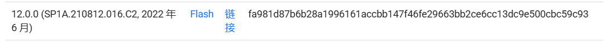
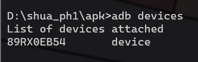
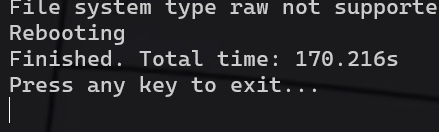
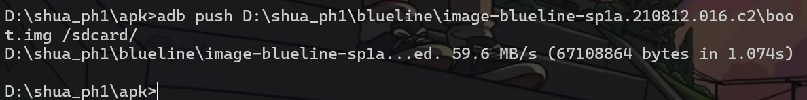
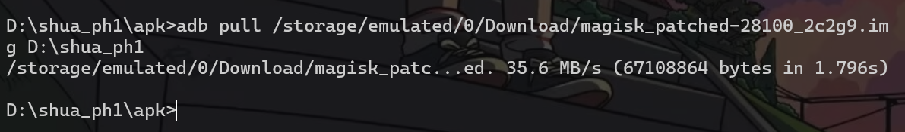
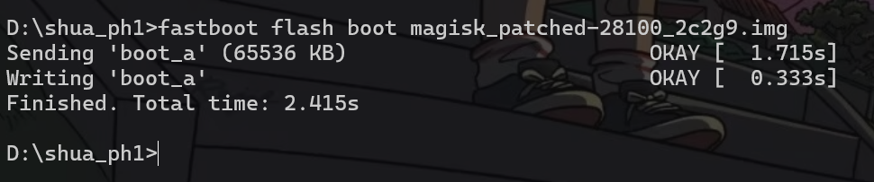
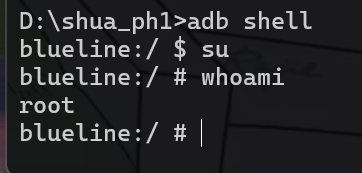

# pixel 3 android 12 线刷

## 先前准备

- 手机能解锁bootloader
- 对应版本刷机镜像

> pixel官方镜像网址
>
> https://developers.google.cn/android/images?hl=zh-cn#blueline



- 下载Android SDK platform-tools（ADB）

> https://developer.android.com/tools/releases/platform-tools?hl=zh-cn

## 刷机

**1）adb连接**

手机连点7次`设置->关于手机->版本号`进入开发者模式

进入`系统->高级->开发者选项`，开启`USB调试`

数据线连接手机和电脑

PC端运行指令，手机端在弹出的消息中选择同意调试，连接成功会显示已连接的设备

```
adb devices
```



这时候可以进入手机的shell，由于还没root，只有普通用户权限，部分文件夹无权限访问

**2）解锁Bootloader**

重启手机并进入`bootloader`菜单，可以使用adb命令或在关机时长按[电源键]+[音量下键]

```
adb reboot bootloader
```

在bootloader菜单中使用fastboot命令解锁bootloader

```
fastboot flashing unlock
```

解锁后每次开机会有警告

**3）刷入镜像**

解压镜像压缩包，再进入该文件夹，然后运行以下命令

```
adb reboot bootloader # 先进入 bootloader 模式
flash-all.bat         # 运行bat脚本
```

等待脚本跑完，中间如果卡住可以按回车试试



刷完进行系统初始化，自行设置即可

## root

`重新进入开发者模式`，开启USB调试，重新连上adb

**1）恢复正常网络**

我们连接上wifi后，会在wifi图标旁有个!，也会告诉我们"XXXX的连接受限"

其实这种情况下是能够直接使用的，不过看起来很不舒服

我们可以使用如下指令

```
adb shell settings put global captive_portal_mode 0
```

然后打开`飞行模式`再关闭，就能正常连接了

**2）安装Magisk**

> https://github.com/topjohnwu/Magisk/releases

```
adb install <magisk.apk路径>
```


**3）root**

刚才的解压的镜像包中还有一个压缩文件`image-blueline-sp1a.210812.016.c2.zip`，解压后里面有个`boot.img`。

把`boot.img`传到手机上

```
adb push <boot.img路径> /sdcard/
```



手机上打开 `Magisk` , 依次点击 `安装->选择并修补一个文件->/sdcard/boot.img->开始`

修补完成后，将修补后的 `boot.img` 传到电脑上

```
adb pull /storage/emulated/0/Download/magisk_patched-xxxxx_xxxxx.img <pc端目标地址>
```



刷入经过 Magisk 修补好的 `boot.img`

```
adb reboot bootloader 
fastboot flash boot magisk_patched-xxxxx_xxxxx.img
```



再次开机，电脑`adb shell`后输入`su`，手机同意超级用户权限，root成功

