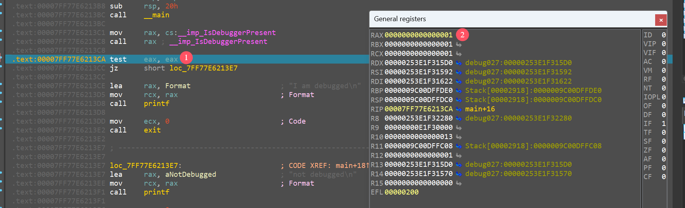
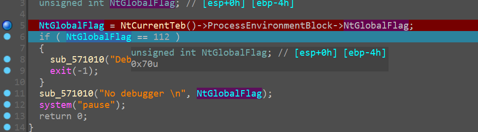
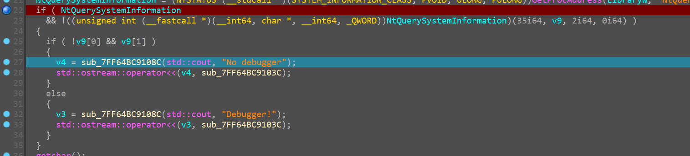
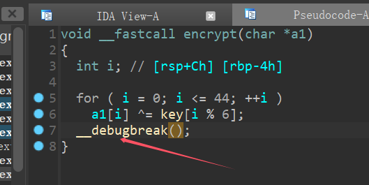
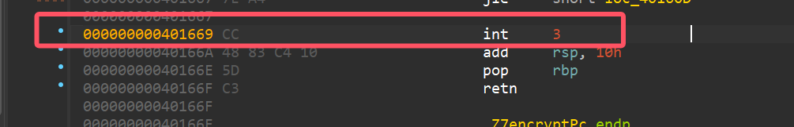
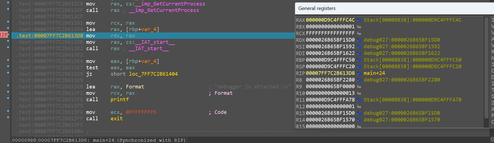
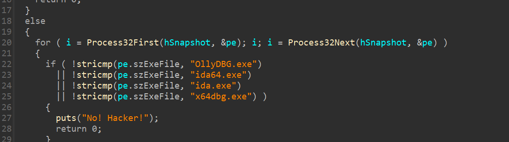
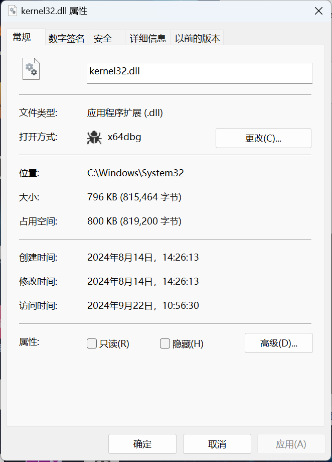

# 一、基于PEB的调试器检测

## 1. IsDebuggerPresent

`IsDebuggerPresent`是Windows提供的API接口，实际上是访问PEB的BeingDebugged标志来判断是否处于调试状态

> 只能检测是否被本地调试器调试

### 代码实现

```c
#include <stdio.h>
#include <Windows.h>
#include <stdlib.h>

int main()
{
    if(IsDebuggerPresent()){
        printf("I am debugged\n");
        exit(0);
    }
    else{
        printf("not debugged\n");
    }
    return 0;
}
```

### 对抗

实际上是使用`IsDebuggerPresent`和`exit`来实现反调试，只要处于调试状态，就会触发exit(0)结束进程

对抗它的方法，一般是patch RAX寄存器的值



使得检测到调试状态也不触发exit(0)

## 2. NtGlobalFlag

NtGlobalFlag 是一个`Windows`内核全局标记，在`Windows`调试方案中经常用到。`NtGlobalFlag`标记是内核全局标记

利用该标记反调试，首先定位`dt -rv ntdll!_TEB`找到`TEB`结构并通过TEB找到`PEB`结构，然后找到`+0x068 NtGlobalFlag`，这个位置的`NtGlobalFlag`类似于同样来自于PEB结构体的`BeingDebugged`，如果是调试状态`NtGlobalFlag`的值会是`0x70`，所以可以判断这个标志是否为`0x70`来判断程序是否被调试了

### 代码实现

```c
#include <stdio.h>
#include <windows.h>

int main(int argc, char* argv[])
{

    DWORD Debug = 0;
    __asm
    {
        mov eax, fs: [0x18]      // TEB基地址
        mov eax, [eax + 0x30]    // 找到PEB
        mov eax, [eax + 0x68]    // 找到 NtGlobalFlag
        mov Debug, eax           // 取出值
    }

    if (Debug == 0x70)
    {
        printf("Debugger! \n");
        exit(-1);
    }
    else
    {
        printf("No debugger \n");
    }

    system("pause");
    return 0;
}
```


### 对抗



可以通过修改NtGlobalFlag结果来绕过 

- `BeingDebugged`同理，把`1` patch 为`0`即可

## 3. HeapFlags && HeapForceFlags

在PEB的ProcessHeap位指向_HEAP结构体，该结构体中有俩个字段会受到调试器的影响，具体如何影响，取决于Windows的版本，主要是修改原始的内容，这两个字段是Flags和ForceFlags

如果 `HeapFlags` 的值**大于 2** 说明程序处于调试状态;

如果 `HeapForceFlags` 的值**大于 0** 则说明处于调试状态

### HeapFlags

- 对于 x64 系统，vista 以上版本的 HeapFlags 位于 *ProcessHeap+ 0x70，剩余低版本的 windows 中的 HeapFlags 位于 *ProcessHeap+ 0x14

- 对于 x86 系统 vista 以上版本的 HeapFlags 位于 *ProcessHeap + 0x40，剩余低版本的 windows 中的 HeapFlags 位于 *ProcessHeap + 0x0c

#### 代码实现

```c++
ULONG64 ul_processHeap = (ULONG64)(__readgsqword + 0x30);
ULONG64 ul_heapFlags = (ULONG64)(*ul_processHeap + 0x70);
if(*ul_heapFlags > 2){
	cout << "发现调试器" << endl;
}
else{
	cout << "没有调试器" << endl;
}

// win11 x64
```

### HeapForceFlags

- 对于 x64 系统，vista 以上版本的 HeapForceFlags位于 *ProcessHeap+ 0x74，剩余低版本的 windows 中的 HeapForceFlags 位于 *ProcessHeap+ 0x18

- 对于 x86 系统 vista 以上版本的 HeapForceFlags 位于 *ProcessHeap + 0x44，剩余低版本的 windows 中的 HeapForceFlags 位于 *ProcessHeap + 0x10

# 二、通过NtQueryInformationProcess函数检测

## 1. ProcessDebugPort -- 7

这个函数是Ntdll.dll中一个原生态API，它用来提取一个给定进程的信息。它的第一个参数是进程句柄，第二个参数告诉我们它需要提取进程信息的类型。为第二个参数指定特定值并调用该函数，相关信息就会设置到第三个参数。第二个参数是一个枚举类型，其中与反调试有关的成员有ProcessDebugPort(0x7)、ProcessDebugObjectHandle(0x1E)和ProcessDebugFlags(0x1F)。例如将该参数置为ProcessDebugPort，如果进程正在被调试，则返回调试端口，否则返回0。

`NtQueryInformationProcess()`函数接受一个信息类的参数用于查询. `ProcessDebugPort(7)`是其中的一个信息类. `kernel32`的`CheckRemoteDebuggerPresent()`函数内部通过调用`NtQueryInformationProcess()`来检测调试, 而`NtQueryInformationProcess`内部则是查询`EPROCESS`结构体的`DebugPort`字段, 当进程正在被调试时, 返回值为`0xffffffff`.

### 代码实现

要调用NtQueryInformationProcess函数，需要动态加载

```c
#include <windows.h>
#include <stdio.h>

// 定义 PROCESSINFOCLASS 枚举类型和 ProcessDebugPort 常量
typedef enum _PROCESSINFOCLASS {
    ProcessDebugPort = 7
} PROCESSINFOCLASS;

int main()
{
    // 动态加载 ntdll.dll
    HMODULE hNtdll = GetModuleHandleA("ntdll.dll");
    if (!hNtdll) {
        printf("Failed to load ntdll.dll\n");
        return -1;
    }

    // 获取 NtQueryInformationProcess 函数的地址
    FARPROC NtQueryInformationProcess = GetProcAddress(hNtdll, "NtQueryInformationProcess");
    if (!NtQueryInformationProcess) {
        printf("Failed to get NtQueryInformationProcess address\n");
        return -1;
    }

    // 检查进程的调试端口
    HANDLE hProcess = GetCurrentProcess();
    UINT64 debugPort;
    NTSTATUS status = ((NTSTATUS(WINAPI*)(HANDLE, PROCESSINFOCLASS, PVOID, UINT64, PULONG))NtQueryInformationProcess)(
        hProcess,
        ProcessDebugPort,
        &debugPort,
        sizeof(debugPort),
        NULL
        );

    if (status == 0 && debugPort != 0) {
        printf("Debugger is attached.\n");
        exit(-1);
    }
    else {
        printf("No debugger is attached.\n");
    }
    return 0;
}
```

ProcessDebugPort设置为7的原因参考[NtQueryInformationProcess 函数 (winternl.h) - Win32 apps | Microsoft Learn](https://learn.microsoft.com/zh-cn/windows/win32/api/winternl/nf-winternl-ntqueryinformationprocess)

这里被小坑了一手，官方里的debugPort定义用的ULONG(win32)，为32位。

而我是64位系统，需要改为UINT64

### 对抗

修改NtQueryInformationProcess得到的结果`debugPort`即可绕过

##  2. ProcessDebugObjectHandle -- 30(0x1E)

同上，NtQueryInformationProcess的第二个参数为30，这是⼀个未公开的字段，对应为ProcessDebugObjectHandle

开启调试进程时，会生成一个调试对象(Debug Obiect)，第二个参数设置为30时，函数的第三个参数就能获取到调试对象的句柄；没开启调试则返回值为`NULL`

### 对抗

同上修改函数的第三个参数即可

##  3. ProcessDebugFlags -- 31(0x1F)

检测Debug Flags(调试标志）的值可以判断进程处于调试状态，通过函数第三个参数就可以获取调试标志的值

- 若为0，则处于调试状态
- 若为1,则处于非调试状态

### 对抗

同上修改函数第三个参数即可

## 4. NtQuerySystemInformation

它是Windows Native API 中的一个函数, 它被用于获取系统底层的详细信息

`NtQuerySystemInformation`被 ntdll.dll 导出，当第一个参数传入 0x23 （SystemInterruptInformation） 时，会返回一个 `SYSTEM_KERNEL_DEBUGGER_INFORMATION`结构，里面的成员KdKdDebuggerEnable 和 KdDebuggerNotPresent 标志系统是否启用内核调试

### 代码实现

```c++
#include <iostream>
#include <Windows.h>
#include <intrin.h>

using namespace std;

typedef struct _SYSTEM_KERNEL_DEBUGGER_INFORMATION {
	BOOLEAN KernelDebuggerEnabled;
	BOOLEAN KernelDebuggerNotPresent;
} SYSTEM_KERNEL_DEBUGGER_INFORMATION, * PSYSTEM_KERNEL_DEBUGGER_INFORMATION;
typedef NTSTATUS(WINAPI* pNtQuerySystemInformation)(IN UINT SystemInformationClass, OUT PVOID SystemInformation, IN ULONG SystemInformationLength, OUT PULONG ReturnLength);

int main()
{
	// 取 NtQuerySystemInformation 地址
	pNtQuerySystemInformation NtQuerySystemInformation = (pNtQuerySystemInformation)GetProcAddress(LoadLibrary(L"ntdll.dll"), "NtQuerySystemInformation");
	if (NtQuerySystemInformation == NULL) {
		goto main_end;
	}

	// 获取系统信息
	SYSTEM_KERNEL_DEBUGGER_INFORMATION KdDebuggerInfo;
	if (NtQuerySystemInformation(
		0x23,											// 要检索的系统信息的类型: SystemInterruptInformation
		&KdDebuggerInfo,								// 接受请求信息
		sizeof(SYSTEM_KERNEL_DEBUGGER_INFORMATION),		// 请求信息的字节大小
		NULL
	) != 0) {
		goto main_end;
	}

	if (KdDebuggerInfo.KernelDebuggerEnabled || !KdDebuggerInfo.KernelDebuggerNotPresent) {
		cout << "Debugger!" << endl;
	}
	else {
		cout << "No debugger" << endl;
	}

main_end:
	getchar();
	return 0;
}
```

### 对抗

在jz/jnz指令处直接修改IP寄存器跳到后⾯的正常代码



# 三、异常处理

## 1. SEH

SEH（Structure Exception Handler），也就是结构化异常处理，是 Windows 系统 上对 C/C++ 程序语⾔的扩展，⽤于处理异常事件的程序控制结构。

### 为什么我们要使用异常处理机制？

当我们敲代码时，我们都知道，程序出现bug是很正常的，有些比较简单的错误，或者有些强大编译工具，在编译的时候能够将我们的错误直接寻找出来，然后告诉你某某行出现了错误，你直接去该地方，但是如果你写的程序，在编译时并没有出现错误，由于一些未考虑到的地方，和一些运行时，错误的输入，就如以下情况

例如： 1、做除法的时候除数为 0； 2、用户输入年龄时输入了一个负数； 3、用 new 运算符动态分配空间时，空间不够导致无法分配； 4、访问数组元素时，下标越界；打开文件读取时，文件不存在。

在这些情况下，虽然我们能通过编译，但是，运行的时候，我们可以发现，我们的程序会莫名其妙的强行停止，没有任何的信息和提示，出错点有这么多，我们如何才能知道到底出现的是什么错误呢？如何才能在程序g掉的时候，在最后一刻给我们发送一个信息告诉我们错在哪儿呢？

这个时候，我们创造出异常处理机制来帮我们解决这个问题。

### 什么是异常处理？

正如其名，所谓异常就是在**应用程序正常执行过程中发生了不正常的运行**。

简单来理解，就是我们写一段代码，在发生一些可预测的异常，甚至或者不可预测的异常时执行我们想要它做的代码，可以是反馈给我们错误信息，可以是修复，使得程序继续正常运行等操作。

说到异常，我们必须要分辨一下，我们平常所说的异常和中断的区别。

中断，由外部硬件设备或异步事件产生。

异常由程序的内部事件产生，异常可以分为故障，陷阱，和终止。

### 异常处理的栈展开的实现

C++ 引入了异常处理机制。其基本思想是：函数 A 在执行过程中发现异常时可以不加处理，而只是“拋出一个异常”给 A 的调用者，假定为函数 B。 拋出异常而不加处理会导致函数 A 立即中止，在这种情况下，函数 B 可以选择捕获 A 拋出的异常进行处理，也可以选择置之不理。如果置之不理，这个异常就会被拋给 B 的调用者，以此类推。 如果一层层的函数都不处理异常，异常最终会被拋给最外层的 main 函数。main 函数应该处理异常。如果main函数也不处理异常，那么程序就会立即异常地中止

***栈展开*** Q:简述一下“栈展开”的过程?A:栈展开的就是指匹配catch子句的过程。具体匹配过程如下：1）当程序抛出一个异常或者在try块中检测到异常时就会停止执行当前的调用链，开始寻找与异常匹配的catch子句。2）当在try块中出现一个throw语句或者在try块中调用了可能出现异常的函数时，首先检查与该try块匹配的catch语句（一个try可能对应多个catch），逐个检查，直到找到匹配的即停止寻找，进入该catch执行处理异常的程序。（注意，匹配不代表最佳匹配，所以最佳的匹配要放在catch的最前端）。3）如果执行过程2）还是没有找到匹配的catch，且当前try嵌套在外部的try块中，则程序就会在外部的try块中查找，直到找到匹配的为止。4）如果执行过程3）还是没有找到匹配的catch语句，则退出当前调用的函数，继续在退出为止的函数的其他函数中寻找，以此类推。5）如果最终执行完上述步骤后还是没有找到匹配的catch，则就是说异常得不到处理（没有被捕获），程序会调用标准库函数terminate终止函数的执行。

### c++异常处理的代码简单探索

通过写代码，我们能对异常处理有一个更直观的认识。

c++在代码的异常处理上，运用的是，try..throw…catch

首先运行try里面，如果遇到异常，就throw抛出一个异常，然后直接调转到catch块，执行我们catch块的代码，这个catch代码里面我们可以打印错误信息，也可以修复错误让程序恢复正常，或者是当发生无可挽回的终止错误，我们可以紧急保存状态，将一些操作执行完，比如将数据输出到文件等。

try-catch 是一种异常处理机制，用于捕获和处理异常。通过使用 try 关键字将可能引发异常的代码块括起来，然后使用 catch 关键字来指定对特定类型的异常进行处理。

下面是 try-catch 异常处理的基本语法形式：

```cpp
try {
    // 可能引发异常的代码块
} catch (异常类型1 异常对象1) {
    // 对异常类型1 的处理代码
} catch (异常类型2 异常对象2) {
    // 对异常类型2 的处理代码
}
// 可选的其它代码
```

当 try 代码块中的代码引发异常时，异常会被抛出，然后依次检查 catch 块的异常类型，如果匹配到相应的异常类型，则执行对应的 catch 块中的代码。

在 catch 块中，您可以根据需要对捕获的异常做相应处理，例如输出错误消息、记录日志、重新抛出异常或采取其他适当的措施。

例如，以下示例演示了如何使用 try-catch 来找到并处理 std::exception 类型的异常：

```cpp
#include <iostream>
#include <exception>
int main() {
    try {
        // 可能引发异常的代码块
        throw std::exception();
    } catch (const std::exception& e) {
        // 对 std::exception 类型的异常进行处理
        std::cout << "捕获到异常: " << e.what() << std::endl;
    }

    return 0;
}
```

在这个示例中，我们使用 throw 语句故意引发 std::exception 异常，并在 catch 块中捕获该异常，然后输出异常信息。

需要注意的是，catch 块中指定的异常类型应该与实际引发的异常类型相匹配或为其基类。

通过使用多个 catch 块，可以针对不同的异常类型编写特定的处理代码，以实现对特定异常的处理。

### 关于异常处理我们还需了解的点

栈展开:  异常抛出后如果在当前函数内没有被捕捉(catch)，它就要沿着**函数的调用链继续往上抛**，直到走完整个调用链，或者在某个函数中找到相应的 catch。如果走完调用链都没有找到相应的 catch，那么 std::terminate() 就会被调用(也就是传到主函数那），这个函数默认是把程序终止掉(abort)，而如果最后找到了相应的 catch，就会进入该 catch 代码块，执行相应的操作。在这个不断向上抛出异常的过程中，如果不能得到对应catch的处理，就退出当前函数，并且***释放当前函数的内存并销毁局部对象***，***继续到上层的调用函数中查找***，直到找到一个可以处理该异常的 `catch` 。这个过程就是栈展开。

为什么要进行栈展开？

1.当程序出现异常时，可以将函数调用栈展开，查找能够处理该异常的代码位置，并执行相应的异常处理操作。

2.可以为程序调试提供帮助。在程序崩溃时，调试器可以通过栈展开来获取函数调用栈的信息，包括每个函数的参数、局部变量和返回值等，从而方便开发人员分析和修复问题。

3.当函数中存在需要释放内存的对象时，栈展开可以确保这些对象在函数退出时被正确地清理。如果没有栈展开，这些对象可能会在函数未正常退出时被遗留下来，导致内存泄漏等问题。

### SEH的机制

[异常处理程序](https://learn.microsoft.com/zh-cn/cpp/cpp/writing-an-exception-handler?view=msvc-170)或 **`__except`** 块，可以根据 `*filter-expression*` 值响应或消除异常。

[终止处理程序](https://learn.microsoft.com/zh-cn/cpp/cpp/writing-a-termination-handler?view=msvc-170)或 **`__finally`** 块，无论异常是否导致终止，都始终调用这两者

这两种类型的处理程序是不同的，但会通过称为“展开**堆栈**”的过程紧密关联。 发生结构化异常时，系统将查找当前处于活动状态的最新安装的异常处理程序。 该处理程序可以执行以下三个操作之一：

- 无法识别异常并将控件传递给其他处理程序 (`EXCEPTION_CONTINUE_SEARCH`)。
- 识别异常，但将其消除 (`EXCEPTION_CONTINUE_EXECUTION`)。
- 识别异常并处理它 (`EXCEPTION_EXECUTE_HANDLER`)。

识别异常的异常处理程序可能不在异常发生时正在运行的函数中。 它可能在堆栈上高得多的函数中。 当前正在运行的函数和堆栈帧上的所有其他函数都将终止。 在此过程中，堆栈会展开。 也就是说，已终止函数的局部非静态变量会从堆栈中清除。

当它展开堆栈时，操作系统将调用你为每个函数编写的任何终止处理程序。 通过使用终止处理程序清理资源，否则资源将由于异常终止而保持打开状态。 如果你已输入了关键部分，可以在终止处理程序中退出它。 程序将要关闭时，你可以执行其他维护任务，如关闭和删除临时文件。

### CTF中SEH的使用

Windows中有一个机制叫异常处理机制，当出现异常的时候操作系统会先把异常抛给调试器并停止在该指令位置，如果没有调试器就会抛给SEH来处理，SEH实现的原理是内部是一个SEH链表包含了一系列异常处理函数，当有异常类添加进来的时候操作系统会把异常添加到SEH链表里面，然后当异常出现的时候遍历异常类看看有没有对应的异常处理，如果该异常没有异常处理则直接程序崩溃。

所以对于此方面的处理，由于出题人会将我们的关键代码，放入SEH断下来之后，从而实现了代码的隐藏，所以处理此类题目我们的思路就是，就是去寻找出题人隐藏的代码，其中有两方面，**一方面就是观察主程序的汇编，对于jmp要特别主要，大多数，就会出现一个莫名的jmp跳过了一大段的内容**，这是因为使用了SEH处理机制，将SEH断入，就会执行我们那跳过的代码。所以我们只需修改跳转即可，另外如果主程序没有而是在其他地方调用，这就需要我们进行动态调试了，**通过动态调试确定我们数据被修改的地方，也能找到被出题人隐藏的代码**。

## 2. VEH

与 SEH 不同的是，SEH 是局部异常链表，⽽ VEH 是全局异常链表，进程的不同线程共⽤⼀个 VEH 链表。SEH是`基于线程`的，而VEH是`基于进程`的。

windows有对应的api函数可以实现`AddVectoredExceptionHandler`

# 四、通过ThreadHideFromDebuger干扰调试

## 1. ZwSetInformationThread

ZwSetInformationThread 等同于 NtSetInformationThread，通过为线程设置 ThreadHideFromDebugger，可以禁止线程产生调试事件

### 对抗

注意到该处 ZwSetInformationThread 函数的第 2 个参数为 ThreadHideFromDebugger，其值为 0x11。调试执行到该函数时，若发现第 2 个参数值为 0x11，跳过或者将 0x11 修改为其他值即可

## 2. NtCreateThreadEx反调

除了通过ZwSetInformationThread来设置已有线程的ThreadHideFromDebuger标记位外，还可以创建一个新的、创建开始就自动具备ThreadHideFromDebuger属性的线程。ZwCreateThreadEx函数的声明如下：

其中CreateFlags参数如果设置了THREAD_CREATE_FLAGS_HIDE_FROM_DEBUGGER位的话则创建的新线程直接具有反调试功能。

### 绕过方法

对ZwCreateThreadEx进行hook过滤，去掉线程ThreadHideFromDebugger属性

# 五、异常结合断点检测调试器

## 1. INT 3（软件断点）

机器码0x33，通过初步分析可以注意到程序通过`AddVectoredExceptionHandler(1,(PVECTORED_EXCEPTION_HANDLER)Handler);` 注册了⼀个异常处理句柄，一般可以发现在 encrypt 函数的结尾存在⼀个软件中断指令( int 3 ，0xCC)

无论何时，使用调试器设置一个断点，它都会插入一个0xCC来修改代码





这里触发断点检测异常过后，就会跳转到注册的异常句柄的函数中，这里一般写在加密逻辑之前，可能藏有影响解题的逻辑

### [SP]代码完整性校验反调

此类反调试也是基于INT 3实现，比如取main函数的地址去进行某个计算，得到的值是固定的(因为main函数完整)。假如在main函数中下了软件断点，就会破坏代码完整性，导致运算值匹配不上，从而触发反调试逻辑

## 2. INT 2D

作为反调试⼿段时，INT 2D 与 INT 3 的作⽤原理相同，在该位置会引发断点异常，进⼊异常处理句柄中触发其他逻辑

## 3. 硬件断点

需要依赖于硬件基础，最多设置为4个，依赖于DR0,DR1,DR2,DR3寄存器

代码访问断点，也就是我们的调试地址寄存器指向的是代码段的一句指令，运行到此处时就会触发断点。听起来和软件断点似乎没有什么不同，但要注意，我们并没有用0xcc去覆盖指令，这就意味着我们不需要复杂的操作来善后，更关键的是，当我们下软件断点时，因为要覆盖，所以要覆盖的指令必须先存在，如果碰到SMC类的程序（如果不知道的朋友可以当作是代码边执行边生成，并不是一次性出现了全部代码）就会碰到下不上断点的尴尬处境，而硬件断点因为是地址，哪怕某个时刻该地址的指令还没被加载，也一样可以下断点。`单步调试`实际上也是用了这个原理

很容易想到预防硬件断点的反调试手段，即然用的是寄存器表示，我只需要看看寄存器的值是不是空就可以判断你是不是下过硬件断点了

# 六、 基于时间的反调试

其实实现方式都大差不差，都是利用调试状态比正常执行的时间长做文章

以下内容针对用户模式，内核模式涉及的基于时间反调试没有总结，包括但不限于：**RDPMC**、**ZwGetTickCount函数 / KiGetTickCount函数**

## 1. GetTickCount函数

程序通过两次`GetTickCount`来获取中间循环的执⾏时间，当代码被调试时消耗 的时间会⽐正常执⾏更⻓，所以可以根据这个⽅法来检测是否被调试

绕过方式可以修改对应寄存器的值解决

```c
bool IsDebugged(DWORD dwNativeElapsed)
{
    DWORD dwStart = GetTickCount();
    // ... some work
    return (GetTickCount() - dwStart) > dwNativeElapsed;
}
```

## 2. rdtsc函数

原理很直接了就是在代码的俩个地方执行rdtsc函数，然后检测两次执行的时间差

```c
BOOL CheckDebug()  
{  
    DWORD time1, time2;  
    __asm  
    {  
        rdtsc  
        mov time1, eax  
        rdtsc  
        mov time2, eax  
    }  
    if (time2 - time1 < 0xff){  
        return FALSE;  
    }else{  
        return TRUE;  
    }  
} 
```


## 3. GetLocalTime函数

通过调用两次 `GetLocalTime` 来检测时间间隔

```c
bool IsDebugged(DWORD64 qwNativeElapsed)
{
    SYSTEMTIME stStart, stEnd;
    FILETIME ftStart, ftEnd;
    ULARGE_INTEGER uiStart, uiEnd;

    GetLocalTime(&stStart);
    // ... some work
    GetLocalTime(&stEnd);

    if (!SystemTimeToFileTime(&stStart, &ftStart))
        return false;
    if (!SystemTimeToFileTime(&stEnd, &ftEnd))
        return false;

    uiStart.LowPart  = ftStart.dwLowDateTime;
    uiStart.HighPart = ftStart.dwHighDateTime;
    uiEnd.LowPart  = ftEnd.dwLowDateTime;
    uiEnd.HighPart = ftEnd.dwHighDateTime;
    return (uiEnd.QuadPart - uiStart.QuadPart) > qwNativeElapsed;
}
```

## 4. GetSystemTime函数

通过调用两次 `GetSystemTime` 来检测时间间隔

```c
bool IsDebugged(DWORD64 qwNativeElapsed)
{
    SYSTEMTIME stStart, stEnd;
    FILETIME ftStart, ftEnd;
    ULARGE_INTEGER uiStart, uiEnd;

    GetSystemTime(&stStart);
    // ... some work
    GetSystemTime(&stEnd);

    if (!SystemTimeToFileTime(&stStart, &ftStart))
        return false;
    if (!SystemTimeToFileTime(&stEnd, &ftEnd))
        return false;

    uiStart.LowPart  = ftStart.dwLowDateTime;
    uiStart.HighPart = ftStart.dwHighDateTime;
    uiEnd.LowPart  = ftEnd.dwLowDateTime;
    uiEnd.HighPart = ftEnd.dwHighDateTime;
    return (uiEnd.QuadPart - uiStart.QuadPart) > qwNativeElapsed;
}
```

## 5. QueryPerformanceCounter函数

```c
bool IsDebugged(DWORD64 qwNativeElapsed)
{
    LARGE_INTEGER liStart, liEnd;
    QueryPerformanceCounter(&liStart);
    // ... some work
    QueryPerformanceCounter(&liEnd);
    return (liEnd.QuadPart - liStart.QuadPart) > qwNativeElapsed;
}
```

## 7. timeGetTime

```c
bool IsDebugged(DWORD dwNativeElapsed)
{
    DWORD dwStart = timeGetTime();
    // ... some work
    return (timeGetTime() - dwStart) > dwNativeElapsed;
}
```

# 七、其它

## 1. **CheckRemoteDebuggerPresent** 

`CheckRemoteDebuggerPresent` 也是一个微软提供的反调试函数，该函数可以在本地或者远程进程中使用。函数接收两个参数，进程句柄和一个指向布尔值的指针。如果指定的进程正在被调试，则函数会把指向布尔值的指针设为 TRUE，否则设为FALSE

> 可以检测本地和远程调试

### 代码实现

结合使用`GetCurrentProcess()`来获得当前进程的伪句柄，来实现反调试

```c
#include <windows.h>
#include <stdio.h>

int main()
{
    BOOL isDebugger = FALSE;
    CheckRemoteDebuggerPresent(GetCurrentProcess(), &isDebugger);
    if (isDebugger)
    {
        printf("debugger is attached.\n");
        exit(-1);
    }
    else
    {
        printf("No debugger is attached.\n");
    }
    return 0;
}
```

### 对抗



- 可以在此处patch RAX的值为0，相当于把伪句柄改为0，自然而然isDebugger返回0

- 也可以在下面`test eax eax`处把rax patch为0，相当于把true改为flase

## 2. SetUnhandledExceptionFilter 

SetUnhandledExceptionFilter 是⼀个 Windows 的 API ，可以注册⼀个异常处理函数。当⼀个异常产⽣且没有被其他异常处理机制捕获并处理时，将会由该函数注册的异常处理函数进⾏处理。这是我们的应⽤程序处理异常的最后机会。 

程序通过 SetUnhandledExceptionFilter(Handler) 注册了异常处理程序，触发异常时对输⼊进⾏额外的操作 ，然后继续正常执⾏。若程序处于调试状态，则该异常将被调试器接管，导致程序执⾏流程与正常流程不同， 达到反调试的⽬的。

简单来说就是调试的时候会异常报错，直接退出，调试不进异常处理函数，实际上遇到异常的时候，会进行异常处理函数内的操作

## 3. 检查父进程

GetShellWindow函数获取explorer.exe的句柄，然后GetWindowThreadProcessId得 到explorer.exe的PID。通过ZwQueryInformationProcess获取当前进程的⽗进程 PID与explorer.exe的PID进⾏⽐较 

既然有比较，那绕过就可以修改cmp之后的zf，也可以修改跳转的函数地址

## 4. 枚举进程

最简单的反调试，但是可能用各种hook技术隐藏，类似于下面



通过查看进程列表中有没有常⽤的调试器来达到检测调试器的⽬的 

## 5. Debug Blocker

Debug Blocker是自我创建技术（以子进程形式运行自身进程）的演进形式。自我创建技术中，子进程负责执行实际原代码，父进程负责创建子进程、修改内存（代码/数据）、更改EP地址等。所以仅调试父进程将无法转到OEP代码处，这样能起到很好的反调试效果。但调试时若用附加命令将子进程附加到调试器，这种反调试手法就会失去作用。Debug Blocker技术的出现正是为了弥补这一不足。

SEH反调试是在同一内存空间处理异常, 但是Debug Blocker是在调试进程的内存空间处理被调试进程的异常, 所以其他调试器不能附加目标进程, 要附加目标进程就先得断开与父进程的联系, 但是断开之后子进程也不能继续运行, 这就是Debug Blocker的精(bian)妙(tai)之处

## 6. Heaven's Gate

### (一) 基础知识

天堂之门，是建立在WoW64技术上的逆向反调试技术

要去认识它，需要先明白**64位系统中32位应用程序的执行过程**以及**WoW64是什么**

#### 1.1 在x64下的进程

在**x64**下的进程，不管是32位或者是64位，实际上都映射了两个地址空间，一个是32位，一个是64位，相当于一个进程的两种工作模式

解释：在64位的操作系统上，32位的应用程序并不能直接在64位环境下运行。为了使32位程序可以正常运行，操作系统提供了一个称为 **WoW64**（Windows on Windows 64-bit）的子系统。WoW64 子系统相当于一个兼容层，专门为32位程序提供了类似32位的运行环境

- 事实上这个32位程序运行的环境也是一个64位的运行环境，系统在创建32位进程时，首先创建一个64位的进程，然后再在其中创建一个32位的子环境。32位程序所调用的系统函数，最终都要通过64位的动态链接库而实现

**而这两种工作模式是可以进行切换的**，他们之间的关键区别在于 `cs`段寄存器  

- 64位:CS = 0x33 
- 32位:CS = 0x23

Windows判别位的方式，是根据`cs`段寄存器的，所以只要修改`cs`的值，就能实现切换，再使用`retf`指令回到xx位 

#### 1.2 WoW64

WoW64（Windows-on-Windows 64-bit）是微软Windows操作系统的一个子系统，它使得32位应用程序能够在64位Windows操作系统上运行。WoW64实现了对32位应用程序的透明兼容，主要通过以下方式：

1. **系统调用转化**：32位系统调用转换为64位系统调用。
2. **地址空间隔离**：32位进程和64位进程拥有各自的虚拟地址空间。
3. **库文件分离**：WoW64将32位和64位的库文件分别存储在不同的系统目录中

- 在32位程序中，使用`syscall`or`call`以及`jmp far ptr`or`call far ptr`实现跨位运行
- *ps*：在windows下调试时**windbg**对32/64位切换的支持较好，其他如ida、x32dbg等调试器在retf语句后都无法调试

### (二) WoW64实现过程

32位程序首先调用32位`ntdll.dll`中的32位函数

再由`ntdll.dll`调用`wow64cpu.dll`中的`X86SwitchTo64BitMode`，就是调用该函数后进程从32位模式切换到64位模式，`wow64.dll`将32位的系统调用转化为64位

再调用64位`ntdll.dll`中的64位函数

#### 2.1 转换过程参考

*ps*：`retf`是切换32位和64位的关键指令

```assembly
// x86 to x64
6A 33                    ; push 0x33      ; 将值 0x33 压入栈顶（此值将用于修改 CS 段寄存器）
E8 00 00 00 00           ; call $+5       ; 将下一条指令的地址（即当前 EIP+5）压入栈中，并继续执行下一条指令
83 04 24 05              ; add dword [esp], 5  ; 修改栈顶的返回地址，将其增加 5，指向 `retf` 之后的下一条指令
CB                       ; retf           ; 通过 `retf`（返回并修改段寄存器），使程序跳转到返回地址，同时将 `CS` 段寄存器修改为 0x33，切换到 64 位模式

// x64 to x86
E8 00 00 00 00           ; call $+5       ; 将下一条指令的地址（即当前 RIP+5）压入栈中，并继续执行下一条指令
C7 44 24 04 23 00 00 00  ; mov dword [rsp + 4], 0x23 ; 将栈中返回地址的高 32 位修改为 0x23，指示程序返回时切换到 32 位模式
83 04 24 0D              ; add dword [rsp], 0xD ; 修改栈顶的返回地址，将其增加 0xD，指向 `retf` 之后的下一条指令
CB                       ; retf           ; 通过 `retf`，程序跳转回 32 位模式，并继续执行跳转后的代码
```

#### 2.2 Test

```c++
#include "stdio.h"
#include "windows.h"
#include "Shlobj.h"
#include "tchar.h"
#pragma comment(lib, "Shell32.lib")

int _tmain(int argc, TCHAR* argv[])
{
    HKEY    hKey = NULL;
    HANDLE  hFile = INVALID_HANDLE_VALUE;
    TCHAR   szPath[MAX_PATH] = { 0, };
    ////////////////
    // system32 folder
    if (GetSystemDirectory(szPath, MAX_PATH))
    {
        _tprintf(L"1) system32 path = %s\n", szPath);
    }
    ////////////////
    // File size
    _tcscat_s(szPath, L"\\kernel32.dll");
    hFile = CreateFile(szPath, GENERIC_READ, FILE_SHARE_READ, NULL,
        OPEN_EXISTING, FILE_ATTRIBUTE_NORMAL, NULL);
    if (hFile != INVALID_HANDLE_VALUE)
    {
        _tprintf(L"2) File size of \"%s\" = %d\n",
            szPath, GetFileSize(hFile, NULL));
        CloseHandle(hFile);
    }
    ////////////////
    // Program Files
    if (SHGetSpecialFolderPath(NULL, szPath,
        CSIDL_PROGRAM_FILES, FALSE))
    {
        _tprintf(L"3) Program Files path = %s\n", szPath);
    }
    ////////////////
    // Registry
    if (ERROR_SUCCESS == RegCreateKey(HKEY_LOCAL_MACHINE,
        L"SOFTWARE\\ReverseCore", &hKey))
    {
        RegCloseKey(hKey);
        _tprintf(L"4) Create Registry Key : HKLM\\SOFTWARE\\ReverseCore\n");
    }
    return 0;
}
```

关于WoW64的知识，在《逆向工程核心原理》的第36章有介绍，上述是本书提供的样例代码，在x86和x32的源码相同

- x86运行


- x64运行


发现32位程序的运行结果与64位程序结果不同



64位程序返回的是正确的值，而32位程序虽然识别的是`C:\WINDOWS\system32\`，但是实际指向内容却是转为32位程序准备的`SysWOW64`。这是WOW64对32位程序进行重定向的结果

### (三) 对抗

遇到32位程序调用64位函数的天堂之门，解题思路:根据汇编和机器码找到64位函数，dump到64位程序中阅读动调

参考文章中提到还可能出现动态天堂之门，只有动调手撕了。。。

## 7. TLS Callback

TLS（Thread Local Storage，线程局部存储）回调函数（Callback Function）常用反调试。TLS回调函数的调用运行要先于EP代码的执行，该特征使它可以作为一种反调试技术的使用

创建或终止某线程时，TLS回调函数都会自动调用执行，前后共2次

严格意义上来讲ILS回调并不算一种反调试方法，它只是提供了一个执行时机，本身并不具备反调试功能，还是需要在IS回调函数内自己实现反调试逻辑