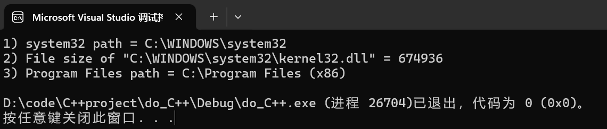
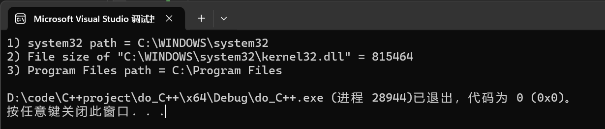
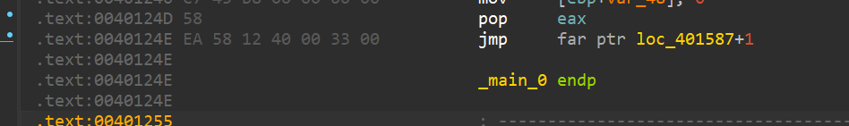
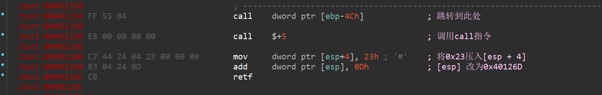
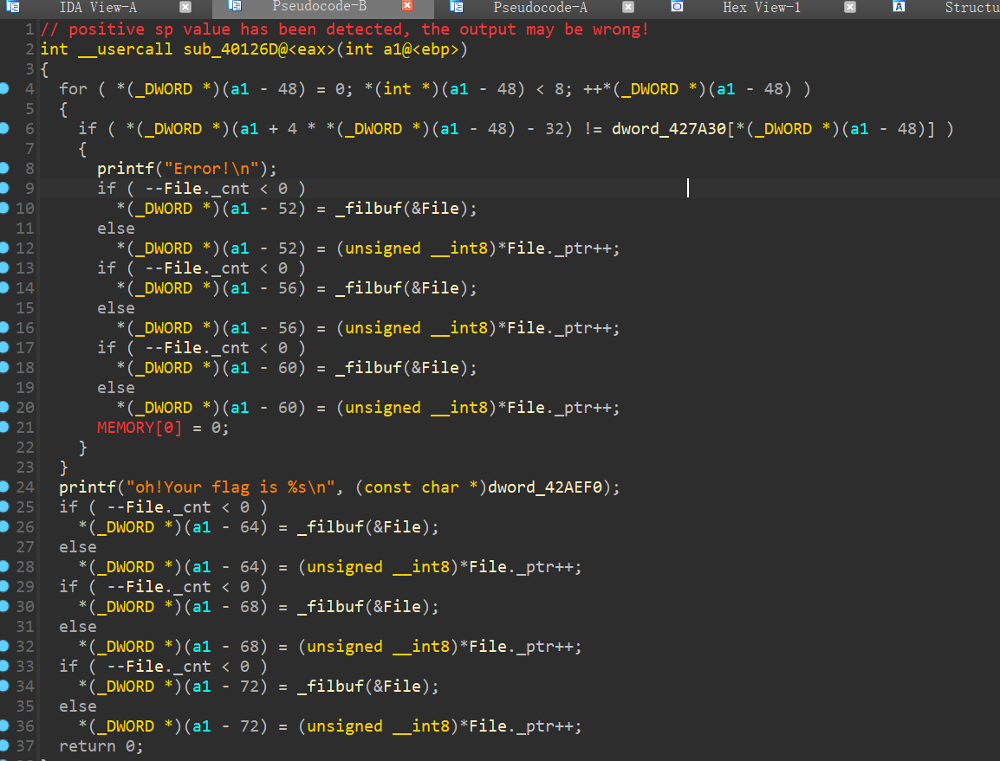
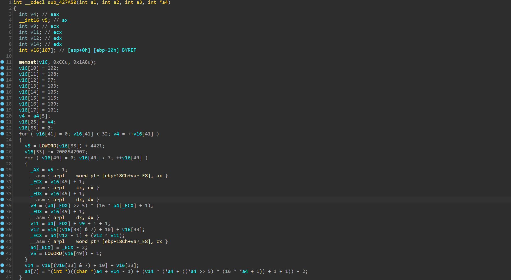
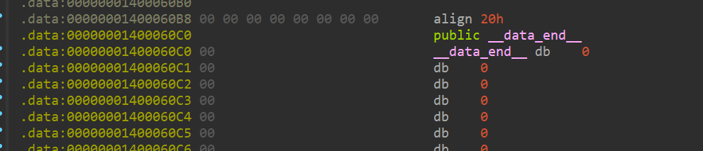

# 天堂之门(Heaven's Gate)

## 一、基础知识

天堂之门，是建立在WoW64技术上的逆向反调试技术

要去认识它，需要先明白**64位系统中32位应用程序的执行过程**以及**WoW64是什么**

### 1.1 在x64下的进程

在**x64**下的进程，不管是32位或者是64位，实际上都映射了两个地址空间，一个是32位，一个是64位，相当于一个进程的两种工作模式

解释：在64位的操作系统上，32位的应用程序并不能直接在64位环境下运行。为了使32位程序可以正常运行，操作系统提供了一个称为 **WoW64**（Windows on Windows 64-bit）的子系统。WoW64 子系统相当于一个兼容层，专门为32位程序提供了类似32位的运行环境

- 事实上这个32位程序运行的环境也是一个64位的运行环境，系统在创建32位进程时，首先创建一个64位的进程，然后再在其中创建一个32位的子环境。32位程序所调用的系统函数，最终都要通过64位的动态链接库而实现

**而这两种工作模式是可以进行切换的**，他们之间的关键区别在于 `cs`段寄存器  

- 64位:CS = 0x33 
- 32位:CS = 0x23

Windows判别位的方式，是根据`cs`段寄存器的，所以只要修改`cs`的值，就能实现切换，再使用`retf`指令回到xx位 

### 1.2 WoW64

WoW64（Windows-on-Windows 64-bit）是微软Windows操作系统的一个子系统，它使得32位应用程序能够在64位Windows操作系统上运行。WoW64实现了对32位应用程序的透明兼容，主要通过以下方式：

1. **系统调用转化**：32位系统调用转换为64位系统调用。
2. **地址空间隔离**：32位进程和64位进程拥有各自的虚拟地址空间。
3. **库文件分离**：WoW64将32位和64位的库文件分别存储在不同的系统目录中

- 在32位程序中，使用`syscall`or`call`以及`jmp far ptr`or`call far ptr`实现跨位运行
- *ps*：在windows下调试时**windbg**对32/64位切换的支持较好，其他如ida、x32dbg等调试器在retf语句后都无法调试

## 二、WoW64实现过程

32位程序首先调用32位`ntdll.dll`中的32位函数

再由`ntdll.dll`调用`wow64cpu.dll`中的`X86SwitchTo64BitMode`，就是调用该函数后进程从32位模式切换到64位模式，`wow64.dll`将32位的系统调用转化为64位

再调用64位`ntdll.dll`中的64位函数

### 2.1 转换过程参考

*ps*：`retf`是切换32位和64位的关键指令

```assembly
// x86 to x64
6A 33                    ; push 0x33      ; 将值 0x33 压入栈顶（此值将用于修改 CS 段寄存器）
E8 00 00 00 00           ; call $+5       ; 将下一条指令的地址（即当前 EIP+5）压入栈中，并继续执行下一条指令
83 04 24 05              ; add dword [esp], 5  ; 修改栈顶的返回地址，将其增加 5，指向 `retf` 之后的下一条指令
CB                       ; retf           ; 通过 `retf`（返回并修改段寄存器），使程序跳转到返回地址，同时将 `CS` 段寄存器修改为 0x33，切换到 64 位模式

// x64 to x86
E8 00 00 00 00           ; call $+5       ; 将下一条指令的地址（即当前 RIP+5）压入栈中，并继续执行下一条指令
C7 44 24 04 23 00 00 00  ; mov dword [rsp + 4], 0x23 ; 将栈中返回地址的高 32 位修改为 0x23，指示程序返回时切换到 32 位模式
83 04 24 0D              ; add dword [rsp], 0xD ; 修改栈顶的返回地址，将其增加 0xD，指向 `retf` 之后的下一条指令
CB                       ; retf           ; 通过 `retf`，程序跳转回 32 位模式，并继续执行跳转后的代码
```

### 2.2 Test

```c++
#include "stdio.h"
#include "windows.h"
#include "Shlobj.h"
#include "tchar.h"
#pragma comment(lib, "Shell32.lib")

int _tmain(int argc, TCHAR* argv[])
{
    HKEY    hKey = NULL;
    HANDLE  hFile = INVALID_HANDLE_VALUE;
    TCHAR   szPath[MAX_PATH] = { 0, };
    ////////////////
    // system32 folder
    if (GetSystemDirectory(szPath, MAX_PATH))
    {
        _tprintf(L"1) system32 path = %s\n", szPath);
    }
    ////////////////
    // File size
    _tcscat_s(szPath, L"\\kernel32.dll");
    hFile = CreateFile(szPath, GENERIC_READ, FILE_SHARE_READ, NULL,
        OPEN_EXISTING, FILE_ATTRIBUTE_NORMAL, NULL);
    if (hFile != INVALID_HANDLE_VALUE)
    {
        _tprintf(L"2) File size of \"%s\" = %d\n",
            szPath, GetFileSize(hFile, NULL));
        CloseHandle(hFile);
    }
    ////////////////
    // Program Files
    if (SHGetSpecialFolderPath(NULL, szPath,
        CSIDL_PROGRAM_FILES, FALSE))
    {
        _tprintf(L"3) Program Files path = %s\n", szPath);
    }
    ////////////////
    // Registry
    if (ERROR_SUCCESS == RegCreateKey(HKEY_LOCAL_MACHINE,
        L"SOFTWARE\\ReverseCore", &hKey))
    {
        RegCloseKey(hKey);
        _tprintf(L"4) Create Registry Key : HKLM\\SOFTWARE\\ReverseCore\n");
    }
    return 0;
}
```

关于WoW64的知识，在《逆向工程核心原理》的第36章有介绍，上述是本书提供的样例代码，在x86和x32的源码相同

- x86运行



- x64运行



发现32位程序的运行结果与64位程序结果不同


64位程序返回的是正确的值，而32位程序虽然识别的是`C:\WINDOWS\system32\`，但是实际指向内容却是转为32位程序准备的`SysWOW64`。这是WOW64对32位程序进行重定向的结果

## 三、CTF运用

题目：ctfshow上的`月饼杯2 EasyTea`

### 3.1 分析天堂之门部分



0xEA是jmp far ptr的操作吗，会跳转到指定段和偏移地址。

58 12 40 00 是指偏移地址0x00401258 

段选择符为 33 00 将cs寄存器改为0x33

即后面将执行的是64位指令



此处是将**eip改为0x40126D，cs改为0x23**

跳转至0x40126D处，先U再P



这里是最终逻辑，是一个cmp函数，提取出cipher

```c
unsigned int dword_427A30[8] = {
    0xB5ABA743, 0x4C5B3EE0, 0xB70AEB14, 0x6946BC13, 0x906089C4, 0x5B9F98F0, 0x0964B652, 0x78920976
};
```

然后继续回找，现在主要看00401258处call指令指向的地址是哪

```assembly
.text:00401258 FF 55 B4                      call    dword ptr [ebp-4Ch]            
// 倒着看回去，追踪[ebp-4c]

.text:00401240 8B 45 DC                      mov     eax, [ebp+var_24]
.text:00401243 89 45 B4                      mov     [ebp+var_4C], eax
// 通过eax作为媒介，追踪到[ebp+var_24]

.text:004011D1 C7 45 DC 50 7A 42 00          mov     [ebp+var_24], offset unk_427A50
// 继续追踪，发现关键函数unk_427A50
```

双击过去是.data段的数据流

强行P创建函数



发现都是64位的指令，32位IDA反编译的结果并不好分析

至此本题完成了32位程序使用64位函数

### 3.2 解题

由于是静态，便可以将这个`unk_427A50`dump出来，patch到随意的64位程序中

```c
# include<stdio.h>

int main()
{
    printf("Hello world!\n");
    return 0;
}

// 现写一个hello world代码
// gcc version 13.2.0 (GCC)
// gcc -o test test.c编译为64位程序
```

打开test.exe（任意64位程序），这里我在.data区的0x1400060C0位置上开始patch



IDApython：

```python
dump_data = [0x48, 0x89, 0x4C, 0x24, 0x08, 0x55, 0x57, 0x48, 0x81, 0xEC, 
  0xA8, 0x01, 0x00, 0x00, 0x48, 0x8D, 0x6C, 0x24, 0x20, 0x48, 
  0x8B, 0xFC, 0xB9, 0x6A, 0x00, 0x00, 0x00, 0xB8, 0xCC, 0xCC, 
  0xCC, 0xCC, 0xF3, 0xAB, 0x48, 0x8B, 0x8C, 0x24, 0xC8, 0x01, 
  0x00, 0x00, 0x90, 0x90, 0x90, 0x90, 0x90, 0x90, 0x90, 0x90, 
  0x90, 0x90, 0x90, 0x90, 0xC7, 0x45, 0x08, 0x66, 0x00, 0x00, 
  0x00, 0xC7, 0x45, 0x0C, 0x6C, 0x00, 0x00, 0x00, 0xC7, 0x45, 
  0x10, 0x61, 0x00, 0x00, 0x00, 0xC7, 0x45, 0x14, 0x67, 0x00, 
  0x00, 0x00, 0xC7, 0x45, 0x18, 0x69, 0x00, 0x00, 0x00, 0xC7, 
  0x45, 0x1C, 0x73, 0x00, 0x00, 0x00, 0xC7, 0x45, 0x20, 0x6D, 
  0x00, 0x00, 0x00, 0xC7, 0x45, 0x24, 0x65, 0x00, 0x00, 0x00, 
  0xB8, 0x04, 0x00, 0x00, 0x00, 0x48, 0x6B, 0xC0, 0x07, 0x48, 
  0x8B, 0x8D, 0xA0, 0x01, 0x00, 0x00, 0x8B, 0x04, 0x01, 0x89, 
  0x45, 0x44, 0xC7, 0x45, 0x64, 0x00, 0x00, 0x00, 0x00, 0xC7, 
  0x85, 0x84, 0x00, 0x00, 0x00, 0x00, 0x00, 0x00, 0x00, 0xEB, 
  0x0E, 0x8B, 0x85, 0x84, 0x00, 0x00, 0x00, 0xFF, 0xC0, 0x89, 
  0x85, 0x84, 0x00, 0x00, 0x00, 0x83, 0xBD, 0x84, 0x00, 0x00, 
  0x00, 0x20, 0x0F, 0x8D, 0x44, 0x01, 0x00, 0x00, 0x8B, 0x45, 
  0x64, 0x05, 0x45, 0x11, 0x48, 0x88, 0x89, 0x45, 0x64, 0xC7, 
  0x85, 0xA4, 0x00, 0x00, 0x00, 0x00, 0x00, 0x00, 0x00, 0xEB, 
  0x0E, 0x8B, 0x85, 0xA4, 0x00, 0x00, 0x00, 0xFF, 0xC0, 0x89, 
  0x85, 0xA4, 0x00, 0x00, 0x00, 0x83, 0xBD, 0xA4, 0x00, 0x00, 
  0x00, 0x07, 0x0F, 0x8D, 0x8A, 0x00, 0x00, 0x00, 0x48, 0x63, 
  0x85, 0xA4, 0x00, 0x00, 0x00, 0x8B, 0x8D, 0xA4, 0x00, 0x00, 
  0x00, 0xFF, 0xC1, 0x48, 0x63, 0xC9, 0x48, 0x8B, 0x95, 0xA0, 
  0x01, 0x00, 0x00, 0x8B, 0x0C, 0x8A, 0xC1, 0xE1, 0x04, 0x8B, 
  0x95, 0xA4, 0x00, 0x00, 0x00, 0xFF, 0xC2, 0x48, 0x63, 0xD2, 
  0x4C, 0x8B, 0x85, 0xA0, 0x01, 0x00, 0x00, 0x41, 0x8B, 0x14, 
  0x90, 0xC1, 0xFA, 0x05, 0x33, 0xCA, 0x8B, 0x95, 0xA4, 0x00, 
  0x00, 0x00, 0xFF, 0xC2, 0x48, 0x63, 0xD2, 0x4C, 0x8B, 0x85, 
  0xA0, 0x01, 0x00, 0x00, 0x41, 0x03, 0x0C, 0x90, 0x8B, 0x55, 
  0x64, 0x83, 0xE2, 0x07, 0x8B, 0xD2, 0x8B, 0x54, 0x95, 0x08, 
  0x44, 0x8B, 0x45, 0x64, 0x44, 0x03, 0xC2, 0x41, 0x8B, 0xD0, 
  0x33, 0xCA, 0x48, 0x8B, 0x95, 0xA0, 0x01, 0x00, 0x00, 0x03, 
  0x0C, 0x82, 0x8B, 0xC1, 0x48, 0x63, 0x8D, 0xA4, 0x00, 0x00, 
  0x00, 0x48, 0x8B, 0x95, 0xA0, 0x01, 0x00, 0x00, 0x89, 0x04, 
  0x8A, 0xE9, 0x5B, 0xFF, 0xFF, 0xFF, 0xB8, 0x04, 0x00, 0x00, 
  0x00, 0x48, 0x6B, 0xC0, 0x07, 0xB9, 0x04, 0x00, 0x00, 0x00, 
  0x48, 0x6B, 0xC9, 0x00, 0x48, 0x8B, 0x95, 0xA0, 0x01, 0x00, 
  0x00, 0x8B, 0x0C, 0x0A, 0xC1, 0xE1, 0x04, 0xBA, 0x04, 0x00, 
  0x00, 0x00, 0x48, 0x6B, 0xD2, 0x00, 0x4C, 0x8B, 0x85, 0xA0, 
  0x01, 0x00, 0x00, 0x41, 0x8B, 0x14, 0x10, 0xC1, 0xFA, 0x05, 
  0x33, 0xCA, 0xBA, 0x04, 0x00, 0x00, 0x00, 0x48, 0x6B, 0xD2, 
  0x00, 0x4C, 0x8B, 0x85, 0xA0, 0x01, 0x00, 0x00, 0x41, 0x03, 
  0x0C, 0x10, 0x8B, 0x55, 0x64, 0x83, 0xE2, 0x07, 0x8B, 0xD2, 
  0x8B, 0x54, 0x95, 0x08, 0x44, 0x8B, 0x45, 0x64, 0x44, 0x03, 
  0xC2, 0x41, 0x8B, 0xD0, 0x33, 0xCA, 0x48, 0x8B, 0x95, 0xA0, 
  0x01, 0x00, 0x00, 0x03, 0x0C, 0x02, 0x8B, 0xC1, 0xB9, 0x04, 
  0x00, 0x00, 0x00, 0x48, 0x6B, 0xC9, 0x07, 0x48, 0x8B, 0x95, 
  0xA0, 0x01, 0x00, 0x00, 0x89, 0x04, 0x0A, 0xE9, 0xA1, 0xFE, 
  0xFF, 0xFF, 0x48, 0x8D, 0x4D, 0xE0, 0x90, 0x90, 0x90, 0x90, 
  0x90, 0x90, 0x90, 0x90, 0x90, 0x90, 0x90, 0x90, 0x48, 0x8D, 
  0xA5, 0x88, 0x01, 0x00, 0x00, 0x5F, 0x5D, 0xC3]
start_addr = 0x1400060C0
end_addr = start_addr + len(dump_data)
for i in range(start_addr, end_addr):
    idc.patch_byte(i, dump_data[i - start_addr])
```

然后P创建函数

```c
__int64 __fastcall _data_end__(int *a1)
{
  char *v1; // rdi
  __int64 i; // rcx
  __int64 result; // rax
  char v4; // [rsp+0h] [rbp-20h] BYREF
  int v5[23]; // [rsp+28h] [rbp+8h]
  int v6; // [rsp+84h] [rbp+64h]
  int j; // [rsp+A4h] [rbp+84h]
  int k; // [rsp+C4h] [rbp+A4h]

  v1 = &v4;
  for ( i = 106i64; i; --i )
  {
    *(_DWORD *)v1 = -858993460;
    v1 += 4;
  }
  v5[0] = 102;
  v5[1] = 108;
  v5[2] = 97;
  v5[3] = 103;
  v5[4] = 105;
  v5[5] = 115;
  v5[6] = 109;
  v5[7] = 101;
  result = (unsigned int)a1[7];
  v5[15] = a1[7];
  v6 = 0;
  for ( j = 0; j < 32; ++j )
  {
    v6 -= 2008542907;
    for ( k = 0; k < 7; ++k )
      a1[k] += (v5[v6 & 7] + v6) ^ (a1[k + 1] + ((a1[k + 1] >> 5) ^ (16 * a1[k + 1])));
    a1[7] += (v5[v6 & 7] + v6) ^ (*a1 + ((*a1 >> 5) ^ (16 * *a1)));
    result = (unsigned int)(j + 1);
  }
  return result;
}
```

得到了很清晰的魔改XTEA逻辑

### 3.3 EXP

```c
#include <stdio.h>
void re_xtea(int *cipher, int *key)
{
    int delta = 0x77B7EEBB;
    int sum = -(delta * 32);
    int j, k = 6;
    for (j = 0; j < 32; j++)
    {
        cipher[7] -= (key[sum & 7] + sum) ^ (*cipher + ((*cipher >> 5) ^ (16 * *cipher)));
        for (k = 6; k >= 0; k--)
        {
            cipher[k] -= (key[sum & 7] + sum) ^ (cipher[k + 1] + ((cipher[k + 1] >> 5) ^ (16 * cipher[k + 1])));
        }
        sum += 0x77B7EEBB;
    }
}

int main()
{
    int cipher[] = {0xB5ABA743, 0x4C5B3EE0, 0xB70AEB14, 0x6946BC13, 0x906089C4, 0x5B9F98F0, 0x0964B652, 0x78920976};
    int key[8];
    key[0] = 102;
    key[1] = 108;
    key[2] = 97;
    key[3] = 103;
    key[4] = 105;
    key[5] = 115;
    key[6] = 109;
    key[7] = 101;
    re_xxtea(cipher, key);
    printf("%s", cipher);
}
// Tea_12345_12345_yes_flag_is_easy
```


### 3.4 总结

本题的思路：

```
32位程序
|
V
把64位函数藏在天堂之门实现处(看汇编)
|
V
因为天堂之门的存在，干扰了IDA分析逻辑，需要通过机器码来手动分析，找到cmp函数
|
V
想办法还原64位函数的内容
```

遇到32位程序调用64位函数的天堂之门，解题思路:根据汇编和机器码找到64位函数，dump到64位程序中阅读

参考文章中提到还可能出现动态天堂之门，只有动调手撕了。。。

## 四、杂谈

> 可能有某些地方理解的不是很到位，若有问题，敬请指教！

天堂之门技术，除了CTF中的反调应用，实战中应该只会存在于`恶意程序`

因为看大佬们沙箱&火绒剑测试的结果，都会被识别出来，实战用处不大

若还想看看其他CTF题中的应用，可以参考此大佬的文章：[CTF中32位程序调用64位代码的逆向方法-安全客 - 安全资讯平台 (anquanke.com)](https://www.anquanke.com/post/id/171111)


- 参考文章：

[天堂之门 - TLSN - 博客园 (cnblogs.com)](https://www.cnblogs.com/lordtianqiyi/articles/16501516.html)

[[原创\]天堂之门-调试器的末路-软件逆向-看雪-安全社区|安全招聘|kanxue.com](https://bbs.kanxue.com/thread-280974.htm)

[[原创\]天堂之门 (Heaven's Gate) C语言实现-软件逆向-看雪-安全社区|安全招聘|kanxue.com](https://bbs.kanxue.com/thread-270153.htm)

[天堂之门（Heaven's Gate）逆向 - yuhury - 博客园 (cnblogs.com)](https://www.cnblogs.com/y0hv2y/p/17872410.html)

[天堂之门技术 | Taardis's blog (taardisaa.github.io)](https://taardisaa.github.io/2021/09/25/Heaven'sGate/)

[[分享\][原创]汇编里看Wow64的原理（浅谈32位程序是怎样在windows 64上运行的？）-软件逆向-看雪-安全社区|安全招聘|kanxue.com](https://bbs.kanxue.com/thread-221236.htm)

[WoW Hell: Rebuilding Heavens Gate - HITBSecConf2021 - Amsterdam HITBSecConf2021 – Amsterdam](https://archive.conference.hitb.org/hitbsecconf2021ams/sessions/wow-hell-rebuilding-heavens-gate/)