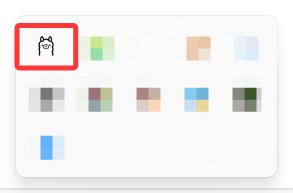
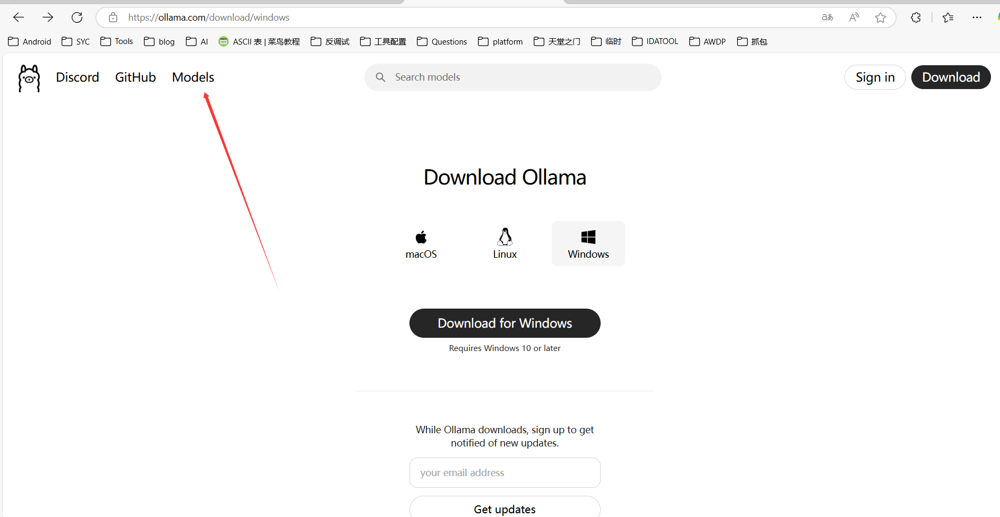
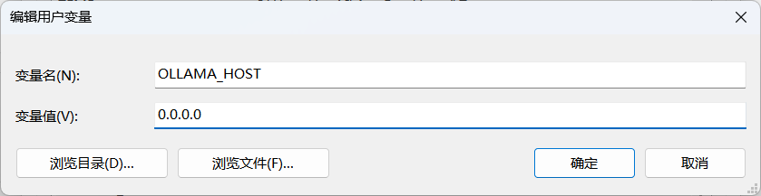
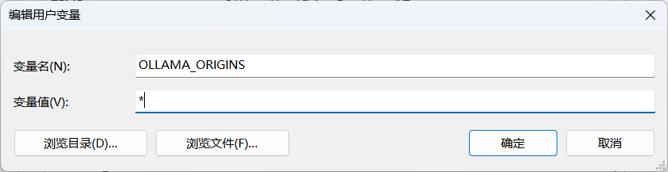
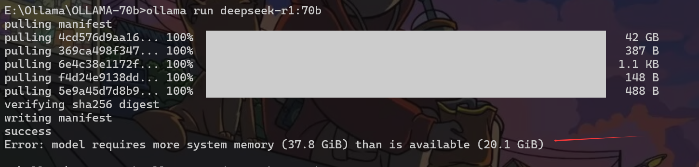
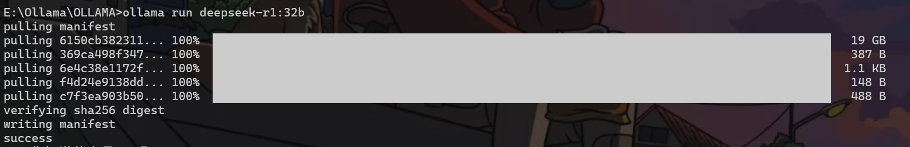
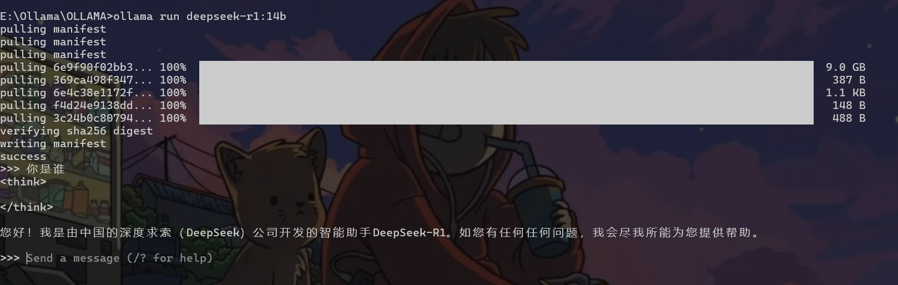
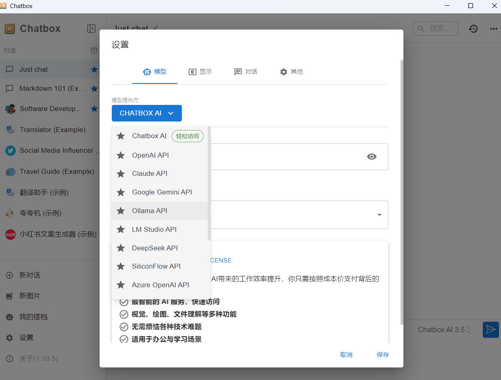
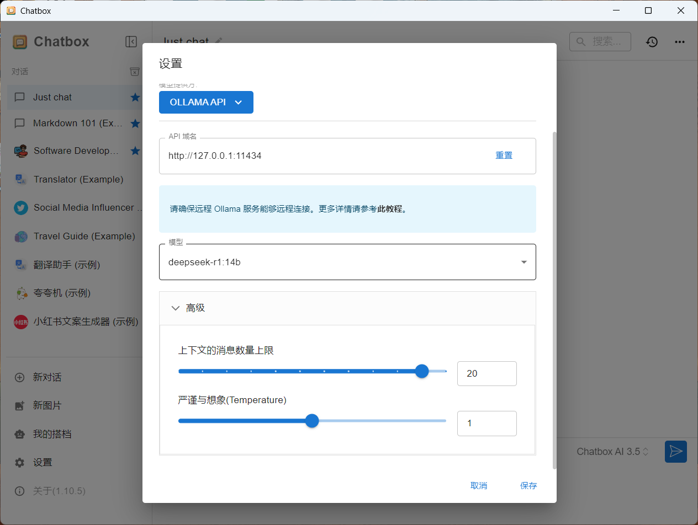
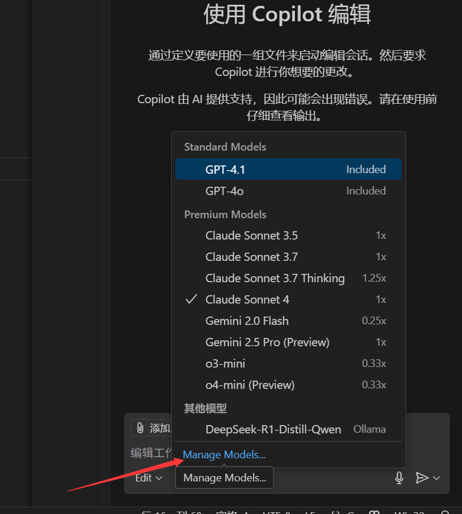

# 下载安装Ollama

> 直通车：https://ollama.com/download/windows

安装之后，Ollama已经运行了，它是CMD命令工具，我们可以在命令行输入ollama来验证，是否安装成功




## 安装DeepSeek-r1模型



我们选择`DeepSeek-r1`

我这里选择的比较大，是`70b`

默认下在C盘，那么我们最好先改下环境变量，方便下到其他盘

### 更改环境变量

- **系统环境变量**

  变量值填你想下载的目录


- **用户变量**





更改完毕后重启`ollama`即可

### 正式下载

```
ollama run deepseek-r1:70b
```



丸辣步子迈大了，改下32b

```
ollama run deepseek-r1:32b
```



我们启动也可以直接用这个指令

```
ollama run deepseek-r1:32b
```

又丸辣，带不动，再次降低为`14b`，下三次了xd

```
ollama run deepseek-r1:14b
```



# 配置 UI

> 我这里使用的是ChatBox
>
> https://chatboxai.app/zh
>
> 官方参考配置https://chatboxai.app/zh/help-center/connect-chatbox-remote-ollama-service-guide



选择`Ollama API`，配置如下



# [+]本人使用的大模型

参考内容16g

```
ollama run deepseek-r1:14b
ollama run gemma3:12b
# 下面两个代码相关问题要好点
ollama run phi4
ollama run codellama:13b
ollama run deepseek-coder:6.7b
ollama run qwen2.5-coder:7b
```

- VScode copilot可以使用本地大模型

  先启动大模型，跑起来，然后如下图，选择即可

